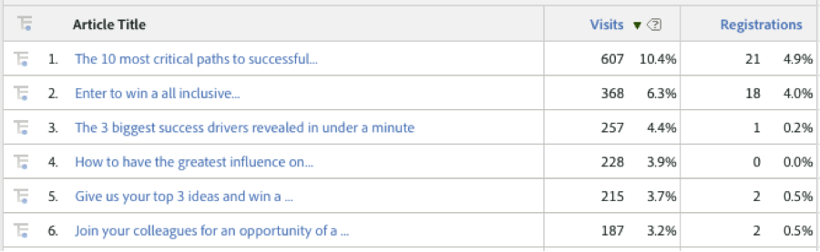

# 依據動態訊號維度檢視流量和轉換度量{#viewing-traffic-and-conversion-metrics-by-dynamic-signal-dimensions}

Adobe Analytics中報表的範例。

此整合提供可作為Adobe Analytics報表使用的新維度-如需詳細資訊，請參閱 [整合報告維度](../../dynamic-signal-for-analytics/dynamic-signal-use-integration/dynamic-signal-reporting-dimensions.md#concept-19c4c9a55d7747698701e771541144be) 。以下報表是分析「瀏覽」和「依文章標題劃分」的轉換度量(註冊)的範例。

