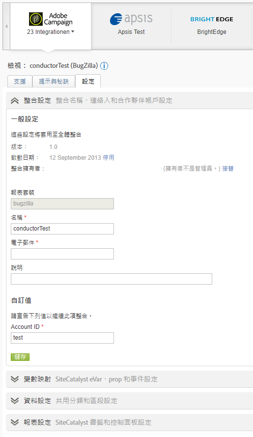

# 資料連接器概觀

Adobe 針對各組織的數位策略與行銷方案提供可執行的即時資訊。Data Connectors 讓您能夠將來自協力廠商應用程式的追蹤資料匯入分析，因此您可以從某一個中央位置蒐集和使用資料。在使用任一款合作夥伴產品時，您可以建立整合以將應用程式資料匯入行銷報表。整合完成後，您便可以產生含應用程式資料的報表。

例如，電子郵件整合可使用電子郵件合作夥伴來散發電子郵件促銷活動。當訪客造訪您的網站時，您會想知道哪些訪客是響應電子郵件行銷活動而來的。Data Connectors 能將電子郵件合作夥伴的資料整合至行銷報表中，因此您可以藉由這些資訊來判斷電子郵件行銷活動的效果。

**系統要求**

Data Connectors 應該可以與最熱門的各種瀏覽器適當地整合。然而，唯有在滿足以下建議的系統上，報表的外觀和功能才能充分發揮:

* 瀏覽器: Microsoft Internet Explorer 6 及更高版本
* Cookie: 必要
* JavaScript: 啟用
* 作業系統: Windows
* Macromedia Flash Player: 第 6 版或更高版本
* 螢幕解析度: 1024x768 (800x600 亦可)
* 色彩深度: 16 位元或更高

此外，當使用者的網頁瀏覽器啟用JavaScript時，資料收集會有所改善。

**必備條件**

在設定產品的 Data Connectors 整合前，請完成以下工作:

* 取得合作夥伴產品帳戶的必要存取憑證，以取得與行銷報表整合所需資料的存取權限。您可能需要建立特殊的電子郵件帳戶，以便用於報表散發者和有關整合操作的通知。
* 識別掌握行銷活動資訊的自訂變數。這通常指的是行銷活動追蹤代碼，不過貴公司使用的可能是不同術語。
* 決定要接收印象的事件，然後按一下資料。您也許會想要據此為事件重新命名。
* 在登陸頁面中放置適當的代碼，讓分析能適當地為來自合作夥伴產品的資料塑型。各夥伴產品的具體說明請參閱「資源」標籤上 Data Connectors 精彩案例中的內容。

## 新增整合

您必須有目前帳戶才能存取「資 [!UICONTROL 料連接器] 」登陸頁面（主控台）。 建議您熟悉Adobe Analytics。

1. 登入Adobe Experience Cloud。
1. Click **[!UICONTROL Analytics]** &gt; **[!UICONTROL Admin]** &gt; **[!UICONTROL Data Connectors]**.
1. 按一下&#x200B;**[!UICONTROL 「新增」]**。
1. 逐步執行「 **[!UICONTROL 新增整合]** 」介面。

   由於各項產品整合不盡相同，因此在整合過程中您可能需要提供特定的設定資訊。

   整合完成時，合作夥伴產品圖示會顯示在「資料連接器網路」頁面上，並可在功能表中使用。

## Data connectors 主控台

啟動整合後，它會顯示在「資料連接器 [!UICONTROL 」頁面] 。 您可以在主控台上檢視詳細資訊並變更組態。 您可以檢視使用中的整合和公司中所有報表套裝的整合。您也可以檢視活動記錄、將整合設定為控制面板、設定整合及尋找說明。



## 在資料連接器中重新行銷區段

再行銷區段是根據 Data connectors 整合中所使用之變數建立的資料檔案。

Adobe Analytics會透過資料倉庫將這些資料以個別的每日檔案傳送至Adobe為第三方建立的FTP。 然後協力廠商再將這些檔案分配給客戶。公司通常會利用這些檔案，向可能造訪過網站及關注過產品但未購買的客戶，進行再行銷。(例如，您針對客戶檢視過但最後並未購買的產品，提供客戶優惠折扣)。

**區段**

* [!UICONTROL  放棄購買]: 訪客新增項目至購物車但未購買的百分比。一般來說，此百分比是「訂單數」除以「購物車新增項目數」所組成的計算量度。
* [!UICONTROL 購買]: 根據特定產品中的訊息 ID 而進行購買的接收者 ID (或是訪客 ID)。
* [!UICONTROL 產品檢視]:類似於「 [!UICONTROL 購物車放棄]」，這也是計算量度。 It reports [!UICONTROL Product Views] divided by Orders, because customers' viewing the product shows some interest.

**實施範例**

為了成功實施再行銷區段，下列條件必須符合:

* Data connectors 合約已建立，且您的組織已透過 Adobe 顧問完成實施階段。
* 產品變數會同時啟動對應的事件:
   * 購物車放棄： `scAdd` 事件
   * 購買： `purchase` 事件
   * Product Views: `prodView` event

> [!NOTE] 如果定義產品時沒有關聯事件，則會自動觸發prodView事件。
如果上述要求不符合，則對應的再行銷區段無法正確回報。

[!UICONTROL]放棄購買: 當使用者新增產品至購物車時會啟動:

```
s.products=";cat";
s.events="scAdd";
```

[!UICONTROL]購買: 在購買確認頁面上啟動:

```
s.products=";
cat;1;50";
s.events="purchase";
//Note: Though optional, adding the purchaseID variable increases accuracy by preventing duplicate purchases
```

**常見問題**

| 問題 | 說明 |
| -----------| ---------- |  
| 再行銷區段檔案中沒有顯示產品 ID 資訊。 | 發生於觸發正確事件，但相同影像要求上沒有產品變數時。 為了修正此問題，請確認產品變數和對應的事件在同個頁面上啟動，如同上方的實施範例所示。 |
| 尚未收到再行銷區段檔案。 | 如果您沒有收到您的檔案，請讓一位您組織所支援的使用者聯絡 ClientCare，以檢查未成功收到報告的原因。 |


> [!IMPORTANT] 除了標準資料連接器整合再行銷區段檔案外，顧問通常也會將資料倉庫請求設定為每日計畫報表。 此資料倉儲要求將包含 Data connectors 變數和非 Data connectors 變數，而該要求可僅根據您組織的特定要求進行排程。若要在疑難排解時避免混淆，請指定有問題的檔案是否真的是再行銷區段檔案，或是包含非 Genesis 變數的資料倉儲要求。
