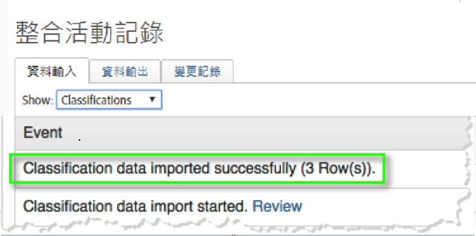
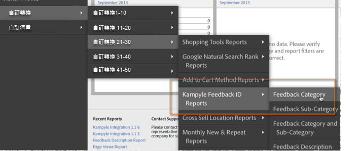

# 部署整合{#deploying-the-integration}

部署此整合的簡單程式包括完成Adobe整合精靈、部署外掛程式碼(JavaScript)，以及驗證整合。

## 完成 Adobe 整合精靈{#complete-the-adobe-integration-wizard}

若要啟動整合，請完成「資料連接器」介面中的設定精靈。

1. 登入 Adobe Experience Cloud。
1. 導覽至 **[!UICONTROL Data Connectors]**。
1. 啟動 Kampyle 整合精靈。
1. 選取所需的報表套裝，並提供整合的名稱。
1. 設定下列項目：
   1. **[!UICONTROL Email address]**: 主要連絡人的電子郵件地址.
   1. **[!UICONTROL Description]** （可選）:此整合設定的說明。
   1. **[!UICONTROL Kampyle Key]**:在>下的Kampyle應用程式中尋找 **[!UICONTROL Feedback Form]** 此金鑰 **[!UICONTROL Feedback Form Customization]**。
   1. **[!UICONTROL Tracking Server]**:您用來追蹤Adobe Analytics資料的追蹤伺服器值。
   1. **[!UICONTROL Tracking Server Secure]**:如果您的追蹤伺服器對於安全/https流量不同，請在此處提供該設定。
1. Configure the following **[!UICONTROL Variable Mappings]** items:
   1. **[!UICONTROL Kampyle Feedback ID]**:從報表套裝中選取可用的eVar變數
   1. **[!UICONTROL Feedback Grade]**:從報表套裝中選取可用的成功事件（鍵入「計數器」）。
   1. **[!UICONTROL Feedback Items]**:從報表套裝中選取可用的成功事件（鍵入「計數器」）。
   1. **[!UICONTROL Feedback with Grade]**:從報表套裝中選取可用的成功事件（鍵入「計數器」）。
1. 核取方塊以自動建立 Kampyle 整合控制面板 (建議)。
1. Review all configuration items and click **[!UICONTROL Activate Now]**.

## 部署整合設定物件{#deploy-the-integration-configuration-object}

完成整合精靈後，將整合設定物件部署至您的Web屬性。 在許多情況下，部署整合設定物件最簡單的方式，就是將物件加入您的 Adobe Analytics 部署程式碼中。

> [!NOTE] 如果您使用Adobe Experience Platform Launch，就可以透過該工具輕鬆新增整合設定物件。

1. Navigate to the **[!UICONTROL Resources]** > **[!UICONTROL Support]** tab of the integration.
1. 下載並儲存資 **[!UICONTROL Kampyle Integration Code (JS)]** 源。 程式碼看起來類似：

   ```
   /* Kampyle:  Integration configuration settings */
     window.k_sc_param = { "version":1.1 }
   ```

1. 使用下列其中一種方法部署代碼：

   * 使用Adobe Experience Platform Launch。
   * 將程式碼傳送至維護Adobe Analytics部署的組織資源。

## 驗證整合{#verify-the-integration}

驗證整合是否透過完成兩項檢查成功傳輸資料。

### 整合活動記錄 {#section-0472df9180db4f218db5f6040cab07af}

View your Kampyle integration setup within the Adobe Experience Cloud by navigating to **[!UICONTROL Support]** > **[!UICONTROL Integration Activity Log]**. Under the **[!UICONTROL Data In]** tab, you should see entries stating that classification data was successfully imported.

> [!NOTE] 成功部署後24小時內通常會出現記錄項目。



### Adobe 報表資料 {#section-1ae9f0a5e6bc40988478ff55aefd56ac}

導覽至適當功能表結構內的 Kampyle 報表，使用 Adobe Analytics 檢視 Kampyle 意見報表。

> [!NOTE] 假設整合式意見表單正在主動接收提交內容，報表資料應會在部署成功後 24 到 48 小時內顯示。


