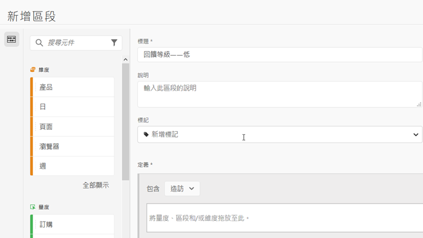
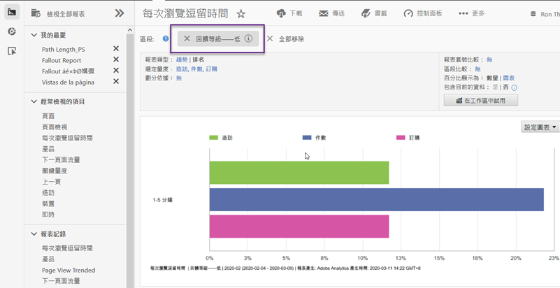

# 使用整合{#using-the-integration}

一旦部署後，您就可以開始使用這項整合提供的其他功能。若要從 Adobe Analytics 中取得此整合的值，需執行以下操作。

>[!NOTE] 可能需要 24 到 48 小時的時間，才會開始在 Adobe Analytics 報表中看到 Kampyle 回應資料。

## 混合意見與現場行為資料{#mix-feedback-and-onsite-behavior-data}

您可以依據意見維度來劃分 Reports &amp; Analytics 報表。

使用 Adobe Reports &amp; Analytics，您可以向下切入許多可用於報表的意見維度。以下報表範例說明如何切入至特定意見類別，然後依意見說明加以劃分。Reports &amp; Analytics 的量度 (造訪與客戶服務查詢) 和 Kampyle 的量度 (平均意見等級) 會並排顯示，以方便分析。

## 依意見維度分段{#segment-by-feedback-dimension}

您可以根據意見維度建立區段。

此整合的主要功能是可以根據 Kampyle 意見維度建立 Adobe Analytics 區段。例如，您建立的區段可以只包含評為 1 或 2 級的造訪。您可將此區段稱為「意見等級 - 低」。此區段定義如下所示：

然後可將此區段套用至幾乎所有報表 - 例如此處顯示的「每次造訪逗留時間報表」。

