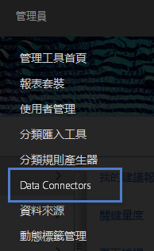
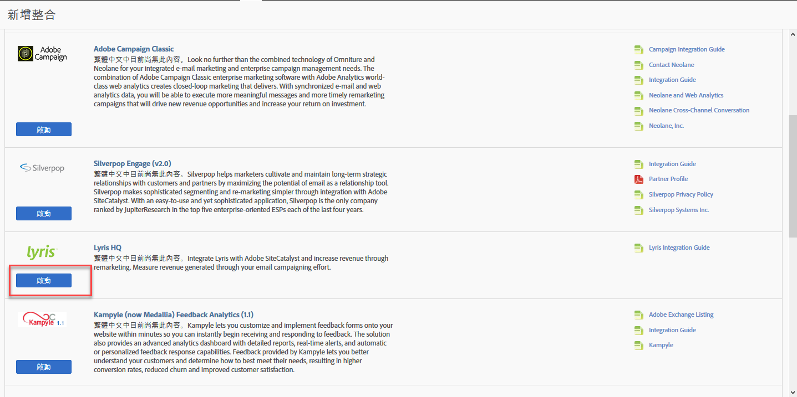
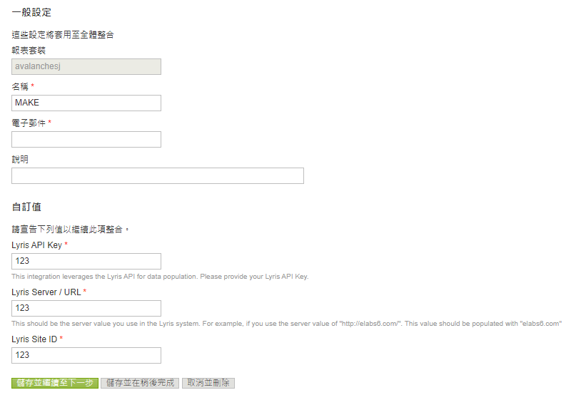
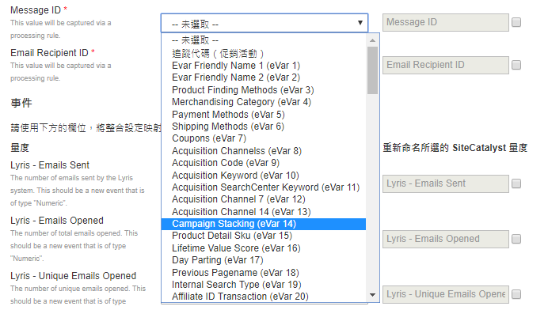
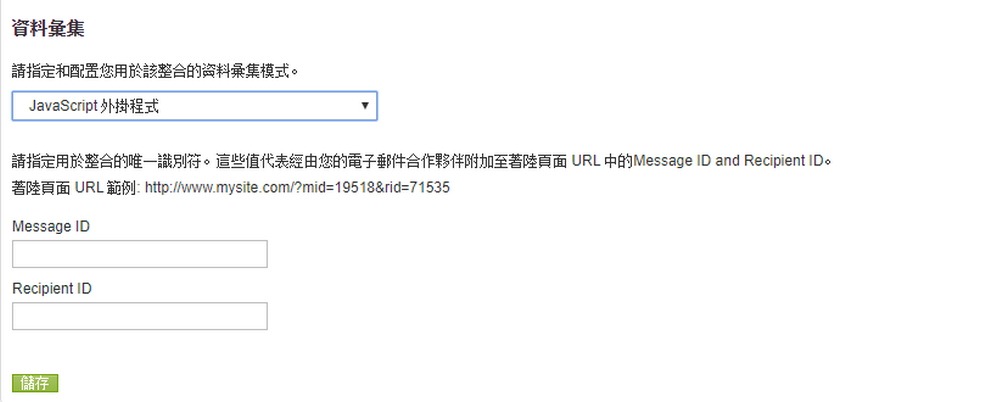
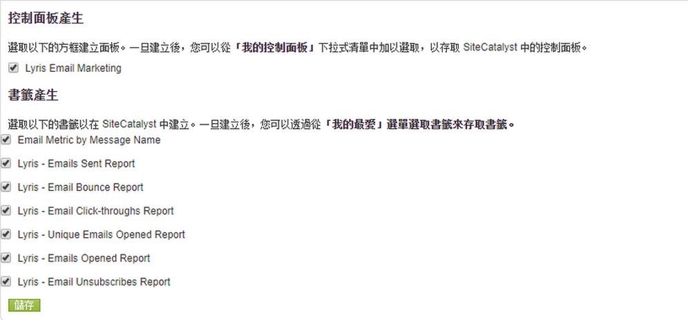
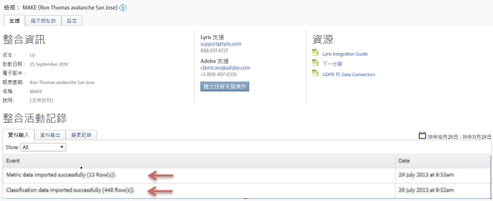

# 部署整合{#deploying-the-integration}

說明三步驟部署程式。

部署此整合是一個簡單的程式，需要執行下列動作：

## 完成整合精靈{#completing-the-integration-wizard}

使用整合精靈的步驟。

若要啟動整合，您必須在「資料連接器」介面中完成Lyris整合精靈。

1. 導覽至Adobe Experience cloud中的「資料連接器」（先前稱為Genesis）區域。

   

1. 在「 **[!UICONTROL 新增整合]**」下方的「Lyris HQ」下，按一下「**[!UICONTROL &#x200B;啟動」]**。

   

1. 在「 **[!UICONTROL 一般設定]**」下，選擇所要的報表套裝並提供整合的名稱。
1. 在「自訂值」下填寫您所有與Lyris帳戶相關 **[!UICONTROL 的資訊]**。

   

1. 從下拉式選單中選擇適當的保留eVar和事件。

   

1. 除了3個自動化合作夥伴區 **[!UICONTROL 段外]**，您也可以在「區段」下選擇您自己的區段。
1. 此整合可能需要將數個資料點下載至您的Lyris帳戶。 您可以在「存取請求」下選擇授予此 **[!UICONTROL 項的存取權]**。
1. 在「 **[!UICONTROL 資料收集]**」下，您可以選擇使用自動或手動解決方案（JavaScript外掛程式），從著陸頁面URL收集查詢字串參數。 如果您選擇擁有自動化解決方案，請為「訊息ID」和「收件者ID」輸入查詢字串參數。 如需JavaScript外掛程式，請連絡您的Adobe顧問。

   

1. 您可以選擇自動產生Lyris儀表板和書籤。

   

1. 檢閱整合摘要，然後按一 **[!UICONTROL 下啟動]**。

## Lyris emailLabs中的設定{#configuration-within-the-lyris-emaillabs}

說明精靈完成後，在Lyris中設定的步驟。

1. 完成整合精靈後，您必須與Lyris Professional團隊合作，以完成與Lyris HQ帳戶的整合併協助測試。
1. 新增URL查詢字串參數：確認URL附加字串已正確輸入至使用者介面的「組織」設定區域。 這應包含促銷活動層級ID(hq_m)和收件者層級ID(hq_v)。

   字串ID的範例為：

   ```
   hq_lid=149&hq_m=96843&hq_l=23&hq_v=7703a51905
   ```

   >[!NOTE]
   >
   >如果您要套用Lyris的原生分析工具，請按一 *下「追蹤* 」標籤所有新增的必要變數。

## 驗證整合{#verifying-the-integration}

驗證Lyris/Adobe Analytics整合是否成功的步驟。

完成所有部署步驟後，您可以驗證整合是否成功傳輸資料。

> [!NOTE] 資料交換需要幾天的時間才能開始。 在啟動整合後，請務必與Lyris聯絡。

1. 導覽至Data Connectors中的Lyris整合。 在「支 **[!UICONTROL 援]**>整合活**[!UICONTROL &#x200B;動記錄」下，您應該會看到成功匯入]**量度資料和 **[!UICONTROL /或成功匯入分]******類資料的事件：

   

1. 現在，使用適當的量度檢視您的Lyris訊息報表。 在Adobe Experience cloud中，選取「報 **[!UICONTROL 告與分析」]**。
1. 選取正確的報表套裝。
1. 在「 **[!UICONTROL 自訂轉換]**」下，選取「**[!UICONTROL &#x200B;訊息ID報表]** 」並選 **[!UICONTROL 擇「訊息ID/訊息名稱」]**。

## 查詢字串參數外掛程式代碼{#query-string-param-plug-in-code}

顯示要與Adobe Analytics搭配使用的Lyris外掛程式程式碼。

> [!NOTE] 請務必先在Adobe Analytics的「管理工具」中保留必要的eVar，然後再使用下列程式碼。 一旦您知道已保留哪些eVar，請以相關eVar取代eVarN。 例如eVar10。

```
/* 
  * Plugin: getQueryParam 2.3 
  */ 
s.getQueryParam=new Function("p","d","u","" 
+"var s=this,v='',i,t;d=d?d:'';u=u?u:(s.pageURL?s.pageURL:s.wd.locati" 
+"on);if(u=='f')u=s.gtfs().location;while(p){i=p.indexOf(',');i=i<0?p" 
+".length:i;t=s.p_gpv(p.substring(0,i),u+'');if(t){t=t.indexOf('#')>-" 
+"1?t.substring(0,t.indexOf('#')):t;}if(t)v+=v?d+t:t;p=p.substring(i=" 
+"=p.length?i:i+1)}return v"); 
s.p_gpv=new Function("k","u","" 
+"var s=this,v='',i=u.indexOf('?'),q;if(k&&i>-1){q=u.substring(i+1);v" 
+"=s.pt(q,'&','p_gvf',k)}return v"); 
s.p_gvf=new Function("t","k","" 
+"if(t){var s=this,i=t.indexOf('='),p=i<0?t:t.substring(0,i),v=i<0?'T" 
+"rue':t.substring(i+1);if(p.toLowerCase()==k.toLowerCase())return s." 
+"epa(v)}return ''"); 
 
/*in the s_doPlugins function - Replace N with actual eVar number*/ 
s.eVarN=s.getQueryParam("<insert Lyris QS Param>");  
//places query param value from Message ID in eVarN variable s.eVarN=s.getQueryParam("<insert Lyris QS Param>");  
//places query param value from Recepient ID in eVarN variable 
```
