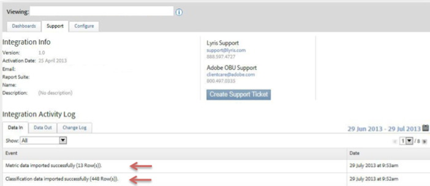

# 驗證整合{#verifying-the-integration}

驗證Lyris/Adobe Analytics整合是否成功的步驟。

完成所有部署步驟後，您可以驗證整合是否成功傳輸資料。

>[!NOTE]
>
>資料交換需要幾天的時間才能開始。 在啟動整合後，請務必與Lyris聯絡。

1. 導覽至Data Connectors中的Lyris整合。 在「支 **[!UICONTROL 援]** &gt;整合活 **[!UICONTROL 動記錄」下，您應該會看到成功匯入]**&#x200B;量度資料和 **[!UICONTROL /或成功匯入分]******&#x200B;類資料的事件：

   

1. 現在，使用適當的量度檢視您的Lyris訊息報表。 在Adobe Experience cloud中，選取「報 **[!UICONTROL 告與分析」]**。
1. 選取正確的報表套裝。
1. 在「 **[!UICONTROL 自訂轉換]**」下，選取「 **[!UICONTROL 訊息ID報表]** 」並選 **[!UICONTROL 擇「訊息ID/訊息名稱」]**。
