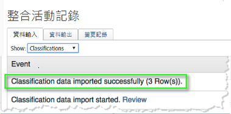
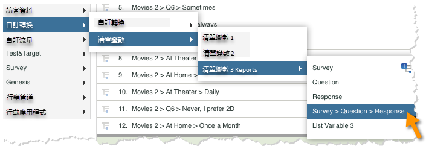
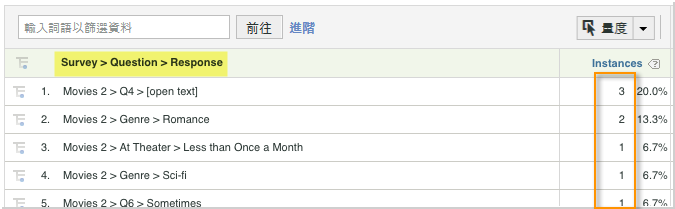

# 部署整合{#deploying-the-integration}

部署此整合是一個簡單的程式，需要執行下列動作。

## 完成Adobe整合精靈{#completing-the-adobe-integration-wizard}

若要啟動整合，您必須在「資料連接器」介面中完成Qualtrics整合精靈

1. 導覽至資料連接器並啟動Qualtrics整合精靈。
1. 選取您要用於此整合的報表套裝，並提供名稱。

   完成整合精靈，提供下列步驟所述的資訊。 1.精 **靈步驟1**

   | Email Address | 主要聯絡人電子郵件地址。 |
   |---|---|
   | 說明 | （可選）此整合設定的說明。 |
   | Qualtrics組織ID | [尋找您的Qualtrics組織ID](../qualtrics-overview/qualtrics-org-id.md) |
   | Adobe SiteCatalyst Token | [產生您的Qualtrics Adobe Analytics Token](../qualtrics-overview/qualtrics-token.md) |

1. **精靈步驟2 —— 變數映射**| Qualtrics回應清單|從您的報表套裝中選取可用的清單變數。 （您可能需要在「報表套裝管理員」中啟用新的listVar。）||—|—|| Qualtrics回應ID|從報表套裝中選取可用的eVar或prop。 （您可能需要在「報表套裝管理員」中啟用新的listVar。）||追蹤伺服器|提供您用來追蹤Adobe Analytics資料的追蹤伺服器（網域）設定。 如果追蹤 `trackingServerSecure` 伺服器與標準追蹤伺服器設定不同，請使用它。  || Qualtrics調查提交|從報表套裝中選取可用事件（您可能需要從報表套裝管理員中啟用新事件）。  |

1. **精靈步驟3**:不需要，僅提供資訊。

   步驟結果 1。**精靈步驟4 —— 匯出設定**

   | eVar | 選取最多5個eVar以供匯出至Qualtrics時公開 |
   |---|---|
   | 事件 | 選取最多5個要公開的自訂事件以匯出至Qualtrics |
   | Prop | 選取最多5個要公開以匯出至Qualtrics的Prop |
   | 存取要求 | 勾選您要匯出至Qualtrics之任何標準量度和維度的方塊。 必 `visitor_id` 須允許導出正常運行。 |

1. **精靈步驟5**:檢閱設定，然後按一下「 **[!UICONTROL 立即啟動]**」。

## 啟用Qualtrics Research Suite中的整合{#enabling-the-integration-in-qualtrics-research-suite}

完成整合精靈後，您必須啟動每個要連線之Qualtrics調查的整合。

1. 登入Qualtrics Research Suite。
1. 在「我 **[!UICONTROL 的調查]** 」索引標籤上，按一 **** 下您要整合之調查的「編輯」按鈕。
1. 按一下「 **[!UICONTROL 進階選項]** 」功能表，然 **[!UICONTROL 後選取Adobe Analytics]**。 （如果您未看到此選項，請詢問您的管理員有關取得所需權限的問題）。

   

1. 選取「Adobe Analytics設定」，然後按一下「 **[!UICONTROL 儲存]**」。 如果沒有可用的設定，則您可能尚未完成Adobe整合精靈。
   1. 「包 **[!UICONTROL 含部分回應]** 」核取方塊可用來指示您希望在每個部分調查畫面完成後，將資料擷取至Adobe Analytics。 如果未勾選，則只會針對完整完成的調查傳送資料。
   1. 只 **** 有在與已設定為接收時間戳記資料（非常用）的報表套裝整合時，才應使用「傳送含信標的時間戳記」核取方塊。
   

## 驗證整合{#verifying-the-integration}

完成所有部署步驟後，您可以驗證整合是否成功傳輸資料。

1. **整合活動記錄**:在「資料連接器UI」中，檢視Qualtrics整 **[!UICONTROL 合的]** 「支援」標籤。 在「整合活 **[!UICONTROL 動記錄」標題下]** ，您應看到指出成功匯入分類資料的項目。

   >[!NOTE]
   >
   >這些項目應會在成功部署後1小時內顯示。

   

1. **報告資料**:導覽Qualtrics調查報表（在「清單變數」下），以行銷報告與分析UI檢 **[!UICONTROL 視您的Qualtrics調查報表]**。

   >[!NOTE]
   >
   >假設整合式調查正在積極接收回應，此資料應會在部署成功24-48小時內顯示。

    

