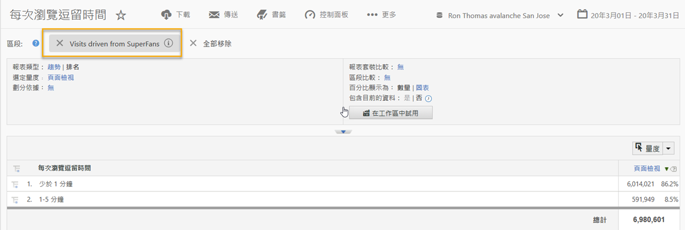
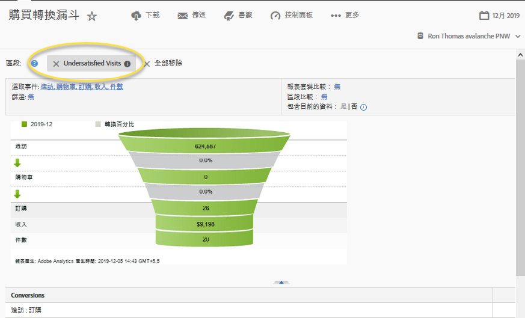

# 使用整合{#using-the-integration}

部署完成後，您就可以開始使用此整合提供的其他功能。

> [!NOTE] 您可能需要24-48小時，才能開始在Adobe Analytics報表中查看Qualtrics回應資料。

以下是從Adobe Analytics中取得此整合價值所要採取的動作。

1. 使用調查回應資料建立區段(請參 [閱建立區段](https://docs.adobe.com/content/help/en/analytics/components/segmentation/seg-home.html))。
1. 套用區段至關鍵報表。

## 範例 {#section-07051d0d60a44408a4e108034586c42f}

以下說明分析人員如何使用調查回應資料來定義Adobe Analytics區段。 此案例假設有調查問題，例如「您對今天的造訪有多滿意？」 使用這個問題，我們可以建立區段來識別「不滿意」的訪客。 此類區段可用於深入鑽研任何Adobe Analytics報表——例如購買轉換漏斗，如下所示。

 

