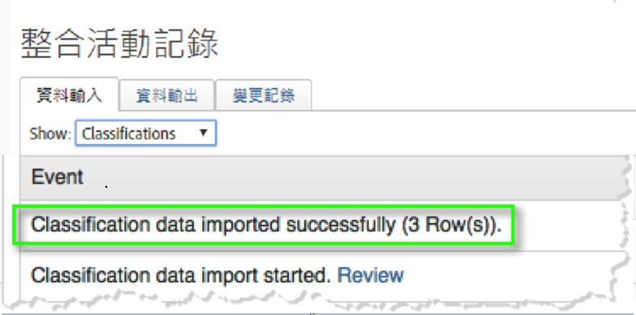
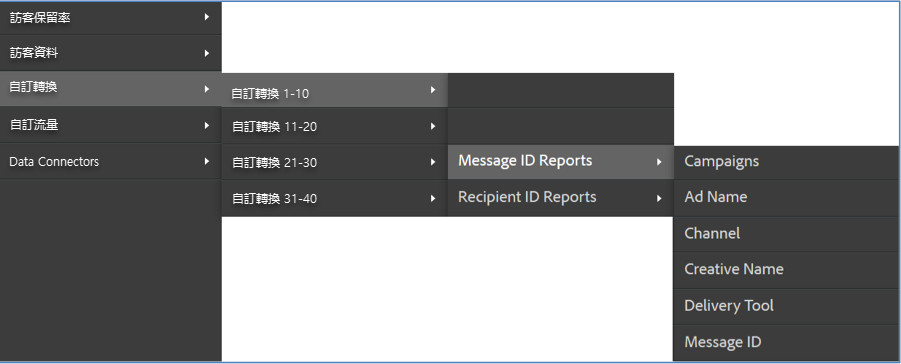

# 驗證整合{#verifying-the-integration}

部署後，您應透過下列檢查，驗證整合是否能成功傳輸資料。

1. 檢視整合活動記錄。
   1. 在 Adobe Experience Cloud中，導覽至&#x200B;**[!UICONTROL 「支援]** > **[!UICONTROL 整合活動記錄」]**。

      

   1. 尋找&#x200B;**[!UICONTROL 「成功匯入分類資料」]**、**[!UICONTROL 「成功匯入量度資料」]**、**[!UICONTROL 「成功匯出量度資料」]**&#x200B;等項目。這些項目應會在成功部署後 1 天內顯示。
1. 在 Adobe Analytics 中檢視您的報表資料。

   1. 導覽至&#x200B;**[!UICONTROL 「自訂轉換]** > **[!UICONTROL 自訂轉換 1-10]** > **[!UICONTROL 訊息 ID 報表」]**。

      

   1. 尋找 Responsys 報表。這項資料應會在成功部署後 24 到 48 小時內顯示。
