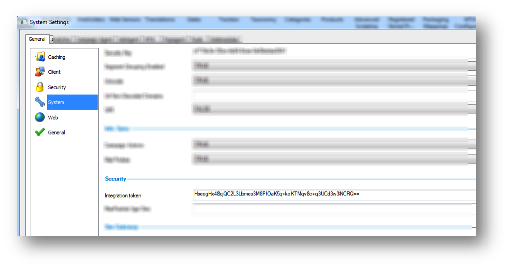

# Seligent的必要條件{#prerequisites-for-selligent}

列出您的Seligent帳戶提供的必要資訊，然後再部署整合。

**有效的Seririgent帳戶**

若要使用此Data Connectors整合，您必須擁有有效的Seligent帳戶。

**帳戶資訊**

在此整合設定期間，您將需要下列有關您的Seligent帳戶的資訊：

* **Adobe Service URL**：

   URL可從用來登入Seririgent行銷解決方案的URL衍生。以「/automation/omniture. asmx」取代URL的「/simweb/login. aspx」一部分。

   例如：http://<client-specific install url>/automation/omniture.asmx

* **查詢字串參數：** 這些項目會附加在訊息ID和收件者ID的著陸頁面URL(訪客ID)中。對於訊息ID和收件者ID，這些一律是MID和REST。

* **整合Token** 從Simweb內部啓動Manager工具，前往 **[!UICONTROL 「設定]** &gt; **[!UICONTROL 系統設定]** &gt; **[!UICONTROL 一般]** 」標籤&gt; **[!UICONTROL 系統]**。**[!UICONTROL 在「安全性]**」下，您可以找到整合代號。

   

