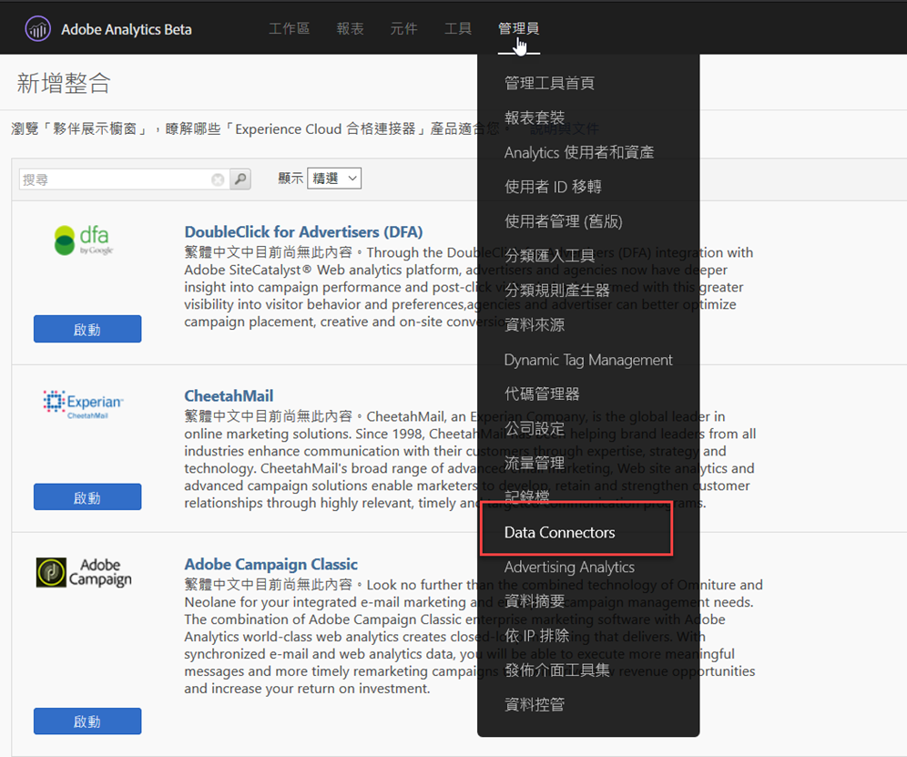
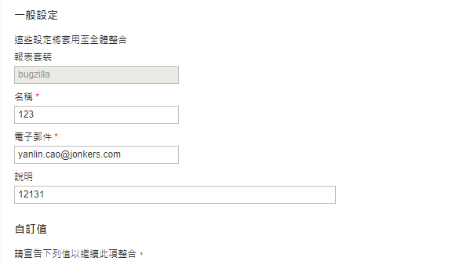
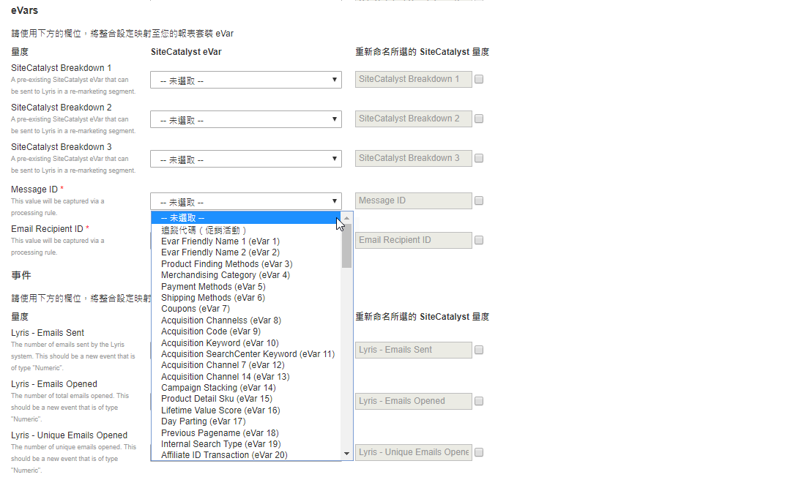

# 部署整合{#deploying-the-integration}

部署此項整合是一個簡單的3步驟程式。

## 完成整合精靈{#completing-the-integration-wizard}

若要啟動整合，您必須在「資料連接器」介面中完成「選擇性整合」精靈。

1. 導覽至Adobe Experience cloud中的「資料連接器」區域。

   

1. 在「 **[!UICONTROL 新增整合]**」下方，將Selligent外掛程式拖放至Adobe Experience Cloud。

   

   這將開啟Selligent Data Connector整合。

1. **整合設定**:選擇所要的報表套裝，並在「整合設定」下提供整合 **[!UICONTROL 的名稱]**。

1. 在「 **[!UICONTROL 自訂值]**」下方，填入所有與Selligent帳戶相關的資訊。

   

1. **變數對應**:從下拉式選單中選擇適當的保留eVar和事件：

   

1. **資料設定**:除了3個自動化合作夥伴區 **[!UICONTROL 段外]** ，您可在「您的區段」下選擇 **[!UICONTROL 您自己的區段]** 。

1. 此整合可能需要將數個資料點下載至您的Selligent帳戶。 您可以選擇在「存取請求」下授予相 **[!UICONTROL 同的存取權]**。
1. 在「 **[!UICONTROL 資料收集]**」下方，選擇自動或手動解決方案（JavaScript外掛程式），從著陸頁面URL收集查詢字串參數。 如果您選擇自動化解決方案，請為「訊息ID」和「收件者ID」輸入查詢字串參數，其分別為MID和RID。 如需JavaScript外掛程式，請連絡您的Adobe顧問。
1. **報表設定**:在「控 **[!UICONTROL 制面板產生]**」(Dashboard Generation)下，選中該框以自動為您生成「選擇」控制面板。

   

1. 檢閱整合摘要，然後按一 **[!UICONTROL 下啟動]**。

## Selligent中的配置{#configuration-within-selligent}

在Adobe Analytics內啟用「整合」後，「選擇」端就會啟用自動設定。

已建立追蹤器，可追蹤每封電子郵件。 如果您想要將其限制在特定網域，請更新追蹤器組態。

我們強烈建議您將URL中Adobe Analytics的追蹤參數移至最前面。 這將確保Adobe處理規則會從著陸頁面URL擷取參數。 勾選下方顯示的核取方塊以啟用追蹤。

## 驗證整合{#verifying-the-integration}

完成所有部署步驟後，您可以驗證整合是否成功傳輸資料。

資料交換需要幾天的時間才能開始。 在啟動整合後，請務必與Selligent聯絡。

### 整合活動記錄 {#section-927e270495db479fba9578915d9ae9c9}

導覽至「資料連接器」中的「自訂整合」。 在「支 **[!UICONTROL 援]** 」索引標籤下，您應會看到「已成功匯入量度資料」和／或「已匯入分類資料」等事件：

### 報告資料 {#section-ebd481a162324e66bd6dc8cb4b8d2424}

使用適當的度量檢視您的「選擇性訊息」報表。

1. 前往Adobe Experience cloud下的「報告與分析」。
1. 選取正確的報表套裝。
1. 在「 **[!UICONTROL 自訂轉換]**」下，選取「 **[!UICONTROL 訊息ID報表]** 」並選 **[!UICONTROL 擇「訊息ID/訊息名稱」]**。
