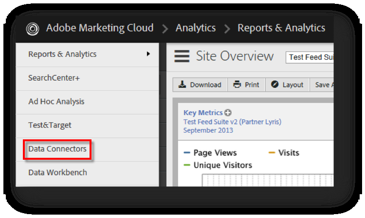

# 完成整合精靈{#completing-the-integration-wizard}

若要啓用整合，您必須在「資料連接器」介面中完成Seligent整合精靈。

1. 導覽至Adobe Marketing Cloud中的「資料連接器」區域。

   

1. 在 **[!UICONTROL 「新增整合]**」下，將「Seligent增效模組」拖放至Adobe Marketing Cloud。

   

   這將開啓「Seligent資料連接器整合」。

1. **整合設定**：選擇所需的報表套裝，並在整合設定下 **[!UICONTROL 提供整合的名稱]**。

1. 在 **[!UICONTROL 「自訂值]**」下，填寫您所有 [的Seligent帳戶相關資訊](../../selligent-overview/selligent-activation/selligent-prereqs-seligent.md#concept-071c594b1bcc465cbce7a6fda3f1d829)。

   

1. **變數對應**：從下拉式選單中選擇適當 [的保留eVar和事件](../../selligent-overview/selligent-activation/selligent-configure-variables.md#concept-907c2bdbed274c11a46d4cc323ef0238) ：

   

1. **資料設定**：您可以從三個自動化 ******[!UICONTROL 合作夥伴]** 區段選擇區段底下的區段。

1. 此項整合可能需要下載一些資料點至您的Seligent帳戶。您可以選擇在存取請求下 **[!UICONTROL 提供相同的存取權]**。
1. 在 **[!UICONTROL 「資料收集]**」下，選擇自動或手動解決方案(JavaScript外掛程式)，從著陸頁面URL收集查詢字串參數。如果您選擇自動化解決方案，請分別輸入MID和RITE的訊息ID和收件者ID的查詢字串參數。如需JavaScript外掛程式，請聯絡您的Adobe顧問。
1. **報表設定**：在 **[!UICONTROL 「控制面板產生]**」下，勾選方塊讓您自動產生Seligent控制面板。

   

1. 檢閱整合摘要，然後按一下 **[!UICONTROL 「啓動]**」。

