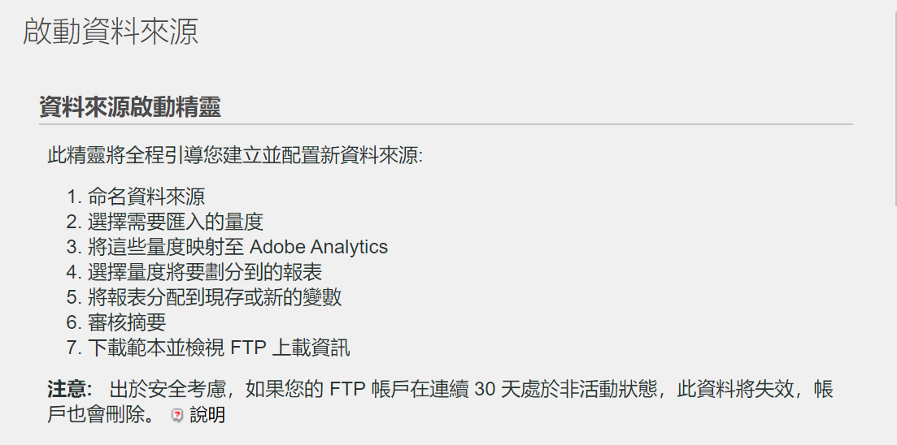

# 使用[!UICONTROL 資料來源]匯入[!UICONTROL 付費搜尋]量度

對許多行銷組織而言，付費搜尋是觸及新客戶及留住現有客戶的最有價值且最可靠的方法之一。 Adobe Analytics 中的[!UICONTROL 資料來源]功能可讓您從 Google AdWords 之類的數位廣告平台輕鬆地匯入進階付費搜尋資料。 您可以將其與行銷資料的其餘部分整合，連同網站上的行為和客戶屬性資料，好讓您更深入了解組織的付費搜尋工作。

這些步驟向您說明如何設定與 AdWords 的整合來匯入關鍵字，以及曝光數、點按數、每次點按成本等量度。

步驟中會說明如何設定每次點按付費資料的一次性匯入。 不過，[!UICONTROL 資料來源]可讓您使用這裡所述的檔案格式持續匯入資料。 根據您的付費搜尋平台，您或許可以排程定期匯出 (每天、每月等)、設定自動化流程來將這些匯出轉換成 Adobe Analytics 所需的檔案格式，以及將這些檔案上傳到 Adobe Analytics 以取得付費搜尋整合報告。

## 先決條件

* 您已實作付費搜尋偵測。
* 您正在擷取追蹤代碼資料。
* 您對每個廣告群組都有唯一的追蹤代碼。

## 設定[!UICONTROL 成功事件]

我們的第一步是準備 Adobe Analytics 來接收量度。 若要這樣做，您需要設定一些成功事件。

[!UICONTROL 成功事件]是可追蹤的動作。 [!UICONTROL 成功事件]的條件由您決定。 為了追蹤[!UICONTROL 付費搜尋]量度，我們想要設定圍繞著[!UICONTROL 點按數]、[!UICONTROL 曝光數]和[!UICONTROL 總成本]的[!UICONTROL 成功事件]，並啟用[!UICONTROL 追蹤代碼]。

1. 前往 **[!UICONTROL Adobe Analytics > 管理員 > 報表套裝]**。
1. 選取報表套裝。
1. 按一下&#x200B;**[!UICONTROL 編輯設定 > 轉換 > 成功事件]**。

   

1. 在「自訂成功事件」底下，使用&#x200B;**[!UICONTROL 新增]**&#x200B;建立 3 個自訂成功事件：[!UICONTROL 點按數] (計數器)、[!UICONTROL 曝光數] (計數器) 和[!UICONTROL 總成本] (貨幣)。

   

1. 按一下「儲存」。
您應該會收到一則訊息，告知您的儲存已被核准。
1. 瀏覽至&#x200B;**[!UICONTROL 管理員 > 報表套裝 > 編輯設定 > 轉換 > 轉換變數]**。
1. 選取&#x200B;**[!UICONTROL 行銷活動 > 行銷活動變數]**&#x200B;底下的&#x200B;**[!UICONTROL 追蹤代碼]**&#x200B;旁邊的核取方塊來啟用追蹤代碼。

   

## 設定資料來源

[!UICONTROL 資料來源]可讓您將非點按資料流資料與 Adobe Analytics 分享。 在此案例中，我們使用 Adobe Analytics 來追蹤付費搜尋量度。 我們使用追蹤代碼當作將兩個資料片段 (付費搜尋量度和 Adobe Analytics 量度) 繫結在一起的關鍵。

1. 瀏覽至 **[!UICONTROL Adobe Analytics > 管理員 > 所有管理員 > 資料來源]**。
1. 選取&#x200B;**[!UICONTROL 建立]**&#x200B;索引標籤，開始啟用新的資料來源。
1. 在&#x200B;**[!UICONTROL 選取類別]**&#x200B;底下選取&#x200B;**[!UICONTROL 廣告行銷活動]**。

   

1. 在&#x200B;**[!UICONTROL 選取類型]**&#x200B;底下選取&#x200B;**[!UICONTROL 每次點按付費普通服務]**。
1. 按一下&#x200B;**[!UICONTROL 啟用]**。隨即顯示[!UICONTROL 資料來源啟用精靈]：

   

1. 按&#x200B;**[!UICONTROL 下一步]**，並為您的資料來源命名。 此名稱將出現在資料來源管理員中。
1. 接受服務合約，然後按&#x200B;**[!UICONTROL 下一步]**。
1. 選取三個標準量度：[!UICONTROL 曝光數]、[!UICONTROL 點按數]和[!UICONTROL 總成本]，然後按&#x200B;**[!UICONTROL 下一步]**。
1. 現在將這個新的資料來源「對應」到我們在[成功事件](/help/admin/admin/c-manage-report-suites/c-edit-report-suites/conversion-var-admin/c-success-events/success-event.md)中建立的自訂事件。

   

1. 選擇資料維度
選取「追蹤代碼」旁邊的方塊，然後按&#x200B;**[!UICONTROL 下一步]**。
1. 對應資料維度。
將匯入的資料維度 (屬性) 對應到您想要用來儲存它的 Adobe Analytics 屬性。 這可能是標準維度或 eVar。 當您按&#x200B;**[!UICONTROL 下一步]**&#x200B;之後，摘要中會顯示產生的對應：

   

1. 按一下&#x200B;**[!UICONTROL 儲存]**。
1. 按一下&#x200B;**[!UICONTROL 下載]**，為此資料來源下載範本檔案。
檔案名稱會對應到您一開始指定的資料來源類型 - 在此案例中即為「Generic Pay-Per-Click Service template.txt」。
1. 使用您最愛的文字編輯器開啟範本。
此檔案已填入量度和維度以及其對應。

## 匯出 PPC 資料並將其上傳到 Analytics

與這些類似的步驟也適用於 Google Adwords、MSN、Yahoo 和其他 PPC 帳戶。

### 匯出資料

1. 登入您的 PPC 帳戶並建立新的報表或匯出。
確定匯出包含以下欄位：日期、目的地 URL (登陸頁面)、曝光數、點按數和成本。 匯出可包含其他欄位，但您會在執行底下步驟時刪除這些欄位。
1. 如果可能的話，請將報表儲存為 `.csv` 或定位字元分隔的檔案。 這樣會讓報表更容易用於以下步驟。
1. 在 Microsoft Excel 中開啟檔案。

### 在 Microsoft Excel 中編輯檔案

1. 在 Microsoft Excel 中，刪除上述欄以外的所有欄。
1. 刪除上方任何多餘的列。
1. 若要將追蹤代碼與目的地 URL 分開：
a. 複製並貼上所有欄中的資料。
b. 按一下&#x200B;**[!UICONTROL 資料 > 資料剖析]**。
c. 在精靈中的步驟 1，確定已選取&#x200B;**[!UICONTROL 分隔符號]**，然後按&#x200B;**[!UICONTROL 下一步]**。
d. 在精靈中的步驟 2，根據您建立 URL 的方式來指定分隔符號 (? 或 &amp;)，然後按&#x200B;**[!UICONTROL 下一步]**。
e. 在精靈中的步驟 3，預覽您的資料，並確定其中一欄為「trackingcodename=trackingcode」。 如果您有其他變數，請重複這些步驟 (使用 &amp; 當作分隔符號)。
f. 刪除追蹤代碼、曝光率、點按數和成本以外的所有欄。 新增稱為「日期」的一個新欄，並依照以下順序組織您的欄：日期 :: 追蹤代碼 :: 曝光率 :: 點按數 :: 成本。
1. 將此資料新增到您在上述「設定資料來源」一節中所下載的範本。
現在，您已準備好上傳檔案。

### 透過 FTP 將檔案上傳到 Adobe Analytics

返回「資料來源精靈」來獲得指示，並透過 FTP 上傳檔案：

## 建立計算量度

在制定每次點按付費決策時，新增計算量度會很有幫助。

例如，您可以新增這些[計算量度](https://experienceleague.adobe.com/docs/analytics/components/calculated-metrics/calcmetric-workflow/cm-build-metrics.html?lang=zh-Hant#calculated-metrics)：

| 名稱 | 公式 | 量度類型 | 說明 |
| --- | --- | --- | --- |
| 每次瀏覽頁面檢視次數 | 頁面檢視次數/瀏覽次數 | 數值 | 套用至網站級別時: 顯示每次瀏覽的平均頁數。套用至「人氣最高的頁面」報告時: 顯示每次瀏覽特定頁面的平均檢視次數。 |
| 平均訂購值 | 收入/訂購量 | 貨幣 | 顯示每次訂購的平均收入。 |
| 每次瀏覽的收入 | 收入/瀏覽 | 貨幣 | 顯示每次瀏覽的平均收入。 |
| 點進率 (CTR) | 點按數/曝光數 | 數值 | 測量線上廣告或電子郵件行銷活動的點按與曝光數的比率。 |
| 利潤 | 收入 - 成本 | 貨幣 | 顯示行銷活動的收入扣掉成本。 |
| 每次曝光的利潤 (PPI) | (收入 - 成本)/曝光數 | 貨幣 | 顯示每次顯示廣告時所產生的收入 (扣掉成本)。 |
| 廣告投資報酬率 (ROAS) | 銷售金額/廣告支出 | 貨幣 | (ROI) 代表在相應廣告上所花的每一塊錢賺到了幾塊錢。 |

## 設定並執行報表

最後一個步驟是將資料來源量度及任何計算量度新增到「追蹤代碼」報表中，並深入研究行銷活動，以取得每個廣告群組的表現的立即檢視。

1. 在 **[!UICONTROL Adobe Analytics > 報表]**&#x200B;中，選取您已匯入資料來源的報表套裝。
1. 瀏覽至&#x200B;**[!UICONTROL 報表 > 行銷活動 > 追蹤代碼 > 追蹤代碼]**。
1. 選取日期範圍。
1. 按一下&#x200B;**[!UICONTROL 量度 > 新增]**，並從標準量度清單中新增您的資料來源量度 (點按數、曝光率、總成本)。
1. 針對您可能已新增的任何計算量度執行相同操作。 當您新增量度時，報表將會更新。
