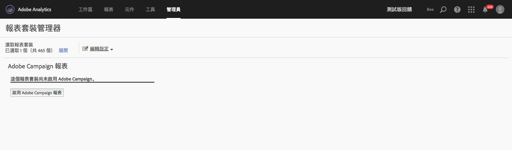

# Adobe Campaign Standard 報告

如需如何設定此整合的詳細資訊，請前往 [Adobe Campaign 文件](https://helpx.adobe.com/tw/campaign/standard/integrating/using/about-campaign-analytics-integration.html)。

>[!IMPORTANT]
>本文僅適用於 Adobe Campaign **Standard** 報告。請參閱[此處](https://experienceleague.adobe.com/docs/analytics/integration/analytics-to-campaign-classic.html)了解如何新增 Adobe Campaign **Classic** 報告。

這個 Adobe Analytics 與 Adobe Campaign Standard 之間的整合：

* 讓您從 Adobe Campaign Standard 共用您的 KPI (關鍵績效指標) 資料至 Adobe Analytics。
* 使用 Adobe Analytics 參數充實追蹤公式。
* 在&#x200B;**[!UICONTROL 「Analytics]** > **[!UICONTROL 報表]** > **[!UICONTROL Adobe Campaign」]**&#x200B;下方新增報表。
* 新增 5 個 Adobe Campaign 分類。
* 新增 9 個 Adobe Campaign 量度。
* 新增 6 個 Adobe Campaign 維度。
* 透過自動佈建的資料來源，每 15 分鐘就將資料同步到 Analytics。

## 步驟 1：啟用 Adobe Campaign Standard 報告 {#section_C685EF10505045708A6536BB13F6CD58}

若要在 Analytics 中檢視 Campaign Standard 資料，您必須先在報告套裝管理器中啟用 Campaign 報告。

1. 導覽至&#x200B;**[!UICONTROL 「Analytics]** > **[!UICONTROL 管理員]** > **[!UICONTROL 報表套裝]** > **`<select report suite>`** > **[!UICONTROL 編輯設定]** > **[!UICONTROL Adobe Campaign]** > **[!UICONTROL Adobe Campaign 報表」]**。
1. 按一下&#x200B;**[!UICONTROL 啟用 Campaign 報告功能]**。

   

## 步驟 2.檢視 Adobe Campaign 報表 {#section_9C18A29F3CC54BD4AC5EA96417F17B33}

Adobe Campaign Standard 和 Adobe Analytics 之間的整合，會在「**[!UICONTROL Analytics]** > **[!UICONTROL 報告]**」下方新增以下報告

* **[!UICONTROL Adobe Campaign 執行的傳送 ID]**：顯示從 Adobe Campaign 匯入、有關從 Adobe Campaign 傳送之電子郵件的資料。|

## 步驟 3：使用 Adobe Campaign 分類 {#section_74A28AF3F4CA4091943789DE4D8B2B63}

**[!UICONTROL 「Analytics]** > **[!UICONTROL 管理員]** > **[!UICONTROL 報表套裝]** > **`<select report suite>`** > **[!UICONTROL 編輯設定]** > **[!UICONTROL Adobe Campaign]** > **[!UICONTROL Adobe Campaign 分類」]**

在您針對 Adobe Campaign 啟用報表套裝後，以下分類即可使用：

| 分類 | 說明 |
| --- | --- |
| [!UICONTROL 傳送 ID] | 您在 Campaign 中看到的「內部傳送名稱」 |
| [!UICONTROL 傳送標籤] | Campaign 提供的傳送方式：個別傳送/定期傳送/交易傳送 |
| [!UICONTROL 行銷活動 ID] | 您在 Campaign 中看到的「內部行銷活動名稱」 |
| [!UICONTROL 行銷活動標籤] | Adobe Campaign 中的行銷活動 |
| [!UICONTROL 已執行傳送標籤] | 個別已執行傳送的清單 |

## Adobe Analytics 中可用的 Adobe Campaign Standard 維度和量度 {#section_F33385C9660644AF84172EC39601469B}

以下&#x200B;**量度**&#x200B;可透過 Adobe Analytics 報表套裝中的 Campaign 使用：

* Adobe Campaign 已傳送
* Adobe Campaign 已打開
* Adobe Campaign 已點擊
* Adobe Campaign 已傳送
* Adobe Campaign 不重複打開
* Adobe Campaign 不重複點擊
* Adobe Campaign 取消訂閱
* Adobe Campaign 彈回數總計
* Adobe Campaign 執行的傳送 ID 例項

以下&#x200B;**維度**&#x200B;可透過 Adobe Analytics 報表套裝中的 Campaign 使用：

| 維度名稱 | 定義 |
| --- | --- |
| 行銷活動 ID | 在活動期間傳送的 KPI 之所有行銷活動的 ID |
| 行銷活動標籤 | 行銷活動 ID 標籤 |
| 傳送 ID | 在活動期間傳送的 KPI 之所有傳送 ID亦包括循環傳送和交易傳送的主傳送 ID。範例：已排程循環傳送 DM1，而 DM2、DM3、DM4 和 DM5 是該循環傳送的子傳送。「傳送 ID」會顯示所有傳送的結果，從 DM1 至 DM5 都會顯示。 |
| 傳送標籤 | 傳送 ID 標籤 |
| 執行的傳送 ID | 僅限已執行傳送的 ID。沒有循環/交易主傳送的 ID。範例：已排程循環傳送 DM1，而 DM2、DM3、DM4 和 DM5 是該循環傳送的子傳送。已執行傳送 ID 會顯示從 DM2 到 DM5，實際已執行的傳送之所有傳送結果。 |
| 已執行傳送標籤 | 已執行傳送 ID 標籤 |
