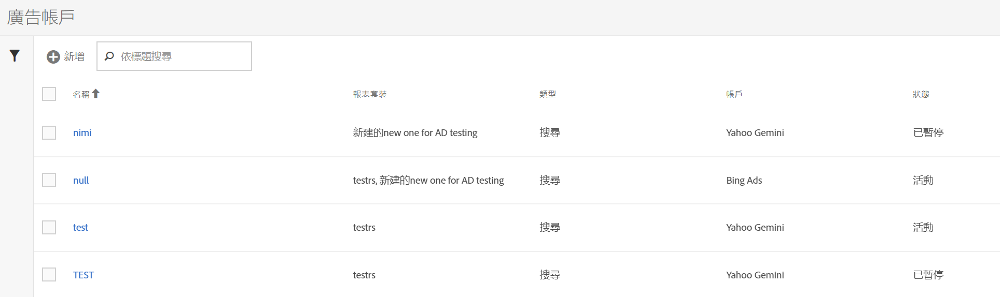

# 設定 Advertising 帳戶

Adobe Analytics管理員可以建立新的Advertising帳戶，並將多個帳戶對應至多個報表套裝（1 ：1， 1 ：許多、許多：許多）。

管理員還可[授權給非管理員](/help/integrate/c-advertising-analytics/overview.md#section_FCC58EB635954A32990D4E67B52B4369)，使其得以設定廣告帳戶。

<!--

-->

1. 在 Adobe Analytics 中，導覽至&#x200B;**[!UICONTROL 「管理員]** > **[!UICONTROL Advertising 帳戶」]**。
1. (僅限首次使用) 接受「一般使用者授權合約」的條款。
1. 選取&#x200B;**[!UICONTROL +新增]**。
1. 顯示[!UICONTROL 新搜尋引擎設定]對話方塊。

   

1. 依照下列准則填入&#x200B;**[!UICONTROL 搜尋引擎設定]**：

   | 設定 | 說明 |
   | --- | --- |
   | **[!UICONTROL 類型]** | 您有2個選項：**[!UICONTROL Google Adwords]**&#x200B;和&#x200B;**[!UICONTROL Bing Ads]**。  注意：Microsoft Bing 已於 2019 年 3 月 31 日併購 Yahoo Gemini，因此 Yahoo Gemini 廣告帳戶選項已無法繼續使用。 |
   | 帳戶名稱 | 您可以選擇將此帳戶名稱設為適合您的任何名稱。  帳戶名稱是出現在UI中的帳戶的易記名稱。 |
   | OAuth 代號 | **注意**： OAuth是存取許可權委派的開放標準，常用來授權給網站或應用程式存取網站上的資訊，但不提供密碼。 您注意到您被導向至協力廠商URL (efrontier.com)。 Adobe使用Adobe Media Optimizer來推動這三個搜尋引擎的OAuth驗證程式。 如果您使用Internet Explorer 11 （或更舊版本），將無法擷取這三個搜尋引擎的Oauth權杖。 請改用其他網頁瀏覽器。
選取&#x200B;**[!UICONTROL 擷取Token]**&#x200B;以啟動OAuth2驗證程式。 系統會要求您使用自己的認證登入您的Google/Bing搜尋帳戶。 根據您的選擇，程式會有些微差異： <ul><li>Google Adwords：提供 Google 帳戶 ID</li><li>Microsoft Bing：提供 Bing 帳戶 ID 和 Bing 客戶 ID。</li></ul>如需這些 ID 的相關資訊，請參閱[尋找您的帳戶 ID](/help/integrate/c-advertising-analytics/c-adanalytics-workflow/aa-locate-account-id.md)。 當您成功登入後，**[!UICONTROL OAuth 權杖]**&#x200B;欄位會顯示&#x200B;**[!UICONTROL 已擷取]**。 |

1. 在&#x200B;**[!UICONTROL 追蹤]**區段中，您提供如何使用Adobe Analytics實作追蹤資料的資訊。 追蹤是使用搜尋引擎資料適度增加Adobe Analytics資料的必要步驟。
依照以下準則填入**[!UICONTROL 「追蹤設定」]**：

   | 設定 | 說明 |
   | --- | --- |
   | 類型 | <ul><li>**自動**：讓Advertising Cloud引擎決定如何將追蹤引數附加到的追蹤範本/目的地URL。 [!UICONTROL 自動型別追蹤]是最簡單的方法，但可能不會產生最佳的整合資料集。 **重要：**&#x200B;若要使用[!UICONTROL 自動型別追蹤]設定搜尋引擎帳戶，您必須執行下列動作：<ul><li>`s_kwcid`引數和值已新增至帳戶中的帳戶追蹤範本或登陸頁面URL。 引數和值會插入在URL的結尾。 如果您的網頁伺服器在URL末端需要特定`key=value`配對，則可能需要執行其他動作。 或需要更新以支援URL中的任何新`key=value`配對。 **附註**：進一步瞭解您是否應該將此引數新增至您的[內容安全性原則](https://experienceleague.adobe.com/en/docs/id-service/using/reference/csp)。</li><li>此外，關鍵字可作為 `s_kwcid` 值的一部分插入至登陸 URL 中。如果關鍵字包含特殊字元或符號，請確認您的網頁伺服器可以支援這些字元。 `+`是常見的特殊字元範例，用於「修改廣泛比對」關鍵字。</li></ul></li><li>**手動**：讓您管理如何將追蹤引數新增到搜尋引擎的追蹤範本/目的地URL。 [如需各個搜尋引擎的相關資訊，請參閱這些手動追蹤範例](/help/integrate/c-advertising-analytics/c-adanalytics-workflow/aa-manual-vs-automatic-tracking.md)。</li></ul> |

1. 在&#x200B;**[!UICONTROL 對應]**&#x200B;區段中，選取一或多個報表套裝以連結至此搜尋引擎帳戶。 在儲存 Advertising 帳戶之前，您必須先提供至少一個報表套裝。您可以將多個帳戶對應至多個報表套裝（1 ：1， 1 ：許多、許多：許多）。 請注意，Adobe Media Optimizer從搜尋引擎提取的資料只會複製到任何對應的報表套裝，因此不會分割資料。

   >[!IMPORTANT]
   >
   >只有對應至 Experience Cloud 組織的報表套裝才可供選取。 如果畫面並未列出您的報表套裝，請參閱[疑難排解 Advertising Analytics](/help/integrate/c-advertising-analytics/c-adanalytics-workflow/aa-troubleshooting.md)。

   依照以下準則進行&#x200B;**[!UICONTROL 「對應設定」]**：

   | 設定 | 說明 |
   | --- | --- |
   | 報表套裝對應 | 報表套裝對應決定與此搜尋引擎帳戶相連結的報表套裝。換句話說，這會決定要將搜尋引擎資料傳送到哪些報表套裝中。 |

1. 選取「**[!UICONTROL 儲存]**」。
1. 免責宣告會顯示警告清單。 確認您已閱讀並瞭解本合約。 選取核取方塊，然後選取&#x200B;**[!UICONTROL 確定]**。

   此時，系統會將您導向 Advertising 帳戶[管理使用者介面](/help/integrate/c-advertising-analytics/c-adanalytics-workflow/aa-manage-ad-accounts.md)，而新建立的帳戶應該會列示在其中。

>[!NOTE]
>
>搜尋引擎資料會在24小時之後開始填入Analytics報表，請耐心等候。
