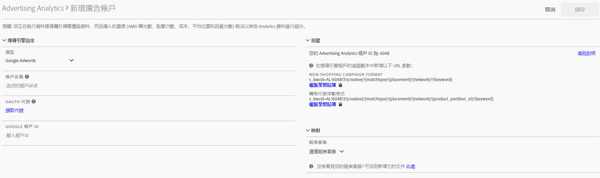

# 設定 Advertising 帳戶

Adobe Analytics管理員可以建立新的廣告帳戶，並將多個帳戶對應至多個報表套裝(1:1、1:Many、Many:Many)。

管理員也可 [以授與非管理員的存取權](/help/integrate/c-advertising-analytics/overview.md#section_FCC58EB635954A32990D4E67B52B4369) ，以設定廣告帳戶。

1. 在Adobe Analytics中，導覽至 **[!UICONTROL Admin]** > **[!UICONTROL Advertising Accounts]**。
1. （僅限首次使用）接受使用者授權合約條款。
1. 按一下 **[!UICONTROL + Add]**.
1. 對話 [!UICONTROL New Search Engine Account] 框隨即顯示：

   

1. 請填寫下列 **[!UICONTROL Search Engine Settings]** 准則：

   <table id="table_B3BE66B7D4C54766B8FFD2C6DCD657AF"> 
    <thead> 
      <tr> 
      <th colname="col1" class="entry"> 設定 </th> 
      <th colname="col2" class="entry"> 說明 </th> 
      </tr>
    </thead>
    <tbody> 
      <tr> 
      <td colname="col1"> 
類型 
 </td> 
      <td colname="col2"> 
您有 2 個選項：Google AdWords 和 Microsoft Bing Ads。 
 
注意：Microsoft Bing 已於 2019 年 3 月 31 日併購 Yahoo Gemini，因此 Yahoo Gemini 廣告帳戶選項已無法繼續使用。  
 </td> 
      </tr> 
      <tr> 
      <td colname="col1"> 
帳戶名稱 
 </td> 
      <td colname="col2"> 
您可以選擇將此帳戶名稱設定為任何適合您的名稱。 這是將顯示在UI中的帳戶好記名稱。 
 </td> 
      </tr> 
      <tr> 
      <td colname="col1"> 
OAuth Token 
 </td> 
      <td colname="col2"> 
注意：OAuth 是存取權限委派的開放標準，普遍用來授權給網站或應用程式，以便在不提供密碼的情況下，使其得以存取自身在其他網站上的資訊。 
 
注意：您將發現自己已經重新導向至協力廠商 URL (efrontier.com)。Adobe 使用 efrontier 來推動這三個搜尋引擎的 OAuth 驗證程序。 
 
注意：如果您使用 Internet Explorer 11 (或更早版本)，將無法成功擷取這三個搜尋引擎的 Oauth 代號。請改用其他網頁瀏覽器。 
 
按一下 「擷取Token 」會啟動OAuth2驗證程式。 這表示系統會要求您使用您的認證登入Google/Bing搜尋帳戶。 依您選擇的搜尋引擎不同，操作程序會有些微差異： 
 
        <ul id="ul_FC9B5612F6554495B04C357CB0AB72EB"> 
        <li id="li_CD54231BFF134F83B3B5B14B34A0E1D2">Google Adwords：提供 Google 帳戶 ID。 </li> 
        <li id="li_89B9D54BAA914E5DB2959B193489582E">Microsoft Bing：提供 Bing 帳戶 ID 和 Bing 客戶 ID。 </li> 
        </ul> 
Refer to <a href="/help/integrate/c-advertising-analytics/c-adanalytics-workflow/aa-locate-account-id.md"  > Locate your Account ID</a> for information on these IDs. 
 
成功登入後，「OAuth 代碼」欄位會顯示 
        <systemoutput>
          「已擷取」
        </systemoutput>。 
 </td> 
      </tr> 
    </tbody> 
    </table>

1. In the **[!UICONTROL Tracking]** section, you provide information on how the Search Engine data is tracked by your Adobe Analytics implementation. 這是以搜尋引擎資料適度增加 Adobe Analytics 資料的必要步驟。請填寫下列 **[!UICONTROL Tracking Settings]** 准則：

   <table id="table_1AB4E31456E84ABF8209B02058259C4D"> 
    <thead> 
      <tr> 
      <th colname="col1" class="entry"> 設定 </th> 
      <th colname="col2" class="entry"> 說明 </th> 
      </tr>
    </thead>
    <tbody> 
      <tr> 
      <td colname="col1"> 
類型 
 </td> 
      <td colname="col2"> 
        <ul id="ul_1C5A0502A4984E57A08417A91CCD6FFE"> 
        <li id="li_5736E38286FF494ABDDC6E85281D7F2A"> 自動：讓 Advertising Cloud 引擎決定如何將追蹤參數附加到搜尋引擎的追蹤範本/目的地 URL。這是最簡單的方法，但可能不會產生最佳的整合資料集。 
重要：若要在「自動模式」中設定搜尋引擎帳戶，您必須執行以下動作： 
          <ul id="ul_4FF9D1E3CC4E452BA339E0A725D29FEE"> 
            <li id="li_6F3A6D6259C0420CB7E6FD2C26A1B6E0">"s_kwcid"參數和值將新增至所新增帳戶中的帳戶追蹤範本或著陸頁面URL。 這將插入URL結尾處。 因此，如果您的網頁伺服器在URL結尾需要特定key=value配對，或需要更新來支援URL中任何新key=value配對，則可能需要在您的部件上採取其他動作。 </li> 
            <li id="li_A04D4AA31A934392808639E46C86573F">此外，關鍵字可插入著陸URL做為"s_kwcid"值的一部分，因此，如果關鍵字包含特殊字元或符號，請確認您的網頁伺服器可支援這些字元（常見特殊字元的範例是"+"，用於"Broad Match Modified"關鍵字）。 </li> 
          </ul> 
 </li> 
        <li id="li_EAA7A7CA1E584854A7EC1E43E13B63FE">手動：讓您管理如何將追蹤參數新增到搜尋引擎的追蹤範本/目的地 URL。<a href="/help/integrate/c-advertising-analytics/c-adanalytics-workflow/aa-manual-vs-automatic-tracking.md"  >如需各個搜尋引擎的相關資訊，請參閱這些手動追蹤範例</a>。 </li> 
        </ul> </td> 
      </tr> 
    </tbody> 
    </table>

1. 在區 **[!UICONTROL Mapping]** 段中，您選擇要連結至此搜尋引擎帳戶的報表套裝。 您必須至少提供一個報表套裝，才能儲存廣告帳戶。 您可以將多個帳戶對應至多個報表套裝（1:1、1：多、多：多）。 請注意，AMO從搜尋引擎提取的資料只會複製到任何對應的報表套裝，因此不會分割資料。

   >[!IMPORTANT]
   >
   >僅限[對應至 Experience Cloud 組織](https://marketing.adobe.com/resources/help/en_US/mcloud/map-report-suite.html)的報表套裝可供選取。如果畫面並未列出您的報表套裝，請參閱[疑難排解 Advertising Analytics](/help/integrate/c-advertising-analytics/c-adanalytics-workflow/aa-troubleshooting.md)。

   以下準 **[!UICONTROL Mapping Settings]** 則：

   <table id="table_AF876DC40F97403882C0AA528BD204FF"> 
    <thead> 
      <tr> 
      <th colname="col1" class="entry"> 設定 </th> 
      <th colname="col2" class="entry"> 說明 </th> 
      </tr>
    </thead>
    <tbody> 
      <tr> 
      <td colname="col1"> 
報表套裝 映射 
 </td> 
      <td colname="col2"> 
報表套裝對應會決定連結至此搜尋引擎帳戶的報表套裝。 換言之，它會決定搜尋引擎資料要傳入的報表套裝。 
 
如果您的報表套裝並未列出，可以使用這個工具<a href="https://marketing.adobe.com/resources/help/en_US/mcloud/map-report-suite.html"  >將報表套裝對應到 Experience Cloud 組織</a>。 
 </td> 
      </tr> 
    </tbody> 
    </table>

1. 按一下 **[!UICONTROL Save]**.
1. 儲存後，免責聲明會顯示一份警告清單。 系統會要求確認您已閱讀合約並了解其中的條款。Click the checkbox, then click **[!UICONTROL OK]**.

   您現在會進入「廣告帳戶管 [理」UI](/help/integrate/c-advertising-analytics/c-adanalytics-workflow/aa-manage-ad-accounts.md)，新建立的帳戶應列在此處。

>[!NOTE] 搜尋引擎資料會在 24 小時之後開始填入 Analytics 報表，請耐心等候。

