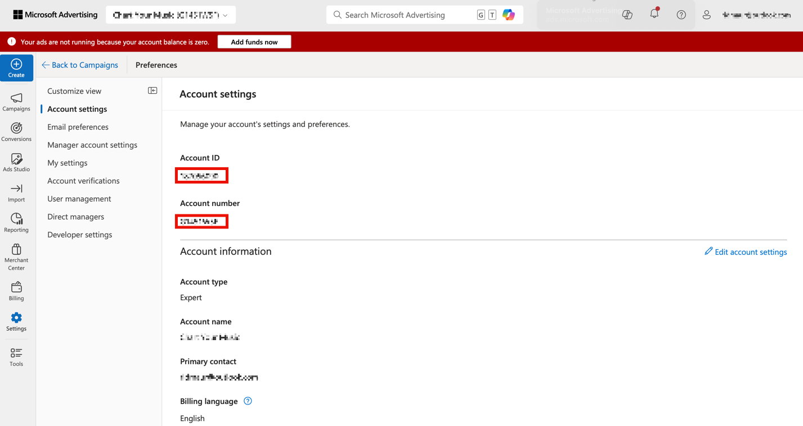

# 找出您的帳戶 ID {#locate-your-account-ids}

瞭解如何找出您的Google Ads和Microsoft Advertising帳戶ID。

## Google Ads (AdWords) {#google}

>[!IMPORTANT]
>
>Google Ads使用兩種型別的帳戶：
>
>- MCC （我的使用者端中心）帳戶，以及
>- 標準帳戶。
>
>為了與Adobe Analytics整合，**您必須使用標準帳戶登入**，而不是MCC帳戶登入。 原因在於MCC帳戶就像是「傘狀」帳戶，使用者只要憑藉同一組登入資訊，就能存取多個Google Ads帳戶，但標準帳戶登入資訊的每組登入資訊只能存取一個帳戶。 雖然Google支援連結一個電子郵件來管理5個帳戶，但Advertising Analytics尚未支援此功能。 一個電子郵件只能與一個Google Ads帳戶連結。

按一下右上角的「帳戶」圖示，檢視Google Ads帳戶號碼（客戶ID）。

## Microsoft Advertising (Bing) {#microsoft}

>[!NOTE]
>
>如果您的Microsoft Advertising （先前稱為Bing）帳戶使用Google匯入功能，請務必更新正確的追蹤字串。 追蹤字串不會自動從Google版本更新為正確的Microsoft Advertising追蹤字串，而且可能會產生未指定的資料。 如需詳細資訊，請參閱Microsoft Advertising說明中的[從Google Ads匯入的專案](https://help.ads.microsoft.com/apex/index/3/en/50851/)。

**[!UICONTROL 帳戶ID]**&#x200B;和&#x200B;**[!UICONTROL 管理員帳戶ID]**&#x200B;都是必要的。

- **[!UICONTROL 帳戶ID]**&#x200B;位於&#x200B;**[!UICONTROL 設定]** > **[!UICONTROL 帳戶設定]** > **[!UICONTROL 帳戶ID]**&#x200B;之下。 確定您使用[!UICONTROL 帳號ID]，而非[!UICONTROL 帳號]。
- **[!UICONTROL 管理員帳戶ID]**&#x200B;位於&#x200B;**[!UICONTROL 設定]** > **[!UICONTROL 管理員帳戶設定]** > **[!UICONTROL 管理員帳戶ID]**&#x200B;之下。 請確定您使用[!UICONTROL 管理員帳號ID]，而非[!UICONTROL 管理員帳號]。

>[!CONTEXTUALHELP]
>id="adanalytics_ma_account_id"
>title="帳戶 ID"
>abstract="「帳戶ID」是位於Microsoft Advertising介面中的數值。 您可以導覽至「設定>帳戶設定>帳戶ID」找到它。"

>[!CONTEXTUALHELP]
>id="adanalytics_ma_manager_account_id"
>title="經理帳戶ID"
>abstract="「管理員帳戶ID」是位於Microsoft Advertising介面中的數值。 您可以瀏覽至「設定>管理員帳戶設定>管理員帳戶ID」，找到它。"
