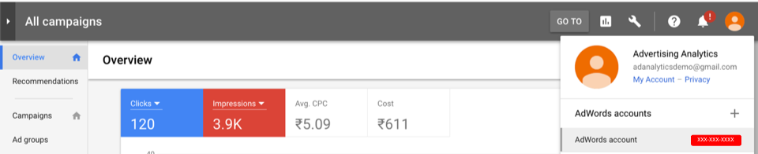

# 找出您的帳戶 ID

本文提供尋找 Google 和 Bing 帳戶 ID 的相關指示。

## Google AdWords {#section_2A62AD448BD949889DB77C2AF3E04C33}

>[!IMPORTANT]
>
>Google AdWords 使用兩種類型的帳戶：a) MCC (我的客戶中心) 帳戶和 b) 標準帳戶。針對與 Adobe Analytics 的整合，**您必須使用標準帳戶登入資訊，而不是 MCC 帳戶登入資訊**。原因在於 MCC 帳戶就像是「傘狀」帳戶，使用者只要憑藉同一組登入資訊，就能存取多個 AdWords 帳戶，但標準帳戶登入資訊的每組登入資訊只能存取一個 AdWords 帳戶。雖然Google支援連結一封電子郵件以管理5個帳戶，但Advertising Analytics尚未支援此功能。 一封電子郵件只能與一個Adwords帳戶連結。

請按一下右上角的「帳戶」圖示來檢視 AdWords 帳號 (客戶 ID)。

## Bing {#section_F1B9C7E997444746936599732CD62665}

>[!NOTE]
>
>如果您的Bing帳戶使用Google匯入功能，請務必更新正確的追蹤字串。 追蹤字串不會自動從Google版本更新為正確的Bing追蹤字串，而且可能會產生未指定的資料。 有關此功能的詳細資訊，請參 [閱](https://help.ads.microsoft.com/apex/index/3/en/50851/)。

須同時提供帳戶 ID 和客戶 ID。這些資訊皆列示於「帳戶」標籤中。

>[!NOTE] 帳號與帳戶 ID 不同。

