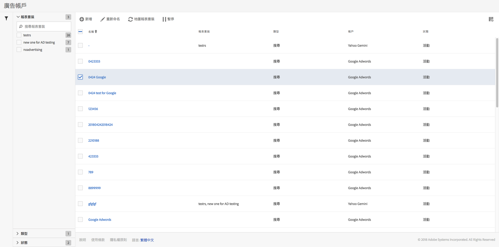

# 管理廣告帳戶

You can access the Management UI by navigating to **[!UICONTROL Admin]** &gt; **[!UICONTROL Advertising Accounts]**.

<table id="table_BE318026CF024E94A885EED86AA7077F"> 
 <thead> 
  <tr> 
   <th colname="col1" class="entry"> 元素 </th> 
   <th colname="col2" class="entry"> 定義 </th> 
  </tr>
 </thead>
 <tbody> 
  <tr> 
   <td colname="col1"> 
<b>動作</b> 
 </td> 
   <td colname="col2"> 
<b>注意：只有在您至少選取一個廣告帳戶時，才會顯示動作。 </b> 
 </td> 
  </tr> 
  <tr> 
   <td colname="col1"> 
+ 新增 
 </td> 
   <td colname="col2"> 
系統會將您導向<a href="../../../integrate/c-advertising-analytics/c-adanalytics-workflow/aa-create-ad-account.md#concept_1958E8C15C334E8B9DC510EC8D5DCA7C" format="dita" scope="local">「Advertising 帳戶」</a>使用者介面。 
 </td> 
  </tr> 
  <tr> 
   <td colname="col1"> 
重新命名 
 </td> 
   <td colname="col2"> 
為此帳戶重新命名，則變更會反映在所有與帳戶相對應的報表套裝中。 
 </td> 
  </tr> 
  <tr> 
   <td colname="col1"> 
對應報表套裝 
 </td> 
   <td colname="col2"> 
讓您編輯報表套裝對應。 
 </td> 
  </tr> 
  <tr> 
   <td colname="col1"> 
暫停 
 </td> 
   <td colname="col2"> 
停用帳戶。若要再次啟動，請按一下「啟動」。 
 </td> 
  </tr> 
  <tr> 
   <td colname="col1"> 
<b>欄標題</b> 
 </td> 
   <td colname="col2"> </td> 
  </tr> 
  <tr> 
   <td colname="col1"> 
名稱 
 </td> 
   <td colname="col2"> 
指派給此廣告帳戶的名稱。 
 </td> 
  </tr> 
  <tr> 
   <td colname="col1"> 
報表套裝 
 </td> 
   <td colname="col2"> 
與此廣告帳戶對應的報表套裝。 
 </td> 
  </tr> 
  <tr> 
   <td colname="col1"> 
類型 
 </td> 
   <td colname="col2"> 
我們目前只支援一種類型: 搜尋。 
 </td> 
  </tr> 
  <tr> 
   <td colname="col1"> 
帳戶 
 </td> 
   <td colname="col2"> 
列出支援的帳戶類型之一：Google Adwords或Bing Ads。 
 </td> 
  </tr> 
  <tr> 
   <td colname="col1"> 
狀態 
 </td> 
   <td colname="col2"> 
狀態指標有 2 種: 
 
    <ul id="ul_376263DEF6EE44B48564D272D3CBFCBC"> 
     <li id="li_75E329B68B4D4E929E227E717C993082"><b>作用中</b>: 帳戶目前正常提取搜尋資料。 </li> 
     <li id="li_5E2DF98B22D34437A2A2C93F996C1EA2"><b>已暫停</b>: 帳戶目前已停用，因此未提取搜尋資料。 </li> 
    </ul> </td> 
  </tr> 
  <tr> 
   <td colname="col1"> 
<b>篩選器</b> 
 </td> 
   <td colname="col2"> 
(左邊界) 您可以根據「報表套裝」、「類型」及「狀態」來篩選廣告帳戶。 
 </td> 
  </tr> 
 </tbody> 
</table>

