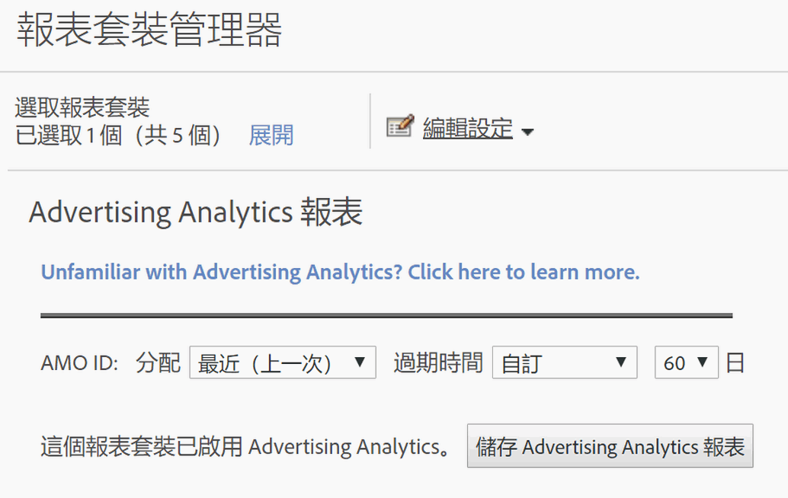

# 啟用 Advertising Analytics 的報表套裝

若要在 Analytics 檢視任何 Advertising Analytics 搜尋資料，您需要為 Advertising Analytics 報表設定每一個已與 Experience Cloud 對應的報表套裝。

1. [將報表套裝對應至組織](https://docs.adobe.com/content/help/en/core-services/interface/about-core-services/report-suite-mapping.html)。
1. 導覽至 **[!UICONTROL Admin]** > **[!UICONTROL Report Suites]**。

1. 選取已對應至您 Experience Cloud 組織的報表套裝。
1. 按一下 **[!UICONTROL Edit Settings]** > **[!UICONTROL Advertising Analytics Configuration]**.

   

   > [!IMPORTANT]AMO ID 代表要插入搜尋資料的 Adobe Advertising Cloud 變數。

1. 請設定您想要 AMO ID 變數使用的變數配置和到期日。轉換變數 (eVars) 可讓 Adobe Analytics 將成功事件歸因於特定變數值。有時候，變數在感應到成功事件之前會遇到一個以上的值。在此情況下，配置會決定哪個變數值可以取得該事件的評分。

   | 設定 | 定義 |
   |--- |--- |
   | 原始值 (首次) | 第一個顯示的值擁有完全分配評價，無論該變數後續的值為何。 |
   | 最近 (最後一個) | 最後一個顯示的值擁有成功事件的完全分配評價，無論先前引發的變數為何。 |
   | 過期時間 | 可讓您指定時段或事件，在經過此時段或事件發生後 eVar 值就會過期 (即不再接收成功事件的評價)。如果成功事件發生在 eVar 過期後，「無」值會接收事件的評分 (沒有作用中的 eVar 值)。 |

1. 按一 **[!UICONTROL Enable Advertising Analytics Reporting]** 下（首次）或 **[!UICONTROL Update Advertising Analytics Reporting]** （後續時間）。 您的報表套裝現在已準備就緒，可以接收 Advertising Analytics 搜尋資料。您現在已經準備就緒，可以[建立 Advertising 帳戶](/help/integrate/c-advertising-analytics/c-adanalytics-workflow/aa-create-ad-account.md)了。

