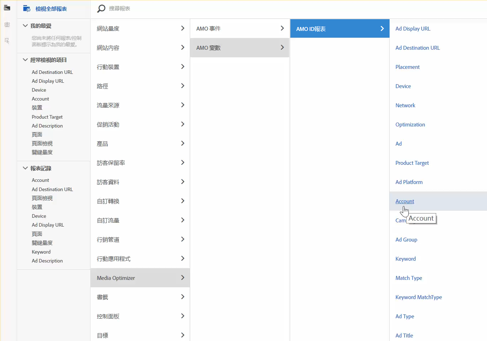

# Adobe Analytics中的廣告資料報告

Analysis Workspace 範本的詳細資料，以及在 Reports &amp; Analytics 和 Report Builder 的報告功能。

>[!NOTE]
>
>您應至少等候24小時，然後搜尋引擎資料才會開始填入您的Analytics報表中。並請注意，Analytics 報表不會傳回每小時精細度的資料，因為 AMO 資料不支援每小時精細度。

## Analysis Workspace: Search Engines {#section_8173F42B2C784F41B9FD82CBB66F9ADF}

透過此範本，任何實作此搜尋引擎整合作業的使用者得以存取 Analytics 豐富的搜尋引擎資料。You can access it via **[!UICONTROL Workspace]** &gt; **[!UICONTROL Templates]** &gt; **[!UICONTROL Advertising]** &gt; **[!UICONTROL Search Engines.]**

>[!NOTE]
>
>即使您尚未實作任何廣告帳戶，所有客戶都可以看到「廣告範本」類別。然而，如果嘗試開啟尚未針對特定公司佈建的「搜尋引擎」範本，系統便會顯示錯誤訊息，說明您尚未設定任何搜尋引擎帳戶。在此情況下，按一下&#x200B;**[!UICONTROL 「立即設定」]**&#x200B;即可前往[「Advertising 帳戶設定」](../../../integrate/c-advertising-analytics/c-adanalytics-workflow/aa-create-ad-account.md#concept_1958E8C15C334E8B9DC510EC8D5DCA7C)畫面。

       

| 表格/視覺化 | 說明 |
|--- |--- |
| 廣告趨勢 | AMO 曝光數、AMO 點選次數和 AMO 成本每天的趨勢概觀。 |
| 廣告平台 | 前個平台(Google、Bing)成本的環圈圖。 |
| 廣告平台總計 | 前幾大平台的自由表格 (依 AMO 曝光數、AMO 點選次數、AMO 成本、AMO 平均位置、AMO 平均值品質分數。 |
| 帳戶 | 成本的堆疊區域。 |
| 帳戶總計 | 前幾名帳戶的自由表格 (依相關聯量度劃分)。 |
| 行銷活動 | 行銷活動成本的長條圖。 |
| 行銷活動總計 | 前幾名行銷活動的自由表格 (依相關聯量度劃分)。 |
| 群組 | 成本的樹狀圖。 |
| 群組總計 | 前幾名廣告群組的自由表格 (依相關聯量度劃分)。 |
| 廣告 | 曝光率、點選次數和成本的橫條圖。 |
| 廣告總計 | 前幾名廣告的自由表格 (依相關聯量度劃分)。 |
| 關鍵字 | 所有關鍵字/符合類型組合的曝光率、點選次數和成本的散佈圖。 |
| 關鍵字總計 | 前幾名關鍵字/符合類型組合的自由表格 (依相關聯量度劃分)。 |

## Reports &amp; Analytics {#section_BB2E75DF909C49EA8D4E92D14D6DFD85}

當您設定 Advertising Analytics 帳戶後，便能使用 Advertising Analytics 報表。

## Report Builder {#section_8E0371CF81144C33990D909685D1726E}

當您設定 Advertising Analytics 帳戶後，便能使用 Advertising Analytics 報表。
