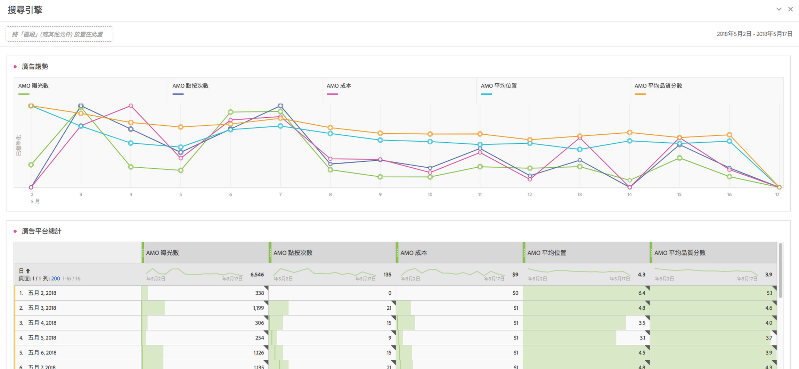
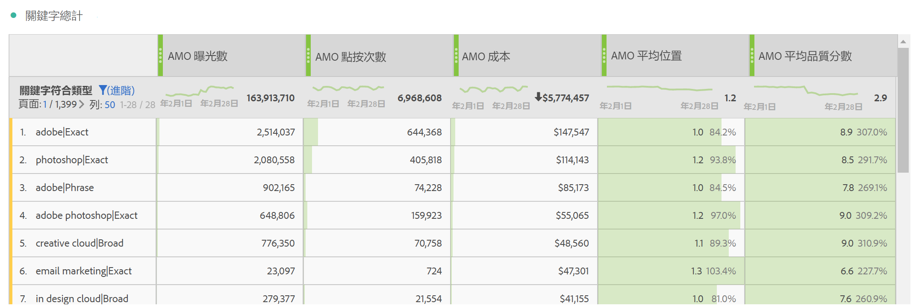
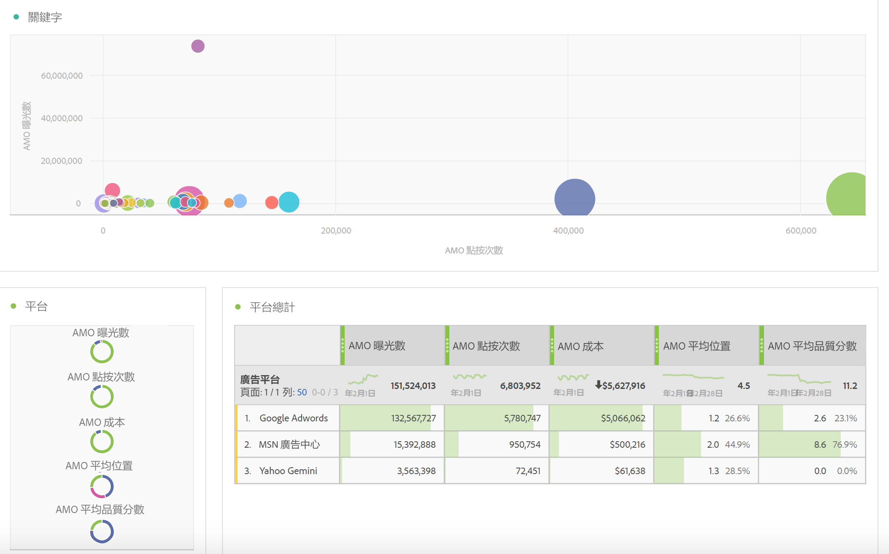
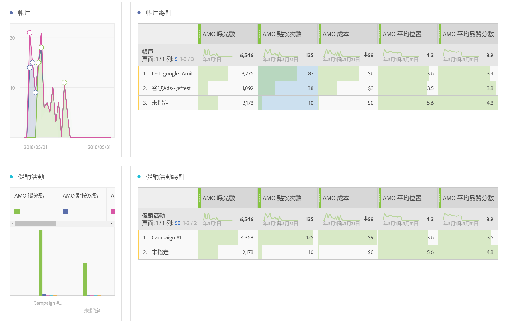
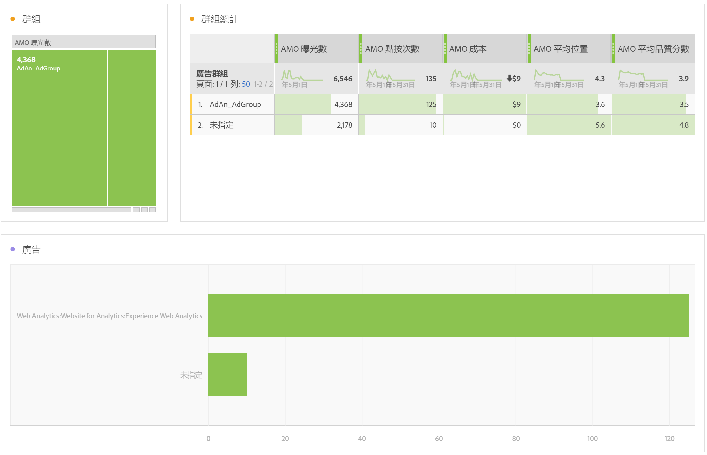
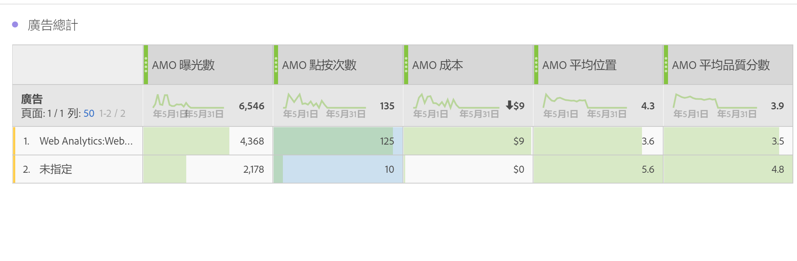

# 廣告資料報表

本文提供有關Analysis Workspace報表與Report Builder報表的詳細資訊。

>[!NOTE]
>
>搜尋引擎資料會在24小時之後開始填入Analytics報表，請耐心等候。 Analytics報表不會傳回每小時精細度的資料，因為Adobe Advertising資料不支援每小時精細度。

## 付費搜尋報告 {#section_8173F42B2C784F41B9FD82CBB66F9ADF}

此報表可讓任何實作搜尋引擎整合的人員存取Analytics中的搜尋引擎資料。 您可以透過&#x200B;**[!UICONTROL Workspace]** > **[!UICONTROL 報表]** > **[!UICONTROL 贏取]** > **[!UICONTROL Advertising Analytics：付費搜尋]**&#x200B;存取它

>[!NOTE]
>
>即使您尚未實作任何Advertising帳戶，所有客戶仍可看見「付費」搜尋報表。 如果您嘗試為尚未布建的公司開啟付費搜尋報告，則會出現錯誤訊息，說明您尚未設定任何搜尋引擎帳戶。 選取「**[!UICONTROL 立即設定]**」，系統會將您導向[Advertising帳戶設定](/help/integrate/c-advertising-analytics/c-adanalytics-workflow/aa-create-ad-account.md)畫面。

       

| 表格/視覺效果 | 說明 |
|--- |--- |
| 廣告趨勢 | AMO曝光數、AMO點按數和AMO成本的每日趨勢概觀。 |
| 廣告平台 | 2大平台(Google Ads、Microsoft Advertising)的成本環圈圖。 |
| 廣告平台總計 | 排名在前的平台的自由格式表格，依AMO曝光數、AMO點按數、AMO成本、AMO平均數劃分。 位置，AMO平均 品質分數。 |
| 帳戶 | 棧疊成本區域。 |
| 帳戶總計 | 排名最前的帳戶的自由表格，依相關量度劃分。 |
| 行銷活動 | 行銷活動成本的長條圖。 |
| 促銷活動總計 | 排名最前的行銷活動的自由表格，依相關量度劃分。 |
| 群組 | 成本樹狀圖。 |
| 群組總計 | 排名最前的廣告群組的自由表格，依相關量度劃分。 |
| 廣告 | 曝光數、點按數和成本的水準長條圖。 |
| 廣告總計 | 排名最前的廣告的自由格式表格，依相關量度劃分。 |
| 關鍵字 | 所有關鍵字/比對型別組合的曝光數、點按數和成本的散佈圖。 |
| 關鍵字總計 | 排名最前的關鍵字/相符型別組合的自由格式表格，依相關量度劃分。 |

## Report Builder {#section_8E0371CF81144C33990D909685D1726E}

當您設定Advertising Analytics帳戶後，Advertising Analytics報表即可供使用。
