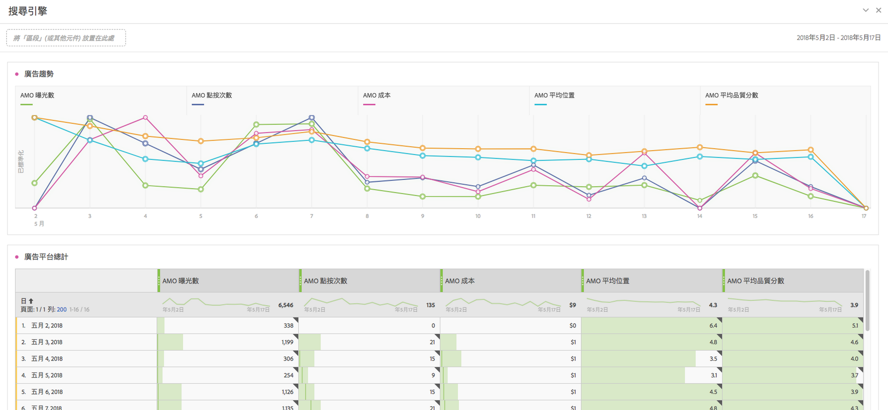

# Advertising Analytics

Advertising Analytics可讓您在Adobe Analytics中以並排方式檢視所有Google Ads和Microsoft Advertising付費搜尋資料。 以往，您只能在Adobe Advertising Cloud (AMO)或每個廣告介面中檢視任何Google Ads或Microsoft Advertising資料。 您現在可以直接從搜尋引擎以及AMO ID例項（按一下例項）取得曝光數、點選數和成本資料。

我們將來自這些搜尋引擎的資料全都帶到 Adobe Analytics 中，以便您運用 Analysis Workspace 的強大功能分析相同的資料。Workspace中新的[付費搜尋效能](/help/integrate/c-advertising-analytics/c-adanalytics-workflow/aa-report-ad-data-an.md)範本有助於進行此分析。

以下是這次整合所針對的客群：

* 需要為付費搜尋行銷人員收集績效報告的&#x200B;**分析人員**。
* 想要了解向自己網站傳送多少流量以及客戶轉換率的&#x200B;**付費搜尋行銷人員**。我有哪些符合成本效益的廣告促銷活動？

## 先決條件 {#prerequisites}

* Advertising Analytics 只適用於 Adobe Analytics [Select](https://www.adobe.com/tw/data-analytics-cloud/analytics/select.html)、[Prime](https://www.adobe.com/tw/data-analytics-cloud/analytics.htmlanalytics/prime.html) 及 [Ultimate](https://www.adobe.com/tw/data-analytics-cloud/analytics.htmlanalytics/ultimate.html) 的 SKU。
* 此功能適用於非 Advertising Cloud 以及非 AMO 的客戶。
* 您必須是Adobe Analytics管理員才能存取Advertising Analytics，或屬於已[授與Advertising Analytics存取權](/help/integrate/c-advertising-analytics/overview.md#permissions)的產品設定檔。
* 針對您要檢視Google Ads或Microsoft Advertising搜尋資料的任何報表套裝，您必須[啟用Advertising Analytics報表套裝](/help/integrate/c-advertising-analytics/c-adanalytics-workflow/aa-provision-rs.md) ( **[!UICONTROL 管理員]** > **[!UICONTROL 編輯設定]** > **[!UICONTROL Advertising Analytics設定]**)。
* 若要將搜尋帳戶整合至 Adobe Analytics，您需要擁有具備編輯權限之帳戶的使用者登入憑證，例如 Google 帳戶 ID 和密碼。
* 若是Microsoft Advertising，您也需要[[!UICONTROL 帳戶ID]和[!UICONTROL 經理帳戶ID]](c-adanalytics-workflow/aa-locate-account-id.md)。

## Advertising Analytics 權限 {#permissions}

Analytics有兩個許可權會自動授與Analytics管理員。 之後，管理員便可以選擇將這些權限授予非管理員使用者。

| 權限 | 定義 | 在登入 Adobe Experience Cloud 的情況下授予權限 |
| --- | --- | --- |
| Advertising Analytics 管理 | 可讓使用者設定/編輯/檢視廣告搜尋帳戶。 | 登入[adminconsole.adobe.com](https://adminconsole.adobe.com) > [!UICONTROL 產品] > [!UICONTROL Adobe Analytics] > [!UICONTROL 產品設定檔] > [!UICONTROL 許可權]索引標籤> [!UICONTROL Analytics工具] > [!UICONTROL Advertising Analytics管理] |
| Advertising Analytics 設定 | 可讓使用者設定要為 Advertising Analytics 佈建的報告套裝。 | 登入[adminconsole.adobe.com](https://adminconsole.adobe.com) > [!UICONTROL 產品] > [!UICONTROL Adobe Analytics] > [!UICONTROL 產品設定檔] > [!UICONTROL 許可權]索引標籤> [!UICONTROL Analytics工具] > [!UICONTROL Advertising Analytics設定] |

## Advertising Analytics維度和量度 {#dimensions-metrics}

Advertising Analytics將下列維度和量度新增至Analysis Workspace、Report Builder及Analytics Reporting API。

### 維度

>[!IMPORTANT]
>
>這次整合會透過 AMO ID 變數的分類，建立一組新的維度。這些新建立的維度並不會影響或修改您現有的行銷管道或宣傳活動追蹤變數維度。當訪客從付費搜尋廣告登陸網站時，AMO ID 便會連結到訪客的個人資料。在這種情況下，AMO 維度可用來劃分此整合提供的 AMO 量度以及訪客於下游擷取的任資料 (造訪次數、訪客數、頁面檢視次數、反彈率、訂單、收入、自訂事件等等)。在報告其他站上量度時，也可以透過其他維度劃分這些資料。
>
>這些量度的分類會每天更新。因此，如果您在搜尋引擎內變更中繼資料，您可能要在分類更新後翌日才能看到這些變更內容。

| 分類（維度）名稱 | 定義 |
| --- | --- |
| **[!UICONTROL 關鍵字MatchType (AMO ID)]** | 關鍵字比對類型。值通常會是廣泛、確切的詞句；如果沒有符合類型的廣告類型，則沒有值。 |
| **[!UICONTROL 廣告平台(AMO ID)]** | 搜尋引擎名稱。值可以包括「Google AdWords」或「Microsoft Bing Ads」。 |
| **[!UICONTROL 帳戶(AMO ID)]** | 受追蹤搜尋引擎帳戶的名稱。 |
| **[!UICONTROL 行銷活動(AMO ID)]** | 在搜尋引擎帳戶中的宣傳活動名稱。 |
| **[!UICONTROL 廣告群組(AMO ID)]** | 在搜尋引擎中的廣告群組名稱。 |
| **[!UICONTROL 廣告(AMO ID)]** | 用於廣告的廣告標題與廣告說明。 |
| **[!UICONTROL 關鍵字(AMO ID)]** | 來自您搜尋引擎帳戶的「關鍵字」值。 |
| **[!UICONTROL 符合型別(AMO ID)]** | 指派給關鍵字的關鍵字比對類型。值通常會是廣泛、確切的詞句；如果沒有符合類型的廣告類型，則沒有值。 |
| **[!UICONTROL 廣告型別(AMO ID)]** | 投放的廣告類型，通常為「文字廣告」。 |
| **[!UICONTROL 廣告標題(AMO ID)]** | 廣告中使用的標題物件。 |
| **[!UICONTROL 廣告說明(AMO ID)]** | 廣告中使用的廣告說明物件。 |
| **[!UICONTROL 廣告顯示URL (AMO ID)]** | 廣告中使用的廣告顯示 URL 物件。 |
| **[!UICONTROL 廣告目的地URL (AMO ID)]** | 指派給廣告的登陸頁面 URL 或最終 URL。 |
| **[!UICONTROL 網路(AMO ID)]** | 正在投放廣告的網路。若為 Advertising Analytics，此值一律為「Search」。 |
| **[!UICONTROL 位置(AMO ID)]** | 託管式版位網站 (內容網路用)。僅託管式版位會使用此維度。 |
| **[!UICONTROL 產品目標(AMO ID)]** | 用於 PLA 廣告的產品目標名稱 (非購買的實際產品)。 |
| **[!UICONTROL 最佳化(AMO ID)]** | Advertising Analytics 不使用。僅 Advertising Cloud 客戶會使用。 |
| **[!UICONTROL 裝置(AMO ID)]** | 目前不使用。廣告指定目標裝置 (而非訪客實際使用的裝置) 類型 (例如行動裝置或桌上型電腦)，未來可能的產品增強功能預留位置。 |

### 量度

>[!IMPORTANT]
>
>Advertising Analytics 提供的量度 (如下所示) 屬於搜尋引擎的摘要層級資料。這些量度並未連結到 Analytics 訪客個人資料，而是只連結到 AMO ID 變數及其相關聯的分類維度。在這種情況下，除了依據 AMO ID 維度的量度外，這些量度都不應由任何維度/區段進行報告。這樣做會導致 Analytics 將資料顯示為零。您可以將其與其他量度一併加入計算量度中，但這些計算量度僅應由 AMO ID 維度劃分。
>
>這些量度採用的是每日所得的資料，因此不會有當日的資料。此外，這些量度的報告精細度也不應少於每日報告一次。
>
>若登陸頁面設定了 AMO ID，則會設定一個 AMO ID 實例量度 (即「點閱率」)。此量度會以登陸頁面的點擊即時進行擷取，並可以由該登陸頁面設定的其他維度劃分。

| 量度名稱 | 定義 |
| --- | --- |
| **[!UICONTROL AMO曝光數]** | 根據搜尋引擎報告的廣告曝光次數。 |
| **[!UICONTROL AMO點按]** | 根據搜尋引擎報告的廣告點選次數。 |
| **[!UICONTROL AMO成本]** | 根據搜尋引擎報告，所獲悉之您為每個關鍵字/廣告支付的成本。 |
