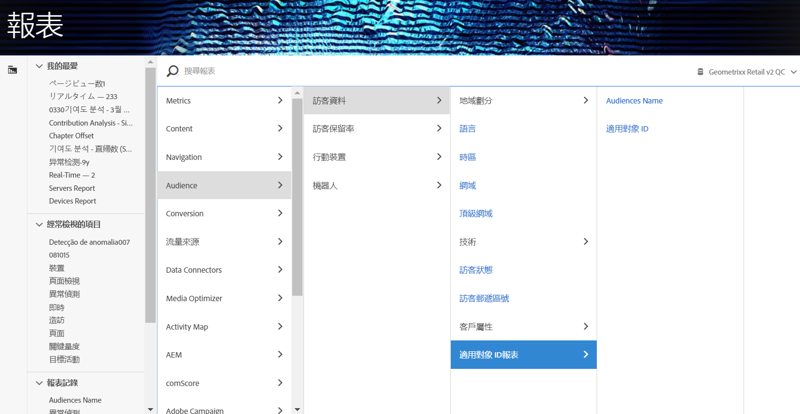

# 在 Analytics 中使用對象資料

您可以在整個 Analytics 中使用 AAM「對象」維度。整合的區段即是稱為「適用對象 ID」和「對象名稱」的新 Analytics 維度，且使用方式與 Analytics 收集的任何其他維度一樣。「資料摘要」中，「對象 ID」會儲存於「mc_audiences」欄。這些維度目前在 Data Workbench 或 Livestream 中均不可用。可以利用 Audiences 維度的部分例子包括：

## Analysis Workspace {#section_C70837499BEA4DED885B3486C9E02C68}

在 Analysis Workspace 中，AAM 區段會顯示為兩個維度。

1. 前往&#x200B;**[!UICONTROL 「工作區」]**。
1. 從&#x200B;**[!UICONTROL 「維度」]**&#x200B;清單中，選取&#x200B;**[!UICONTROL 「對象 ID」]**&#x200B;或&#x200B;**[!UICONTROL 「對象名稱」]**。名稱為易記的 ID 分類方式。

   

## 區段比較 {#section_E72B80B6470C42D4B9B19BE90E6070A2}

[區段比較](https://marketing.adobe.com/resources/help/zh_TW/analytics/analysis-workspace/segment-comparison.html)會找出兩個區段之間在統計上最顯著的差異。您可以兩種方式在「區段比較」中使用對象資料：1) 作為要比較的兩個區段，2) 作為「排名最前的維度項目」表格中的項目。

1. 前往&#x200B;**[!UICONTROL 「工作區」]**，然後從左欄選取&#x200B;**[!UICONTROL 「區段比較」]**&#x200B;面板。

1. 在&#x200B;**[!UICONTROL 「元件」]**&#x200B;功能表中，搜尋[!UICONTROL 對象名稱]。

1. 開啟[!UICONTROL 「對象名稱」]，以便顯示相關的維度項目。
1. 將您要比較的對象拖曳至「區段比較」產生器。
1. (選用)：您也可以帶入其他維度項目或區段，最多可比較 2 個區段。
1. 按一下&#x200B;**[!UICONTROL 「建立」]**。

   由於「對象 ID」和「對象名稱」維度是用於比較之兩個區段的額外個人資料，因此會自動出現在「排名最前的維度項目」表格中。

   

## Analysis Workspace 中的客戶歷程 (流量){#section_FC30E5795C9D4539838E30FE11FAEA6E}

AAM 區段資料是以逐次點擊的方式傳入 Analytics，並會在該時間點即時表示訪客的對象成員資格。也就是說，訪客可能會先歸入某個區段 (例如「察覺」)，之後再歸類到更符合的區段 (例如「考慮」)。您可以使用 Analysis Workspace 中的[「流量」](https://marketing.adobe.com/resources/help/zh_TW/analytics/analysis-workspace/flow.html)，以視覺化的方式呈現訪客在對象之間所採取的歷程。

1. 前往&#x200B;**[!UICONTROL 「工作區」]**，然後從左欄選取&#x200B;**[!UICONTROL 「流量」]**&#x200B;視覺效果。

1. 將[!UICONTROL 「對象名稱」]維度拖曳至「流量」產生器。
1. 按一下&#x200B;**[!UICONTROL 「建立」]**。
1. (選用)：將任何其他維度拖曳至「流量」視覺效果可建立[維度間流量](https://marketing.adobe.com/resources/help/zh_TW/analytics/analysis-workspace/multi-dimensional-flow.html)。

對象也可用於[流失視覺效果](https://marketing.adobe.com/resources/help/zh_TW/analytics/analysis-workspace/fallout_flow.html)中。

## Analysis Workspace 中的文氏圖表視覺效果{#section_E78AB764FB5047148B51DC1526B0DF89}

[文氏圖表視覺效果](https://marketing.adobe.com/resources/help/zh_TW/analytics/analysis-workspace/venn.html)可顯示最多 3 個區段之間的重疊部分。

1. 前往&#x200B;**[!UICONTROL 「工作區」]**，然後從左欄選取&#x200B;**[!UICONTROL 「文氏圖表」]**&#x200B;視覺效果。

1. 在元件功能表中，搜尋[!UICONTROL 對象名稱]。
1. 開啟[!UICONTROL 「對象名稱」]，以便顯示相關的維度項目。
1. 將您要比較的對象拖曳至「文氏圖表」產生器。
1. (選用)：您也可以帶入其他維度項目或區段，最多可比較 3 個區段。
1. 按一下&#x200B;**[!UICONTROL 「建立」]**。

## 區段產生器 {#section_2AA81852A1404AB894472CA8959461B6}

您可以將「對象」維度連同 Analytics 收集的行為資訊整合到 Analytics [區段產生器](https://marketing.adobe.com/resources/help/zh_TW/analytics/segment/seg_build.html)。

1. 前往&#x200B;**[!UICONTROL 「元件]** > **[!UICONTROL 區段」]**。
1. 按一下&#x200B;**[!UICONTROL 「新增」]**，建立新區段。
1. 命名區段後，將[!UICONTROL 「對象名稱」]維度拖曳至「定義」面板。
1. (選用)：新增其他標準至區段。
1. 儲存區段。

   

## Reports &amp; Analytics 及 Report Builder{#section_04E8FD30F73344D7937AD3C6CD19E34A}

1. 若要檢視 Analytics 報表，請前往&#x200B;**[!UICONTROL 「報表]** > **[!UICONTROL 訪客資料]** > **[!UICONTROL 對象 ID 報表」]**。
1. 在此資料夾中，您可以同時存取「對象 ID」和「對象名稱」維度。

   

