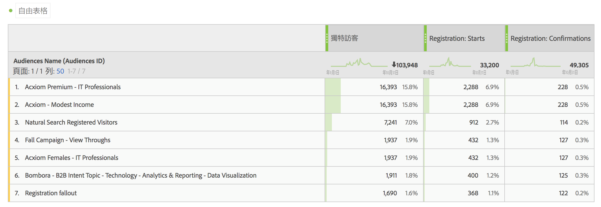
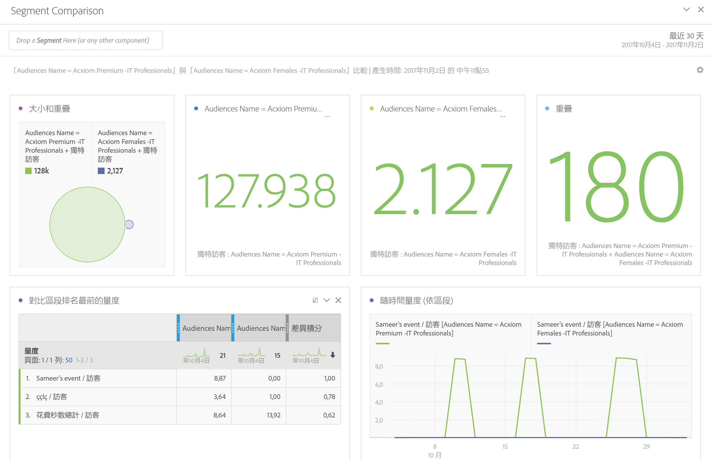
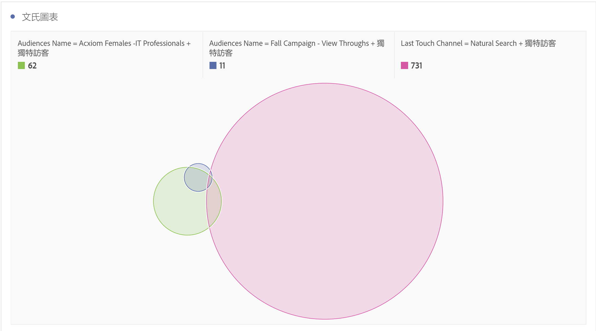
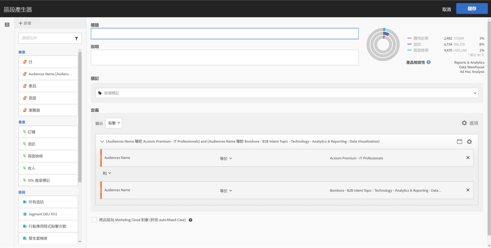

# 在 Analytics 中使用客群資料

您可以在整個Analytics中使用Adobe Audience Manager對象維度。 整合的區段是新的Analytics維度，稱為「對象ID」和「對象名稱」，其使用方式與Analytics收集的任何其他維度相同。 「資料摘要」中，「對象 ID」會儲存於「mc_audiences」欄。 這些維度目前在 Data Workbench 或直播串流中均不可用。 可以利用 Audiences 維度的部分例子包括：

## Analysis Workspace {#workspace}

在Analysis Workspace中，Adobe Audience Manager區段會顯示為兩個維度。

1. 前往 **[!UICONTROL Workspace]**。
1. 從&#x200B;**[!UICONTROL 維度]**&#x200B;的清單中，選取維度&#x200B;**[!UICONTROL 對象ID]**&#x200B;或&#x200B;**[!UICONTROL 對象名稱]**。 名稱是ID的易記分類。

   

## 區段比較 {#compare}

[區段比較](/help/analyze/analysis-workspace/c-panels/c-segment-comparison/segment-comparison.md)會找出兩個區段之間在統計上最顯著的差異。 您可以兩種方式在「細分群體比較」中使用客群資料：1) 作為要比較的兩個細分群體，2) 作為「排名最前的維度項目」表格中的項目。

1. 前往 **[!UICONTROL Workspace]**，然後從左欄選取&#x200B;**[!UICONTROL 「區段比較」]**&#x200B;面板。

1. 在&#x200B;**[!UICONTROL 「元件」]**&#x200B;選單中，搜尋[!UICONTROL 客群名稱]。

1. 開啟[!UICONTROL 「客群名稱」]，以便顯示相關的維度項目。
1. 將您要比較的對象拖曳至「區段比較產生器」。
1. (選用)：您也可以帶入其他維度項目或區段，最多可比較 2 個區段。
1. 按一下&#x200B;**[!UICONTROL 「建立」]**。

   由於「客群 ID」和「客群名稱」維度是用於比較之兩個細分群體的額外輪廓，因此會自動出現在「排名最前的維度項目」表格中。

   

## Analysis Workspace 中的客戶歷程 (流程) {#flow}

Adobe Audience Manager區段資料是以逐次點選的方式傳入Analytics，並會在該時間點即時表示訪客的對象成員資格。 也就是說，訪客可能會先歸入某個區段 (例如「察覺」)，之後再歸類到更符合的區段 (例如「考慮」)。 您可以在Analysis Workspace中使用[流量](/help/analyze/analysis-workspace/visualizations/fallout/fallout-flow.md)，以視覺效果呈現訪客在對象之間所經歷的歷程。

1. 前往 **[!UICONTROL Workspace]**，然後從左欄選取&#x200B;**[!UICONTROL 「流量」]**&#x200B;視覺效果。

1. 將[!UICONTROL 對象名稱]維度拖曳至流量產生器。
1. 按一下&#x200B;**[!UICONTROL 「建立」]**。
1. (選用)：將任何其他維度拖曳至「流量」視覺效果可建立[維度間流量](/help/analyze/analysis-workspace/visualizations/c-flow/multi-dimensional-flow.md)。

對象也可在[流失視覺效果](/help/analyze/analysis-workspace/visualizations/fallout/fallout-flow.md)中使用。

## Analysis Workspace中的文氏圖表視覺效果 {#venn}

[Venn視覺效果](/help/analyze/analysis-workspace/visualizations/venn.md)顯示最多3個區段之間的重疊。

1. 前往 **[!UICONTROL Workspace]**，然後從左欄選取&#x200B;**[!UICONTROL 「文氏圖表」]**&#x200B;視覺效果。

1. 在元件選單中，搜尋[!UICONTROL 客群名稱]。
1. 開啟[!UICONTROL 對象名稱]，以便顯示相關的維度專案。
1. 將您要比較的對象拖曳至文氏產生器。
1. (選用)：您也可以帶入其他維度項目或區段，最多可比較 3 個區段。
1. 按一下&#x200B;**[!UICONTROL 「建立」]**。

## 區段產生器 {#builder}

您可以將「客群」維度連同 Analytics 收集的行為資訊整合到 Analytics [客戶細分工具](/help/components/segmentation/segmentation-workflow/seg-build.md)。

1. 前往&#x200B;**[!UICONTROL 「元件]** > **[!UICONTROL 區段」]**。
1. 按一下&#x200B;**[!UICONTROL [新增]**]以建立新區段。
1. 在命名區段後，將[!UICONTROL 對象名稱]維度拖曳至「定義」面板。
1. (選用)：新增其他標準至區段。
1. 儲存細分群體。

   

