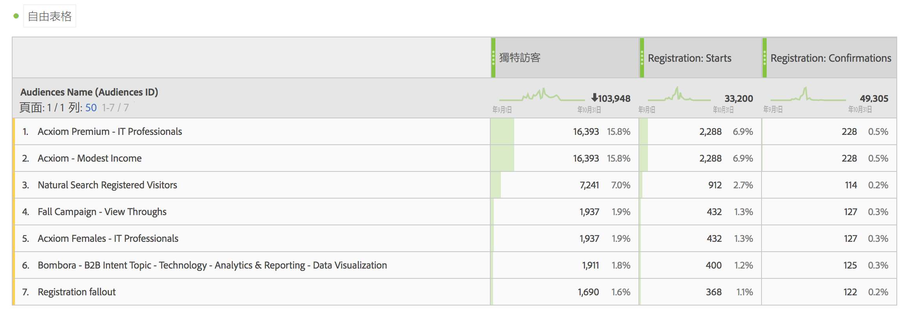

# 在 Analytics 中使用客群資料

您可以在整個Analytics中使用Adobe Audience Manager對象維度。 整合的區段即是稱為「適用對象 ID」和「對象名稱」的新 Analytics 維度，且使用方式與 Analytics 收集的任何其他維度一樣。「資料摘要」中，「對象 ID」會儲存於「mc_audiences」欄。這些維度目前在 Data Workbench 或直播串流中均不可用。可以利用 Audiences 維度的部分例子包括：

## Analysis Workspace {#workspace}

在Analysis Workspace中，Adobe Audience Manager區段會顯示為兩個維度。

1. 前往 **[!UICONTROL Workspace]**。
1. 從&#x200B;**[!UICONTROL 「維度」]**&#x200B;清單中，選取&#x200B;**[!UICONTROL 「對象 ID」]**&#x200B;或&#x200B;**[!UICONTROL 「對象名稱」]**。名稱為易記的 ID 分類方式。

   

## 區段比較 {#compare}

[區段比較](https://experienceleague.adobe.com/docs/analytics/analyze/analysis-workspace/panels/segment-comparison/segment-comparison.html?lang=zh-Hant)會找出兩個區段之間在統計上最顯著的差異。您可以兩種方式在「細分群體比較」中使用客群資料：1) 作為要比較的兩個細分群體，2) 作為「排名最前的維度項目」表格中的項目。

1. 前往 **[!UICONTROL Workspace]**，然後從左欄選取&#x200B;**[!UICONTROL 「區段比較」]**&#x200B;面板。

1. 在&#x200B;**[!UICONTROL 「元件」]**&#x200B;選單中，搜尋[!UICONTROL 客群名稱]。

1. 開啟[!UICONTROL 「客群名稱」]，以便顯示相關的維度項目。
1. 將您要比較的對象拖曳至「區段比較」產生器。
1. (選用)：您也可以帶入其他維度項目或區段，最多可比較 2 個區段。
1. 按一下&#x200B;**[!UICONTROL 「建立」]**。

   由於「客群 ID」和「客群名稱」維度是用於比較之兩個細分群體的額外個人資料，因此會自動出現在「排名最前的維度項目」表格中。

   

## Analysis Workspace 中的客戶歷程 (流程) {#flow}

Adobe Audience Manager區段資料是以逐次點選的方式傳入Analytics，並會在該時間點即時表示訪客的對象成員資格。 也就是說，訪客可能會先歸入某個區段 (例如「察覺」)，之後再歸類到更符合的區段 (例如「考慮」)。您可以使用 Analysis Workspace 中的[「流量」](https://experienceleague.adobe.com/docs/analytics/analyze/analysis-workspace/visualizations/fallout/fallout-flow.html?lang=zh-Hant)，以視覺化的方式呈現訪客在對象之間所採取的歷程。

1. 前往 **[!UICONTROL Workspace]**，然後從左欄選取&#x200B;**[!UICONTROL 「流量」]**&#x200B;視覺效果。

1. 將[!UICONTROL 「對象名稱」]維度拖曳至「流量」產生器。
1. 按一下&#x200B;**[!UICONTROL 「建立」]**。
1. (選用)：將任何其他維度拖曳至「流量」視覺效果可建立[維度間流量](https://experienceleague.adobe.com/docs/analytics/analyze/analysis-workspace/visualizations/flow/multi-dimensional-flow.html?lang=zh-Hant)。

對象也可用於[流失視覺效果](https://experienceleague.adobe.com/docs/analytics/analyze/analysis-workspace/visualizations/fallout/fallout-flow.html?lang=zh-Hant)中。

## Analysis Workspace 中的文氏圖表視覺效果 {#venn}

[文氏圖表視覺效果](https://experienceleague.adobe.com/docs/analytics/analyze/analysis-workspace/visualizations/venn.html?lang=zh-Hant)可顯示最多 3 個區段之間的重疊部分。

1. 前往 **[!UICONTROL Workspace]**，然後從左欄選取&#x200B;**[!UICONTROL 「文氏圖表」]**&#x200B;視覺效果。

1. 在元件選單中，搜尋[!UICONTROL 客群名稱]。
1. 開啟[!UICONTROL 「對象名稱」]，以便顯示相關的維度項目。
1. 將您要比較的對象拖曳至「文氏圖表」產生器。
1. (選用)：您也可以帶入其他維度項目或區段，最多可比較 3 個區段。
1. 按一下&#x200B;**[!UICONTROL 「建立」]**。

## 區段產生器 {#builder}

您可以將「客群」維度連同 Analytics 收集的行為資訊整合到 Analytics [客戶細分工具](/help/components/segmentation/segmentation-workflow/seg-build.md)。

1. 前往&#x200B;**[!UICONTROL 「元件]** > **[!UICONTROL 區段」]**。
1. 按一下&#x200B;**[!UICONTROL 「新增」]**，建立新區段。
1. 命名區段後，將[!UICONTROL 「對象名稱」]維度拖曳至「定義」面板。
1. (選用)：新增其他標準至區段。
1. 儲存區段。

   

