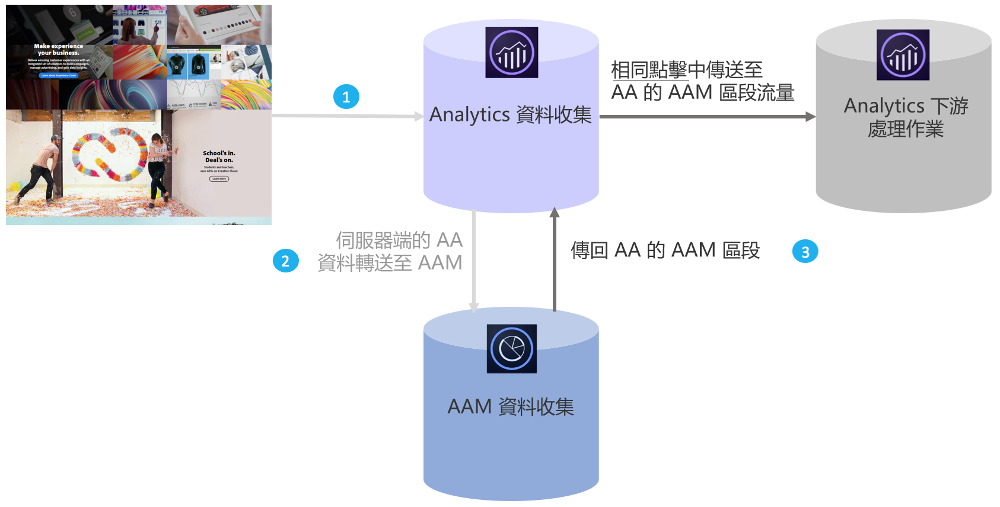

# Audience Analytics 概觀

Adobe Audience Manager (Adobe Audience Manager)是一個功能強大的資料管理平台，可協助您從第一方、第二方/合作夥伴及第三方資料整合建立獨一無二的對象設定檔。 對廣告商來說，這些對象個人資料有助於定義可用於任何數位通路的最有價值區段。

Audience Analytics整合就緒後，您就可以將Adobe Audience Manager對象資料，例如人口資訊（例如性別或收入等級）、心理變數資訊（例如興趣和嗜好）、CRM資料以及廣告曝光數資料，整合至任何Analytics工作流程中。

>[!BEGINSHADEBOX]

如需示範影片，請參閱 [Audience Analytics](https://video.tv.adobe.com/v/25450?quality=12&learn=on){target="_blank"}。

>[!ENDSHADEBOX]

## 主要優點 {#benefits}

Audience Analytics 整合具有以下主要優點：

* 這是市場中的資料管理平台 (DMP) 和分析引擎之間的首個產品化整合。
* 區段可即時從Adobe Audience Manager共用至Analytics，以告知對象探索、細分和最佳化。
* 預設會共用所有Adobe Audience Manager區段，充分豐富Analytics中的客戶設定檔。
* 解決方案管理員可以透過使用者介面實現整合，僅需要變更極少量程式碼。
* 只有遵循 Audience Manager 資料匯出控制的區段才會共用。

## Audience Analytics的運作方式 {#works}

1. 每次訪客瀏覽您的數位內容時，系統都會收集點擊數並傳送到 Analytics。
1. 透過[伺服器端轉送](/help/admin/tools/manage-rs/edit-settings/general/c-server-side-forwarding/ssf.md)，Analytics收到的每次點選都會即時自動傳送至Adobe Audience Manager。
1. 透過Audience Analytics整合，系統會針對各個點選，在Adobe Audience Manager中查詢訪客的對象成員資格，並將區段ID清單傳回Analytics即時處理。

由於Adobe Audience Manager區段是在相同點選的基礎上插入，因此您可以確定Adobe Audience Manager中有關訪客的任何可用資料都不會遺失，並且不會為該點選提供最新資訊。 這一點優於 AppMeasurement 外掛程式，因為外掛程式必須等到下次點擊時 (而非目前點擊) 才能提供這些區段。

此外，Adobe Audience Manager區段ID會自動分類成易記名稱，讓您不必在Analytics報表中辛苦檢視英數字元ID。

## 先決條件 {#prerequisites}

確定已具備下列先決條件：

* 您同時是 Audience Manager 和 Adobe Analytics 的客戶。
* 您是 Audience Manager 管理員。
* 您使用身分識別服務 v1.5 或更新版本。
* Adobe Audience Manager和Adobe Analytics報表套裝對應至同一個Experience Cloud組織。
* 您使用[伺服器端轉送](/help/admin/tools/manage-rs/edit-settings/general/c-server-side-forwarding/ssf.md)，並已實施作業[客群管理模組](https://experienceleague.adobe.com/docs/audience-manager/user-guide/implementation-integration-guides/integration-other-solutions/audience-management-module.html?lang=zh-Hant) (無 DIL 代碼) - AppMeasurement 1.5 或更新版本。

[客群分析工作流程](/help/integrate/c-audience-analytics/c-workflow/audiences-workflow.md)中會說明這些先決條件。
