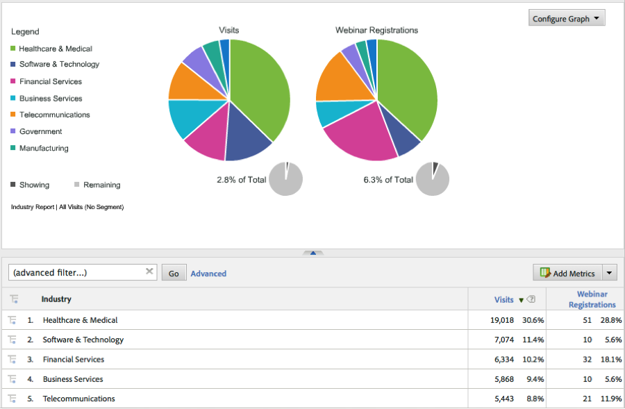

# Verifying the Integration{#verifying-the-integration}

檢查即時追蹤和報告，以驗證整合成功擷取資料。

## Live Tracking {#section-9c20e8ff6b404ae09387ee07d675c9e2}

使用DigitalPulse除錯程式工具來驗證Demandbase維度資料是否傳送至Adobe Analytics。刪除Cookie後，重新載入已部署整合代碼的網站上的頁面。假設您目前的IP對應至Demandbase所識別的組織，您應該會看到類似下列的結果。

**報告與分析(舊稱SiteCatalyst)包含兩個Demandbase上下文資料變數：**


** Target Mbox包含Demandbase描述檔參數：**

只有當您在頁面上實施Target時才會看到此項目，而且您已針對Adobe Target設定此整合-請參閱Adobe整合精靈中的步驟4。


## 報告 {#section-1792fe75dc3249d0ad063dfd87a89162}

使用Adobe整合精靈(步驟7)自動為您建立的Dashboard，檢閱Adobe Analytics中的Demandbase報表。

或者，您也可以導覽至Adobe Analytics功能表結構內的Demandbase報表-請參閱下方的螢幕擷取。

>[!NOTE]
>
>此資料應在24-48小時內順利部署。




## 常問的問題 {#section-d926b160a2ef4f07b43ea1bc67ac2a0a}

**[「n/a]」代表甚麼意思？**

「Demandbase Data Connector」(Demandbase資料連接器)會設定此預設值，以指出屬性「無法使用」。有兩種常見藍本可供設定：

* Demandbase偵測到訪客來自不屬於公司的IP位址。
* 「Account Watch」(帳戶觀看)屬性(開頭為「Watch_ list」)會使用，但公司不在您的「帳戶監控」清單中。

**Why does “[n/a]” appear more often for certain attributes? **

Demandbase會對所有IP位址進行分類，並提供觀眾和觀眾_區段屬性，即使訪客不是來自公司IP亦然。當讀者傳回「居住」、「無線」和「接待服務」等值時，其他屬性可能無法使用。

At times, a visitor’s audience will be “SMB”, but other attributes will show “[n/a]”. 這表示Demandbase可以將訪客歸類為小型企業，但公司個人檔案無法使用。通常最小的公司會發生這種情況：當多個小型企業使用相同的服務供應商或IP位址區塊時。

## Developer Considerations {#section-d33fff55bc4b4db99f82dee418ef1bc2}

如果您需要調整實施中的預設值，請更新行：

```
_db._nonOrgMatchLabel = "[n/a]";
```

