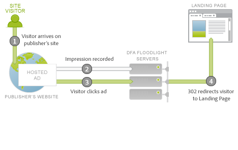

# 廣告服務整合概述{#ad-serving-integration-overview}

此整合可透過數種方式擷取關於廣告驅動型訪客的資料。第一種方式是透過點按廣告以進入加上標記的著陸頁面，我們稱之為點進:

訪客進入發佈者的網站，其中包含廣告。此廣告具有唯一識別碼，名為廣告 ID。廣告中包含版面和創作，後者可說明廣告在發佈者網站上的位置，以及對訪客顯示的內容。當訪客從 DFA 內容伺服器提取此廣告、版面或創作時，此訪客的曝光數將會被追蹤記錄到 DFA Floodlight 伺服器 (1)。

如果訪客點按廣告 (2)，則會查詢 Floodlight 伺服器 (這會計為一次點按)，然後將訪客 302 重新導向 (3) 至著陸頁面。當訪客進入著陸頁面時，即完成所謂的點進。此頁面包含 Adobe 追蹤代碼，會查詢 DFA Floodlight 伺服器中的資料。

如果訪客在 Floodlight 伺服器追蹤點按之後並未實際進入著陸頁面，則不算是點進。有些廣告和實施實際上不一定會使訪客的瀏覽器遵循 302 重新導向。關於此主題的深入討論，請參閱[協調量度差異](../dfa-data-connector-analytics/dfa-reconciling-metric-discrepancies/dfa-reconciling-metric-discrepancies.md#concept-8c31ebe761ca4b3fab1e3a18ef5d098f)。

此整合會在訪客接收到廣告曝光數、未加以點按但在後續的某個時間點經由其他途徑進入著陸頁面時，擷取下一個量度。

我們將此情景稱為閱覽。此情景與點進情景的差異在於，訪客並未點按廣告，而是在繼續進行其他活動後進入著陸頁面 (2)。最簡單的情況是，訪客在瀏覽器中鍵入著陸頁面的 URL。其他情況則包括，訪客繼續進行瀏覽，但後續使用了搜尋引擎，而將訪客導向至著陸頁面。無論是哪種情況，使用者都會進入著陸頁面。
