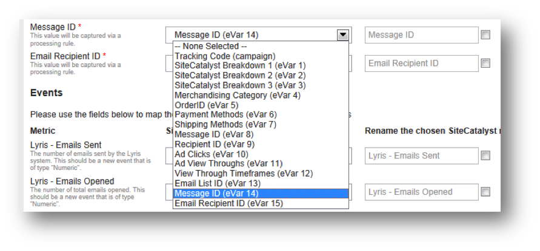

# Completing the Integration Wizard{#completing-the-integration-wizard}

使用整合精靈的步驟。

若要啓動整合，您必須在「資料連接器」介面中完成Lynris整合精靈。

1. 導覽至Adobe Marketing Cloud中的「資料連接器」(先前稱為Genesis)區域。

   

1. Under **[!UICONTROL Add Integration]**, drag and drop the Lyris plugin into the Adobe Marketing Cloud. 如此會開啓Lynris Data Connector整合。

   

1. Under **[!UICONTROL General Settings]**, choose the desired Report Suite and provide a name for the integration.
1. Fill in all your Lyris account-related information under **[!UICONTROL Custom Values]**.

   

1. 從下拉式選單中選擇適當的保留eVar和事件。

   

1. You may choose your own segments under **[!UICONTROL Your Segments]** - apart from the 3 automated Partner segments.
1. 此項整合可能需要下載一些資料點至您的Lyris帳戶。You may choose to give access for this under **[!UICONTROL Access Request]**.
1. Under **[!UICONTROL Data Collection]**, you can choose to have an automated or a manual solution (JavaScript Plug-in) to collect query string parameters from the landing page URL. 如果您選擇擁有自動化解決方案，請輸入訊息ID和收件者ID的查詢字串參數。如需JavaScript外掛程式，請聯絡您的Adobe顧問。

   

1. 您可以選擇為您自動產生Lyris Dashboard和書簽。

   

1. Review the integration summary and click **[!UICONTROL Activate]**.
