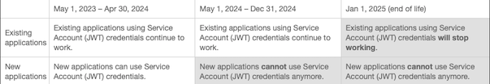

# 目前的 Adobe Analytics 發行說明 (2023 年 5 月)

**上次更新日期**：2023 年 5 月 17 日

Adobe Analytics 版本會在[持續傳遞模式](releases.md)上運作，允許以更可縮放、分階段的方法進行功能部署。因此，這些發行說明每月會更新好幾次。請定期進行檢查。

## Adobe Analytics 中的新功能或更新功能 {#features}

| 功能 | 說明 | [開始推出](releases.md) | [全面發佈](releases.md) |
| ----------- | ---------- | ------- | ---- |
| **非生產沙箱的回填** | 在非生產沙箱中建立 Analytics 來源連接器資料流時，非生產沙箱中的回填將限制為 3 個月。生產沙箱將維持 13 個月。 | 不適用 | 2023 年 4 月 26 日 |
| **專案連結共用 (不需登入)** | 您現在可以與無 Adobe Analytics 存取權的人員共用 Analysis Workspace 專案的唯讀連結。這包括與組織外的人員或組織內未佈建 Adobe Analytics 的人員共用。[了解更多](https://experienceleague.adobe.com/docs/analytics/analyze/analysis-workspace/curate-share/share-projects.html?lang=zh-Hant#share-public-link)
此功能預設為啟用，系統管理員可以停用。[了解更多](https://experienceleague.adobe.com/docs/analytics/analyze/analysis-workspace/user-preferences.html?lang=zh-Hant#company-preferences)
 | 2023 年 5 月 3 日 | 2023 年 6 月 |
| **更新 Analytics 儀表板應用程式 (行動應用程式) 的首頁** | 新更新的首頁可讓您在一個綜合計分卡清單中檢視所有計分卡。如果您一次登入可以存取多個組織，則單一清單會提供您所有組織的計分卡。 | 不適用 | 2023 年 5 月 10 日 |
| **在 Analysis Workspace 中排序元件** | 現在，在 Analysis Workspace 的左側邊欄或資料字典中查看元件時，可以使用新的「排序」選項。您可以按「建議」(最常用)、「字母順序」或「類別」(類型) 來排序元件。
以前，您只能搜尋或篩選元件。[了解更多](/help/analyze/analysis-workspace/components/analysis-workspace-components.md)
 | 不適用 | 待定 |
| **從自由格式表格中刪除包含動態維度的列** | 在 Analysis Workspace 的自由格式表格中，您現在可以使用 x 圖示快速刪除包含動態維度的特定列。執行此操作時，將自動應用「始終排除項」篩選器規則。
以前，想要刪除包含動態維度的列，唯一的方法是在「篩選器」對話框中手動建立規則。[了解更多](/help/analyze/analysis-workspace/visualizations/freeform-table/filter-and-sort.md)
 | 不適用 | 2023 年 5 月 17 日 |
| **在面板中新增視覺效果的新按鈕** | 現在，Analysis Workspace 每個面板的底部都有一個新按鈕，可讓您快速新增視覺效果。 
以前，將視覺效果新增到面板的唯一方法是從左側邊欄拖放視覺效果、複製現有的視覺效果，或者建立空白面板。[了解更多](/help/analyze/analysis-workspace/visualizations/freeform-analysis-visualizations.md)
 | 不適用 | 2023 年 5 月 17 日 |
| **深度連結 (行動應用程式)** | 可讓使用者傳送計分卡連結，這些連結會直接導向應用程式中的計分卡專案。這使得共享專案和提高技術水平較低的對象參與度變得更加容易。 | 不適用 | 2023 年 5 月 17 日 |

{style="table-layout:auto"}

## Adobe Analytics 中的修正

AN-312098；AN-318309；AN-316675；AN-318173；AN-310359；AN-317613；AN-318836；AN-315744；AN-311772；AN-318719；AN-314074；AN-316651<!--"Verified" status-->；AN-318602；AN-315961；AN-317534；AN-318607；AN-316498；AN-316648；AN-318244；AN-317747；AN-318432；AN-318231；AN-317590；AN-318415；AN-318154；AN-316647；N-314417；AN-317614；AN-317725；AN-318114；AN-317876；AN-318052；AN-317966；AN-316477；AN-318036；AN-317931；AN-318045；AN-316246；AN-317281；AN-317879；AN-308077；AN-317708；AN-316115；AN-315963

## 給 Adobe Analytics 管理員的重要通知 {#admin}

| 通知 | 新增或更新日期 | 說明 |
| ----------- | ---------- | ---------- |
| **遷移到AdobeIO OAuth伺服器到伺服器憑據** | 2023 年 5 月 11 日 | Adobe AnalyticsAPI和使用AdobeIO JWT憑據的Livestream客戶必須通過以下方式遷移到AdobeIO OAuth伺服器到伺服器憑據 **2025年1月1日**。 有關更多詳細資訊和時間表，請參閱下表中的終止通知。 |
| **注意：倫敦資料中心的 Adobe Analytics 資料摘要和 Data Warehouse 輸出使用的新 IP** | 2023 年 4 月 27 日 | 如果倫敦資料中心的客戶有資料摘要求和/或 Data Warehouse 報告要傳遞到 FTP/SFTP 服務，以下 IP 位址範圍應新增到防火牆設定以允許存取： <ul><li>130.248.244.32/29</li><li>130.248.244.40/29</li></ul> |
| **裝置查詢流程現在使用協力廠商進行所有裝置查詢** | 2023 年 3 月 3 日 | 2023 年 3 月 2 日，我們推出了用戶端提示支援，更新了裝置查詢流程以使用協力廠商進行所有裝置查詢。先前，協力廠商只用於進行行動裝置查詢。而在此次推出的內容中，部分桌面作業系統誤標記了「Mobile」文字 (例如，「Mobile OS X 10.15.7」而不是「OS X 10.15.7」)。
在 Adobe 4 月版中，我們將更正這些名稱。Analytics 和 CJA 報告將追溯更新，因為它們的報告是根據記錄為事件資料的 ID 來查詢作業系統名稱。一旦 ID 對應的查詢值更新，所有的報告都會修正，包括歷史資料。對於 [!UICONTROL 資料源] 客戶，如果您在報告時使用類似的查找流程，則更改將具有追溯性。 但是，如果您將作業系統值儲存在事件資料中，則只會更新未來的報告。如需詳細資料，請參閱[作業系統](/help/components/dimensions/operating-systems.md)。 |

{style="table-layout:auto"}

## 生命週期結束 (EOL) 重要通知 {#eol}

| EOL 產品或功能 | 新增或更新日期 | 說明 |
| --- | --- | --- |
| **遷移到AdobeIO OAuth伺服器到伺服器憑據** | 2023 年 5 月 11 日 | Adobe AnalyticsAPI和使用AdobeIO JWT憑據的Livestream客戶必須通過以下方式遷移到AdobeIO OAuth伺服器到伺服器憑據 **2025年1月1日**。 從2024年5月1日起，AdobeIO將不允許建立新的JWT憑據。 使用JWT的客戶必須建立新的OAuth伺服器到伺服器憑據，或將其現有JWT憑據遷移到OAuth伺服器到伺服器憑據。 客戶還必須更新其客戶端應用程式以使用新的OAuth伺服器到伺服器憑據。 <ul><li>[從服務帳戶(JWT)憑據遷移](https://developer.adobe.com/developer-console/docs/guides/authentication/ServerToServerAuthentication/migration/)</li><li>[使用新的OAuth伺服器到伺服器憑據](https://developer.adobe.com/developer-console/docs/guides/authentication/ServerToServerAuthentication/implementation/)</li><li>[常見問題](https://developer.adobe.com/developer-console/docs/guides/authentication/ServerToServerAuthentication/faqs/)</li></ul> |
| **日本功能型手機追蹤服務終止** | 2023 年 3 月 21 日 | 僅適用於日本客戶：日本功能型手機追蹤服務 (mod_ktrack) 將於 **2023 年 5 月下旬**&#x200B;終止。 對於所造成的不便，我們深表歉意，但請您卸載或停用安裝在 Apache 伺服器上的模組。請參閱[本文件](/help/release-notes/mod_ktrackforSiteCatalyst_ver1.40.pdf)的第 27 和 28 頁深入了解。 |
| **[!DNL Reports & Analytics]** EOL | 2023 年 3 月 7 日 | 自 **2023 年 12 月 31 日**&#x200B;起生效，Adobe 計畫停止支援 [!DNL Reports & Analytics] 及其隨附的報告和功能。支援 [!DNL Reports & Analytics] 的報告、視覺效果和基礎技術不再符合 Adobe 的技術標準。大部分的 [!DNL Reports & Analytics] 功能在 [Analysis Workspace](https://experienceleague.adobe.com/docs/analytics/analyze/analysis-workspace/home.html?lang=zh-Hant) 中都有提供。自 Analysis Workspace 在 2015 年發佈以來，[!DNL Reports & Analytics] 功能已移至 Analysis Workspace 並已達到工作流程同位臨界值。[本通知](https://spark.adobe.com/page/6WnF8JK6IRDhf/)說明生命週期結束流程。
在 2023 年 12 月 31 日，我們將終止許多關聯的 Reports and Analytics 功能，包括但不限於：排程報表、資料擷取和 DL 報表。2023 年 12 月 31 日之後，將不再傳送任何排程報表。在&#x200B;**2023 年 4 月**，任何排程在 2023 年 12 月 31 日之後到期的報表將自動更新並恢復到 2023 年 12 月 31 日到期。此外，您不能再排程 2023 年 12 月 31 日之後的未來報表。 |
| **[!UICONTROL 人員]量度生命週期結束** | 2023 年 3 月 9 日 | 隨著 [[!DNL Device Co-op]](https://experienceleague.adobe.com/docs/discontinued/using/device-co-op.html) 淘汰不用，Device Co-op 相關的人員量度已不再相關。2023 年 5 月 8 日，我們將移除[!UICONTROL 人員]量度。屆時，我們會將其資料重新導向至[!UICONTROL 不重複訪客]量度，以防止專案、區段和計算量度中斷。
**請注意**：與[[!UICONTROL 跨裝置分析相連結的人員]量度](/help/components/metrics/people.md)不受本公告影響。 |
| **結束[!UICONTROL 發佈清單] 功能生命週期** | 2022 年 9 月 29 日 | 作為 Reports &amp; Analytics EOL 的一部分，[!UICONTROL 發佈清單]預定在 **2023 年 12 月**&#x200B;結束生命週期。您將無法建立新的發佈清單或存取現有[!UICONTROL 發佈清單]，來傳送或排程 [!UICONTROL Analysis Workspace] 專案。 |
| **Data Workbench 的 EOL** | 2022 年 9 月 14 日 | Adobe 打算自 **2023 年 12 月 31 日** 起終止 Data Workbench 的服務。請參閱 [Data Workbench 生命週期結束通知](https://experienceleague.adobe.com/docs/data-workbench/using/eol.html?lang=zh-Hant)以取得詳細資料。若有任何問題，請聯絡貴組織的 Adobe 客戶經理。 |

{style="table-layout:auto"}

## AppMeasurement

如需 AppMeasurement 版本 (版本 2.23.0) 最新的更新，請參閱 [AppMeasurement for JavaScript 發行說明](https://experienceleague.adobe.com/docs/analytics/implementation/appmeasurement-updates.html?lang=zh-Hant)。

## 相關資源

* [2022 年舊版發行說明](/help/release-notes/2022.md)
* [Customer Journey Analytics 發行說明](https://experienceleague.adobe.com/docs/analytics-platform/using/releases/latest.html?lang=zh-Hant)
* [Media Analytics 發行說明](https://experienceleague.adobe.com/docs/media-analytics/using/additional-resources/release-notes.html?lang=zh-Hant)
* [Adobe Experience Cloud 產品](https://business.adobe.com/products/adobe-experience-cloud-products.html)的最新版更新。
