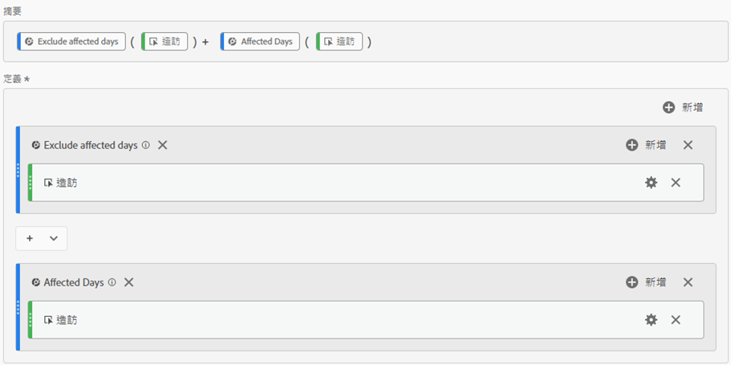
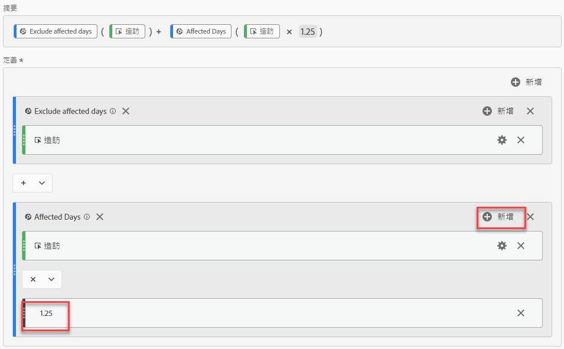
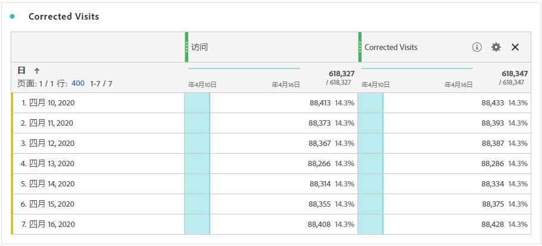
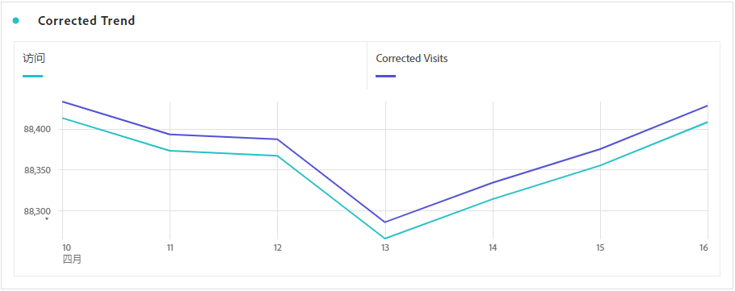

# 衍生受事件影響的資料

如果您的資料[受到事件](overview.md)影響，可以使用計算量度衍生事件持續時間的預估值。 例如，如果發生造成資料減少25%的事件，您可將之作為計算量度的乘數。

從細分和日期比較的角度，瞭解事件影響時，這些步驟的效果最佳。 在關注此頁面之前，請務必遵循[將受事件影響的日期與先前的範圍比較](compare-dates.md)和[在分析中排除特定日期](segments.md)。

>[!NOTE]
>
>此方法是根據一組特定輸入和日期範圍進行估計。 這不是適用於所有使用案例或資料片段的完整解決方案。 此外，此方法要求受影響的日期範圍至少有1個點選可計算。

若要建立受影響時段的預估計算量度：

1. 按照[在分析中排除特定日期](segments.md)下的概述，為「受影響的天數」和「排除受影響的天數」建立兩個區段。
2. 瀏覽至&#x200B;**[!UICONTROL 元件]** > **[!UICONTROL 計算量度]**。
3. 按一下「**[!UICONTROL 新增]**」。
4. 將以上兩個區段拖曳至定義畫布。 將它們之間的運運算元變更為`+`以加總它們。
5. 在兩個區段內新增所需的量度。 例如，您可以使用「造訪」量度。

   

6. 按一下[受影響的天數]容器右上角的&#x200B;**[!UICONTROL [新增]]**，然後按一下[靜態數字]****。 將靜態數字設定為您要位移資料的百分比，如[比較受事件影響的日期與先前的範圍](compare-dates.md)中所述。 在此範例中，位移為25%或1.25。

   

7. 在趨勢自由表格中並排套用「修正」量度。 事件外的所有天數都會反映其正常的量度計數，而所有受影響的天數都會使用乘數位移。

   

8. 線上條視覺效果中檢視資料，以檢視校正後量度的效果。

   
