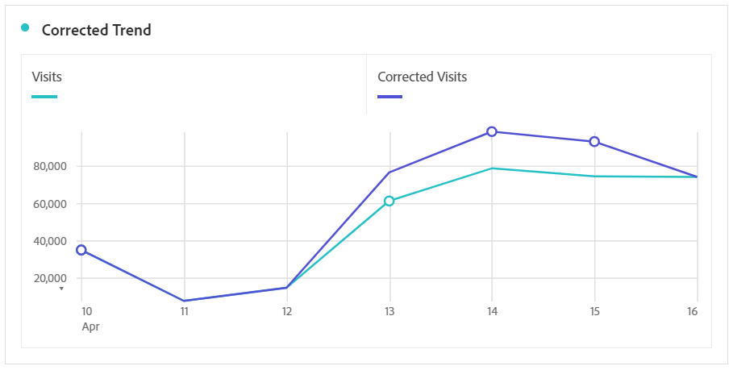

# 衍生受事件影響的資料

如果您的資料受 [到事件影響](overview.md)，則可使用計算量度來衍生事件期間的估計值。 例如，如果您有事件導致資料減少25%，您可將其用作計算量度中的乘數。

當您從區段和日期比較的角度瞭解事件的影響時，這些步驟最有效。 請務必在下 [一頁之前，先遵循「比較受事件影響的日期與先前的範圍](compare-dates.md)[」和「排除分析中的特定日期](segments.md) 」。

>[!NOTE]
>
>此方法為根據一組特定輸入資料及日期範圍之估計。 它不是所有使用案例或資料片段的完整解決方案。 此外，此方法要求受影響的日期範圍至少要有1個點擊才能計算。

若要建立受影響時段的估計計算量度：

1. 為「受影響的日期」和「排除受影響的日期」建立兩個區段，如「排除分析中 [的特定日期」中所述](segments.md)。
2. 導覽至「 **[!UICONTROL 元件]** >計 **[!UICONTROL 算量度」]**。
3. 按一下&#x200B;**[!UICONTROL 「新增」]**。
4. 將上述兩個區段拖曳至定義畫布。 將它們之間的運算子變更為 `+` 總和，以求總和。
5. 在兩個區段中新增所需的量度。 例如，您可以使用「瀏覽」度量。

   

6. 按一 **[!UICONTROL 下]** 「受影響日」容器右上角的「新增」，然後按一下「 **[!UICONTROL 靜態數字」]**。 將靜態數字設為您要偏移資料的百分比，如「比較受事件影響的日期與先前范 [圍」下所述](compare-dates.md)。 在此範例中，偏移為25%或1.25。

   

7. 在趨勢自由表格中並排套用「已修正」量度。 事件外的所有天數都反映其正常數度計數，而所有受影響的天數則使用乘數偏移。

   

8. 以折線視覺化檢視資料，以查看修正後量度的效果。

   
