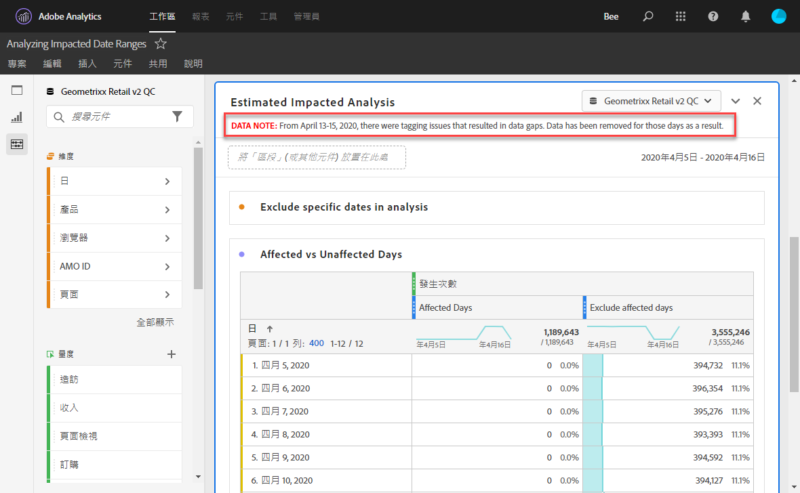
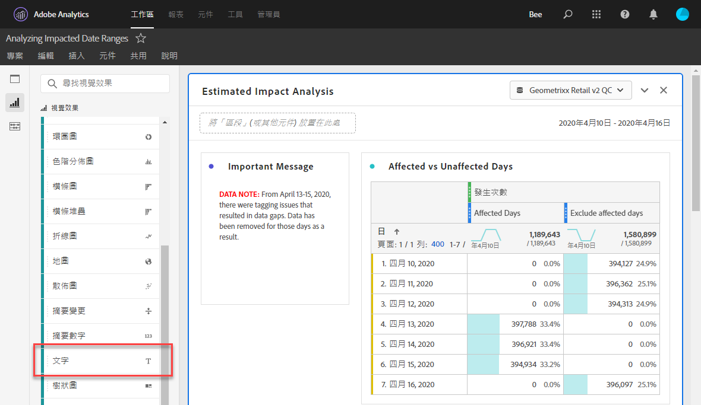
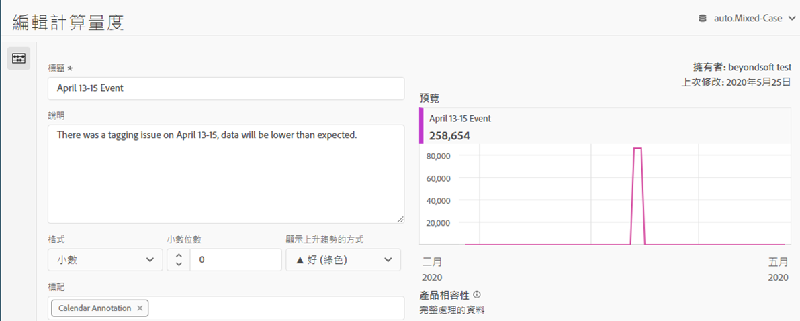
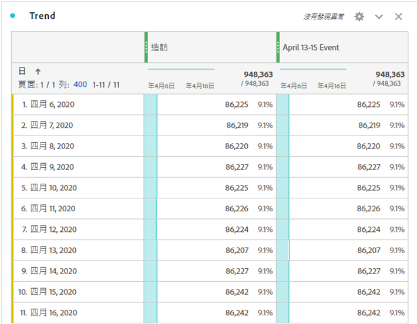
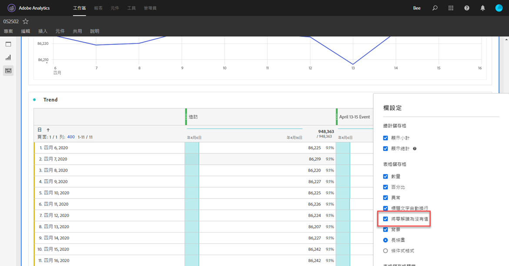
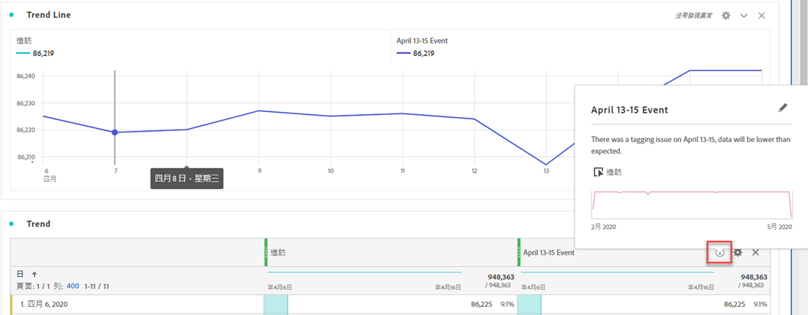

# 向使用者傳達事件影響

如果您的資料[受到事件](overview.md)影響，請務必將該事件傳達給您組織中的使用者。

* 制定您可在通訊中使用的通用免責宣告，以維持一致性
* 在活動期間和之後持續與Analytics使用者和主要利害關係人溝通
* 為後續里程碑（例如下個月或下一年）設定行事曆提醒。 未來的此通訊有助於提醒檢視報表的使用者月對月或年對報表的影響。

在Adobe Analytics中，以下小節顯示您可以與組織中的使用者通訊的不同方式。 您也可以使用Adobe Analytics以外的其他方法（例如電子郵件）與使用者通訊。

## 透過面板或視覺效果說明溝通

如果您的組織中使用者共用Workspace專案，您可以透過面板或視覺效果說明來傳達事件的影響。 在面板或視覺效果標題上按一下滑鼠右鍵，然後選取&#x200B;**[!UICONTROL 編輯說明]**。

## 透過文字視覺效果溝通

您也可以透過專用的文字視覺效果傳達事件的影響。 請參閱分析使用手冊中的[文字視覺效果](/help/analyze/analysis-workspace/visualizations/text.md)。

## 在Workspace中新增自訂日曆事件至趨勢

如需Workspace中的任何趨勢視覺效果，您可以新增代表受影響日期範圍的數列。

1. 依照[在分析中排除特定日期](segments.md)，以「受影響的天數」區段建立計算量度。
1. 將所需的量度新增至計算量度畫布。

   

1. 新增標題和說明，通知使用者該影響。 如有需要，您也可以將此量度標示為行事曆附註。

   

1. 在自由表格中新增「日」維度。 將「造訪」和計算量度新增為並排的欄。

   

1. 按一下計算量度的欄設定齒輪圖示，然後啟用&#x200B;**[!UICONTROL 將零解譯為沒有值]**。

   

1. 新增線條視覺效果。 受影響的日期會以不同顏色表示。 使用者也可以按一下計算量度中的「資訊」圖示以取得詳細資訊。

   

