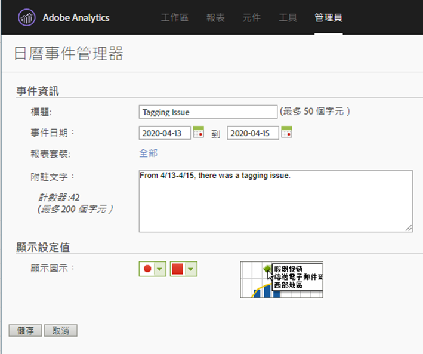

# 向使用者傳達事件影響

如果您有資料 [受事件影響](overview.md)，請務必將該事件與組織中的使用者溝通。

* 制定可在通訊中使用的通用免責聲明，以保持一致
* 在活動期間和之後，與Analytics使用者和主要利害關係人持續溝通
* 為後續里程碑（如下一個月或下一年）放置日曆提醒。 此通訊日後有助於提醒檢視報表的使用者，這些報表會受月對月或年對年報表的影響。

在Adobe Analytics中，下列小節會顯示您與組織中的使用者通訊的不同方式。 您也可以使用Adobe Analytics以外的其他方法（例如電子郵件）與使用者通訊。

## 透過面板或視覺效果說明溝通

如果貴組織的使用者之間有共用的工作區專案，您可以透過面板或視覺效果說明來傳達事件的影響。 以滑鼠右鍵按一下面板或視覺效果標題，然後選取 **[!UICONTROL 編輯說明]**.

## 透過文字視覺效果進行通訊

您也可以透過專用的文字視覺效果傳達事件的影響。 請參閱 [文字視覺效果](/help/analyze/analysis-workspace/visualizations/text.md) 分析使用手冊中。

## 將自訂日曆事件新增至工作區的趨勢

對於工作區中的任何趨勢視覺效果，您可以新增代表您受影響日期範圍的系列。

1. 建立具有「受影響天數」區段的計算量度，方法如下 [在分析中排除特定日期](segments.md).
1. 將所需的量度新增至計算量度畫布。

   

1. 新增標題和說明，告知使用者影響。 您也可以視需要將此量度標籤為日曆附註。

   

1. 在自由表格中，新增「日」維度。 將「造訪」和您的計算量度並排新增為欄。

   

1. 按一下計算量度的欄設定齒輪圖示，然後啟用 **[!UICONTROL 將零解譯為無值]**.

   

1. 新增線條視覺效果。 受影響的日期會以不同的顏色表示。 使用者也可以按一下計算量度中的「資訊」圖示，以取得詳細資訊。

   

## 在「Reports &amp; Analytics」中使用日曆事件

如果您使用「Reports &amp; Analytics」，則可使用 [日曆事件](/help/components/t-calendar-event.md) 強調任何趨勢報表中受影響的日期。 此方法不適用於Analysis Workspace。

1. 導覽至 **[!UICONTROL 元件]** > **[!UICONTROL 所有元件]** > **[!UICONTROL 日曆事件]**.
2. 輸入所需的標題、日期範圍和附註文字。
3. 按一下「**[!UICONTROL 儲存]**」。

