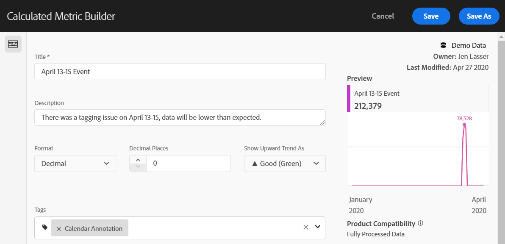

# 向使用者傳達事件影響

如果您的資料受 [到事件影響](overview.md)，請務必將該事件傳達給組織中的使用者。

* 製作常見免責聲明，供您在通訊中使用，以維持一致性
* 在活動期間和活動結束後，持續向Analytics使用者和主要利益相關者提供溝通
* 為後續里程碑（例如下個月或下一年）放置日曆提醒。 未來此通訊可協助提醒使用者檢視月繳型或年繳型報表的影響。

在Adobe Analytics中，下列章節顯示您與組織中使用者溝通的不同方式。 您也可以使用Adobe Analytics以外的其他方法（例如電子郵件）與使用者通訊。

## 透過面板或視覺化說明進行溝通

如果您的組織中的使用者共用工作區專案，您可透過面板或視覺化說明來傳達事件的影響。 以滑鼠右鍵按一下面板或視覺化標題，然後選取 **[!UICONTROL Edit description]**。

## 透過文字視覺化進行溝通

您也可以透過專屬的文字視覺化，傳達事件的影響。 See [Text visualizations](/help/analyze/analysis-workspace/visualizations/text.md) in the Analyze user guide.

## 將自訂日曆事件新增至工作區中的趨勢

對於工作區中的任何趨勢視覺化，您可以新增代表受影響日期範圍的系列。

1. 透過在分析中排除特定日期，建立具有「受影響日期」 [區段的計算量度](segments.md)。
1. 將所要的量度新增至計算量度畫布。

   

1. 新增標題和說明，通知使用者影響。 您也可以視需要將此量度標籤為日曆附註。

   

1. 在自由表格中，新增「日」維度。 新增「瀏覽」和您的計算量度為並排欄。

   

1. 按一下計算量度的欄設定齒輪圖示，然後啟用 **[!UICONTROL Interpret zero as no value]**。

   

1. 新增「行」視覺化。 受影響的日期會以不同的顏色表示。 使用者也可以按一下計算量度中的「資訊」圖示，以取得詳細資訊。

   

## 在「報告與分析」中使用日曆事件

如果您使用「報告與分析」，則可使用日曆事 [件](/help/components/t-calendar-event.md) ，在任何趨勢報表中反白標示受影響的日。 此方法不適用於分析工作區。

1. 導覽至 **[!UICONTROL Components]** > **[!UICONTROL Calendar events]**。
2. 輸入所要的標題、日期範圍和附註文字。
3. 按一下 **[!UICONTROL Save]**.

