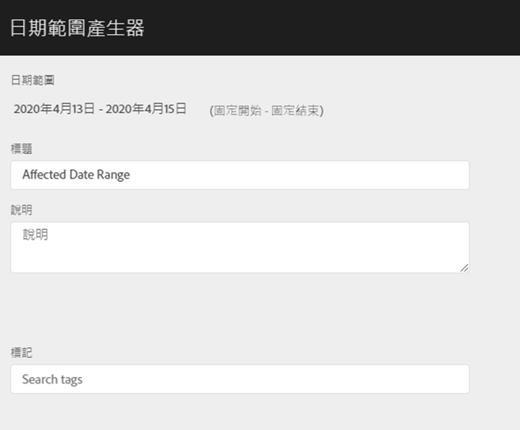
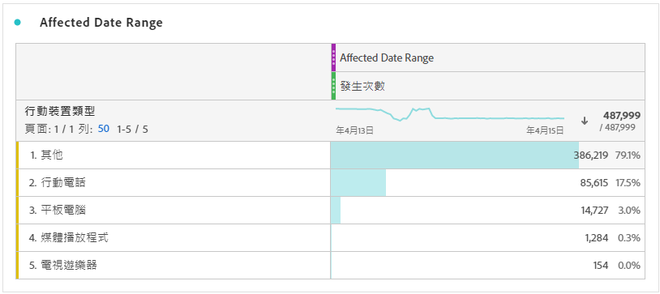
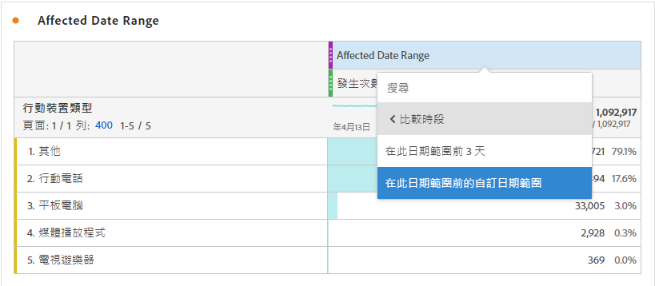
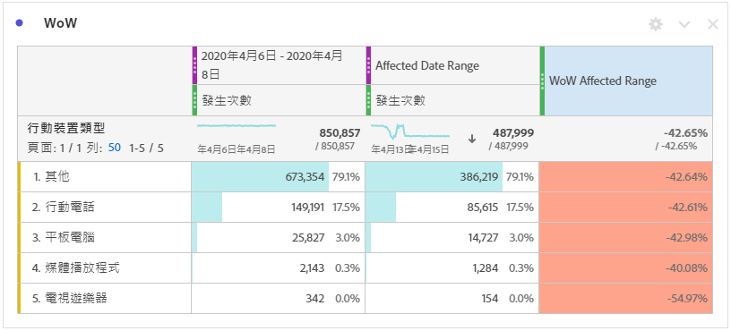
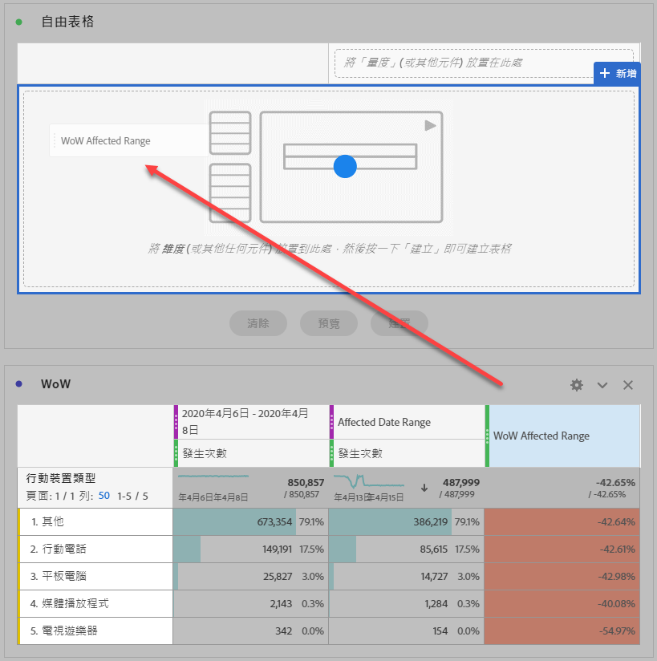
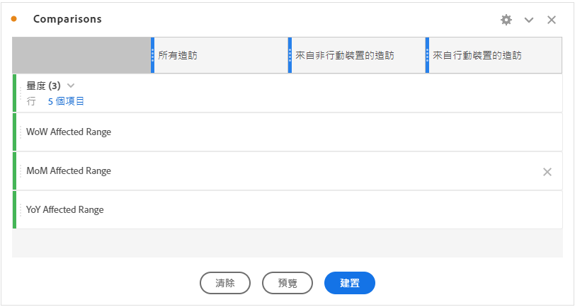
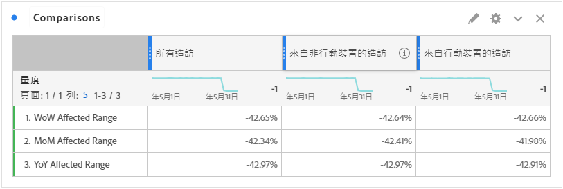

# 將受事件影響的日期與先前的範圍比較

如果您的資料[受到事件](overview.md)影響，您可以檢視歷史趨勢以評估其影響。 此比較有助於瞭解事件對您的資料有何影響，讓您決定是排除資料、新增備註至報表，還是忽略資料。

## 建立包含事件的日期範圍

建立涵蓋事件的日期範圍，以開始探索該事件的影響。

1. 導覽至&#x200B;**[!UICONTROL 元件]** > **[!UICONTROL 日期範圍]**。
2. 按一下「**[!UICONTROL 新增]**」。
3. 選取事件發生時的日期範圍。 按一下「**[!UICONTROL 儲存]**」。

   

## 並排檢視事件日期和類似的先前範圍

您可以使用自由表格視覺效果，將事件日期範圍與類似的先前日期範圍之間的任何量度進行比較。

1. 開啟Workspace專案，並將「日」維度新增至自由表格。 套用棧疊在量度上最近建立的日期範圍，例如「發生次數」。

   

2. 以滑鼠右鍵按一下日期範圍，然後按一下&#x200B;**[!UICONTROL 新增時段欄]** > **[!UICONTROL 自訂日期範圍到此日期範圍]**。
   * 若是周對周比較，請選取事件減7天的範圍。 請確定事件與此日期範圍之間是一週中的哪幾天對齊。
   * 若是月對月比較，請選取上個月的事件範圍。 如果您想要對齊一週中的天數，也可以選取事件減去28天的範圍。
   * 若要逐年比較，請選取去年的事件範圍。
3. 當您選取想要的日期範圍時，它們就會新增至您的自由表格。 您可以按一下滑鼠右鍵，然後新增任意數目的日期範圍，以利比較。

   

## 計算事件和類似先前範圍之間的百分比差異

使用自由表格視覺效果，比較事件日期範圍和類似的先前日期範圍之間的維度專案。 這些步驟說明了您可以遵循的每週對照範例。

1. 開啟Workspace專案，並將&#x200B;**非時間維度**&#x200B;新增至自由表格。 例如，您可以使用「行動裝置型別」維度。 套用棧疊在量度上最近建立的日期範圍，例如「發生次數」：

   

2. 以滑鼠右鍵按一下日期範圍，然後按一下&#x200B;**[!UICONTROL 比較時段]** > **[!UICONTROL 自訂日期範圍到此日期範圍]**。 選取事件減去7天的範圍。 請確定事件與此日期範圍之間是一週中的哪幾天對齊。

   

3. 將產生的「百分比變更」量度重新命名為更具體的值，例如「WoW影響範圍」。 按一下資訊圖示，然後按一下編輯鉛筆來編輯量度名稱。

   

4. 針對逐月和逐年比較重複步驟3和4。 您可在相同表格或不同表格中執行此動作。

## 以列的形式並排分析比較日期範圍

如果您想要進一步分析上述百分比變更，可以將它們轉換為列。

1. 新增自由表格視覺效果並啟用表格產生器。 此動作可讓您按照所需順序放置百分比變更量度。
2. 按住`Ctrl` (Windows)或`Cmd` (Mac)，並一次一個將3%變更量度拖曳到表格的列中。

   

3. 將「所有造訪」區段新增至表格的欄，以及其他任何所需區段。

   

4. 按一下&#x200B;**[!UICONTROL 建置]**。 從產生的表格中，您可以檢視任何所需區段之受影響範圍與前一週、月和年的比較。

   
