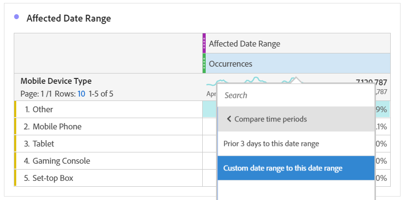

# 將受事件影響的日期與先前的範圍比較

如果您有資料 [受事件影響](overview.md)，您可以查看歷史趨勢以評估其影響。 此比較對於了解事件對您資料的影響程度非常有用，因此您可以決定要排除資料、新增附註至報表，還是忽略資料。

## 建立包含事件的日期範圍

建立包含事件的日期範圍，以開始探索該事件的影響。

1. 導覽至 **[!UICONTROL 元件]** > **[!UICONTROL 日期範圍]**.
2. 按一下「**[!UICONTROL 新增]**」。
3. 選取發生事件的日期範圍。 按一下「**[!UICONTROL 儲存]**」。

   

## 並排檢視事件日期和類似的先前範圍

您可以使用自由表格視覺效果，比較具有類似先前日期範圍之事件的日期範圍之間的任何量度。

1. 開啟工作區專案，並將「日」維度新增至自由表格。 套用最近建立的日期範圍堆疊在量度上，例如「發生次數」。

   

2. 以滑鼠右鍵按一下日期範圍，然後按一下 **[!UICONTROL 新增時段欄]** > **[!UICONTROL 自訂日期範圍至此日期範圍]**.
   * 如需周對周的比較，請選取事件範圍減去7天。 請確定事件與此日期範圍之間的一週天數已對齊。
   * 若要進行月對月比較，請選取上個月事件的範圍。 如果您想要對齊一週中的天數，也可以選取事件範圍減去28天。
   * 對於逐年比較，請選取去年的事件範圍。
3. 當您選取所需的日期範圍時，會將其新增至自由表格。 您可以按一下滑鼠右鍵，然後新增您想要比較的日期範圍。

   

## 計算事件與類似先前範圍之間的百分比差異

使用自由表格視覺效果，比較事件日期範圍與類似先前日期範圍之間的維度項目。 這些步驟將說明您可以遵循的逐周範例。

1. 開啟Workspace專案，然後新增 **非時間維度** 至自由表格。 例如，您可以使用「行動裝置類型」維度。 套用最近建立的日期範圍堆疊在量度上，例如「發生次數」：

   

2. 以滑鼠右鍵按一下日期範圍，然後按一下 **[!UICONTROL 比較時段]** > **[!UICONTROL 自訂日期範圍至此日期範圍]**. 選取事件範圍減去7天。 請確定事件與此日期範圍之間的一週天數已對齊。

   

3. 將產生的「百分比變更」量度重新命名為更具體的值，例如「兩瓦受影響範圍」。 按一下資訊圖示，然後按一下編輯鉛筆以編輯量度名稱。

   

4. 針對逐月和逐年比較重複步驟3和4。 您可以在相同的表格或個別的表格中執行此動作。

## 以列形式並排分析比較日期範圍

如果您想進一步分析上述百分比的變更，可將其轉換為列。

1. 新增自由表格視覺效果並啟用表格產生器。 此動作可讓您將百分比變更量度以所需順序排列。
2. 保留 `Ctrl` (Windows)或 `Cmd` (Mac)，並將3%變更量度拖曳至表格的列中，一次一列。

   

3. 將「所有造訪」區段新增至表格的欄，以及任何其他需要的區段。

   

4. 按一下&#x200B;**[!UICONTROL 建置]**。從產生的表格中，您可以檢視任何所需區段中受影響範圍與上週、月和年的比較。

   
