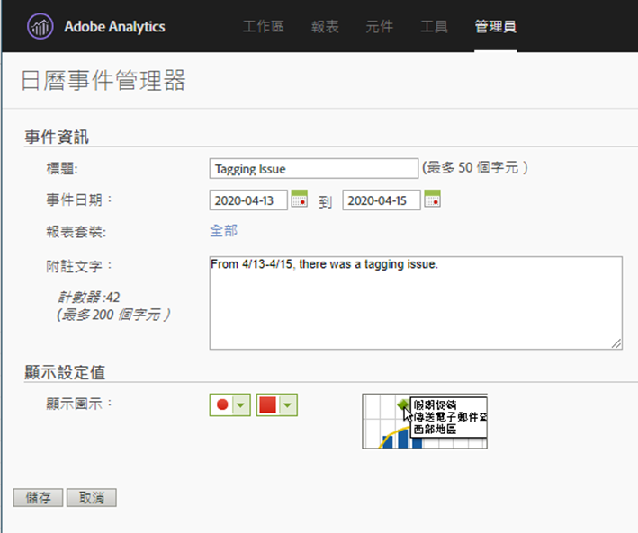

# 向使用者傳達影響

如果您的資料受 [到事件影響](../event-impacted.md)，請務必將該事件傳達給組織中的使用者。 以下章節顯示您與組織中使用者通訊的不同方式。

## 透過面板或視覺化說明進行溝通

如果您的組織中的使用者共用工作區專案，您可透過面板或視覺化說明來傳達事件的影響。 以滑鼠右鍵按一下面板或視覺化標題，然後選取「編 **[!UICONTROL 輯說明」]**。

## 透過文字視覺化進行溝通

您也可以透過專屬的文字視覺化，傳達事件的影響。 See [Text visualizations](/help/analyze/analysis-workspace/visualizations/text.md) in the Analyze user guide.

## 在「報告與分析」中使用日曆事件

如果您使用「報告與分析」，則可使用日曆事 [件](/help/components/t-calendar-event.md) ，在任何趨勢報表中反白標示受影響的日。 此方法不適用於分析工作區。

1. 導覽至「 **[!UICONTROL 元件]** >日 **[!UICONTROL 歷事件」]**。
2. 輸入所要的標題、日期範圍和附註文字。
3. 按一下&#x200B;**[!UICONTROL 「儲存」]**。

