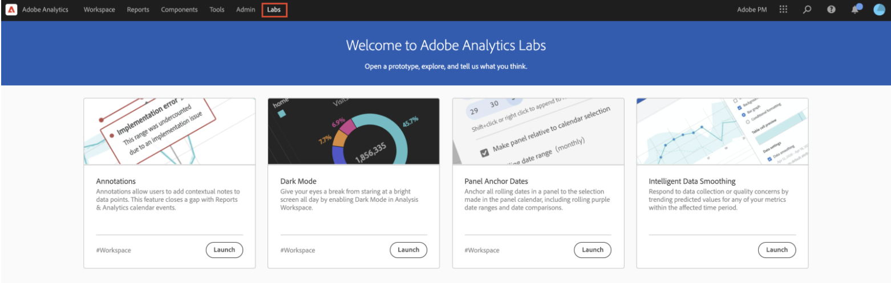

# 智慧型資料平滑

在極少數情況下，某些因素會影響資料品質。 機器人流量、實作變更或服務中斷都可能影響所收集資料的完整性。 這些錯誤也會使分析事件如何影響資料完整性的工作複雜化。

智慧型資料平滑處理是[Analytics Labs](/help/analyze/labs.md)的原型，可分析歷史趨勢，預測受影響期間內任何量度的值，以協助完成此檢視。 原型會套用進階機器學習演演算法，以繪製所分析時段內量度的預期值。

## 執行智慧型資料平滑

1. 導覽至Adobe Analytics Labs：
   
1. 啟動「智慧型資料平滑化」原型。
   
1. 將必須分析的量度新增至自由表格。 原型僅適用於每日粒度，因此請確定表格中的維度為「日」。
   
1. 選擇比事件視窗寬的日期範圍，但請確定該範圍包含事件。
   
1. 按一下自由表格中量度的齒輪圖示。
   
1. 在[!UICONTROL 資料設定]下，選取[!UICONTROL 資料平滑]選項。
   
1. 選取與事件對應的日期/日期範圍，然後按一下[!UICONTROL 套用]。
請確定「資料平滑」的資料範圍是為面板選取的資料範圍子集。 表格和圖表中的量度會被預測值取代。
   
