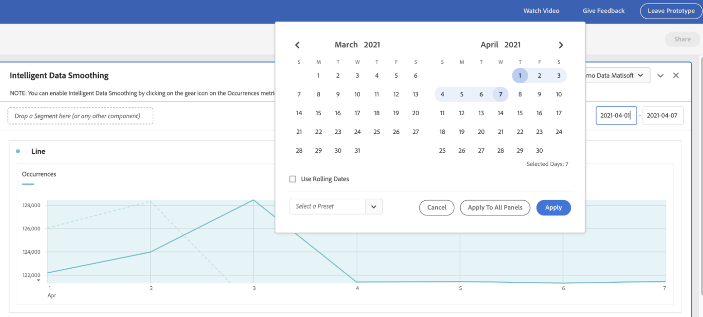

# 智慧型資料平滑

在某些罕見情況下，某些因素可能會影響資料品質。 機器人流量、實作變更或服務中斷都可能影響收集到資料的完整性。 這也會使有關事件如何影響資料完整性的分析變得複雜。

智慧資料平滑是 [Analytics Labs](/help/analyze/labs.md) 可分析歷史趨勢以預測受影響時段內任何量度的值，以協助完成此檢視。 原型會套用進階機器學習演算法，以繪製所分析時段內量度的預期值。

## 執行智慧資料平穩化

1. 導覽至Adobe Analytics Labs:
   
1. 啟動智慧資料平滑原型。
   
1. 新增必須分析的量度至自由表格。 原型只適用於每日粒度，因此請確定表格中的維度為「日」。
   
1. 選擇比事件視窗寬的日期範圍，但請確定包含事件。
   
1. 在自由表格中按一下量度的齒輪圖示。
   
1. 在 [!UICONTROL 資料設定]，請選取 [!UICONTROL 資料平穩化] 選項。
   
1. 選取與事件對應的日期/日期範圍，然後按一下 [!UICONTROL 套用].
請確定「資料平滑化」的資料範圍是為面板選取之日期範圍的子集。 表格和圖表中的量度會由預測值取代。
   
