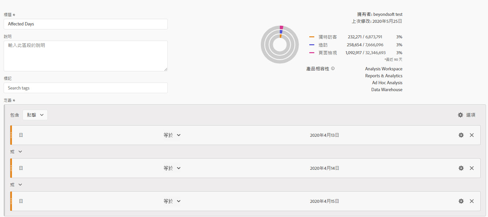
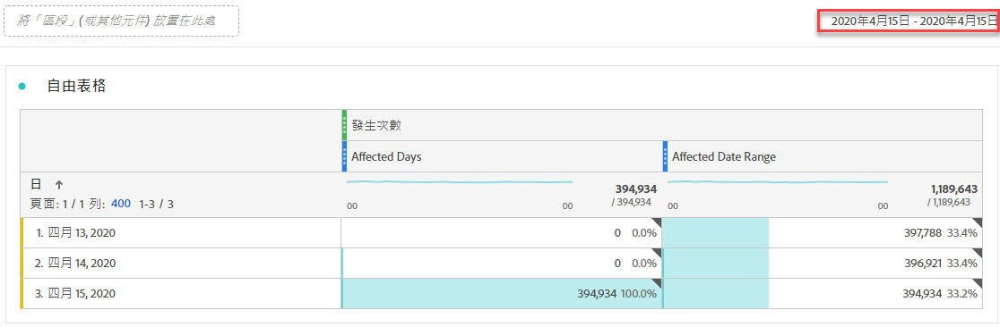
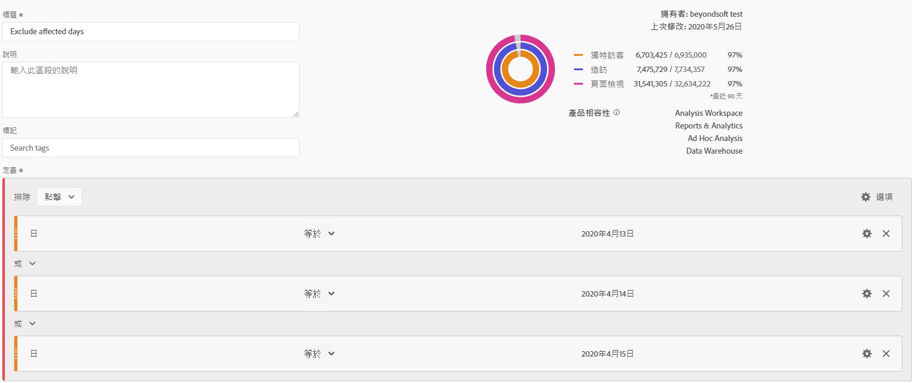
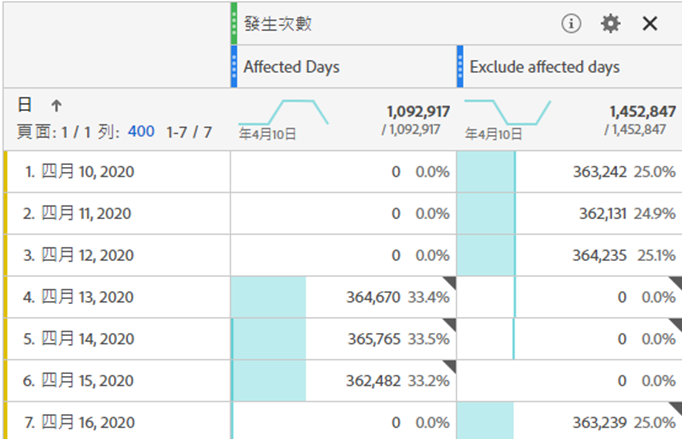
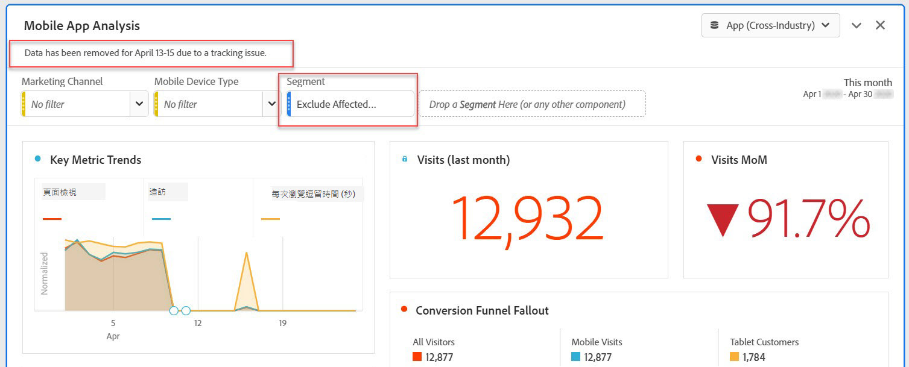
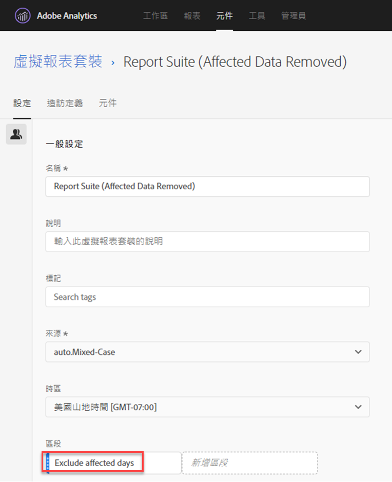

# 在分析中排除特定日期

如果您的資料[受事件](overview.md)影響，您可以使用區段來排除不想在您的報表中包含的任何日期範圍。 將受事件影響的日期細分，有助於防止您的組織就部分資料做出決策。

## 隔離受影響的天數 {#isolate}

建立區段來隔離受影響的日期或日期範圍。 如果您只想聚焦於問題日以檢視更多有關其影響的資訊，此區段就十分實用。

1. 移至&#x200B;**[!UICONTROL 元件]** > **[!UICONTROL 區段]**，然後按一下&#x200B;**[!UICONTROL 新增]**，以開啟區段產生器。
2. 將「日」維度拖曳至定義畫布，並將其設為等於您要隔離的日。
3. 對要在報告中隔離的每一天重複上述步驟。

>[!TIP]
>
>若要將OR陳述式變更為AND陳述式，請按一下OR旁的向下箭頭，然後選取AND。

Adobe建議使用橘色維度元件，而非紫色日期範圍元件。 如果您使用紫色日期範圍元件，這些元件會覆寫專案的日曆範圍：

## 排除受影響的天數 {#exclude}

建立區段，將受影響的日期或日期範圍排除在外。 如果您想要排除發生問題的日期，以將對整體報告的影響降至最低，此區段就十分實用。

1. 移至&#x200B;**[!UICONTROL 元件]** > **[!UICONTROL 區段]**，然後按一下&#x200B;**[!UICONTROL 新增]**，以開啟區段產生器。
2. 在區段定義畫布的右上角，按一下&#x200B;**[!UICONTROL 選項]** > **[!UICONTROL 排除]**。
3. 將「日」維度拖曳至定義畫布，並將其設為等於您要移除的日。
4. 對要在報表中移除的每一天重複上述步驟。

## 在報表中使用這些區段

建立排除區段後，您就可以像使用其他區段一樣使用此區段。

### 在趨勢報表中比較區段 {#compare}

您可以在報告中同時套用「受影響的天數」區段和「排除受影響的天數」區段，以便並排比較。 將兩個區段拖曳至量度上方或下方，以便比較：

如果您不想在表格或視覺效果中顯示零（造成下降），請在欄設定下啟用&#x200B;**[!UICONTROL 將零解譯為沒有值]**。

如果您不想在表格或視覺效果中顯示零（造成下降），請在欄設定下啟用&#x200B;**[!UICONTROL 將零解譯為沒有值]**。

### 將排除區段套用至專案 {#apply}

您可以將「排除受影響的天數」區段套用至Workspace專案。 將排除區段拖曳至標示為&#x200B;*將區段放置在此處*&#x200B;的Workspace畫布區段。

>[!TIP]
>
>在面板說明中加入排除資料的相關附註，協助檢視報表的使用者。 以滑鼠右鍵按一下面板的標題，然後按一下&#x200B;**[!UICONTROL 編輯說明]**。

### 在虛擬報表套裝中使用排除區段 {#use-vrs}

您可以在[虛擬報告套裝](/help/components/vrs/vrs-about.md)中使用區段，更方便地排除資料。 此選項的理想狀況是，您不需要記得將區段套用至包含受影響日期範圍的每個報表。 如果您已將虛擬報表套裝當作資料的主要來源，您可以將區段新增至現有的虛擬報表套裝。

1. 導覽至&#x200B;**[!UICONTROL 元件]** > **[!UICONTROL 虛擬報表套裝]**。
2. 按一下「**[!UICONTROL 新增]**」。
3. 輸入虛擬報表套裝的所需名稱和說明。
4. 將排除區段拖曳至標示為&#x200B;**[!UICONTROL 新增區段]**&#x200B;的區域。
5. 按一下右上方的&#x200B;**[!UICONTROL [繼續]]**，然後按一下&#x200B;**[!UICONTROL [儲存]]**。

