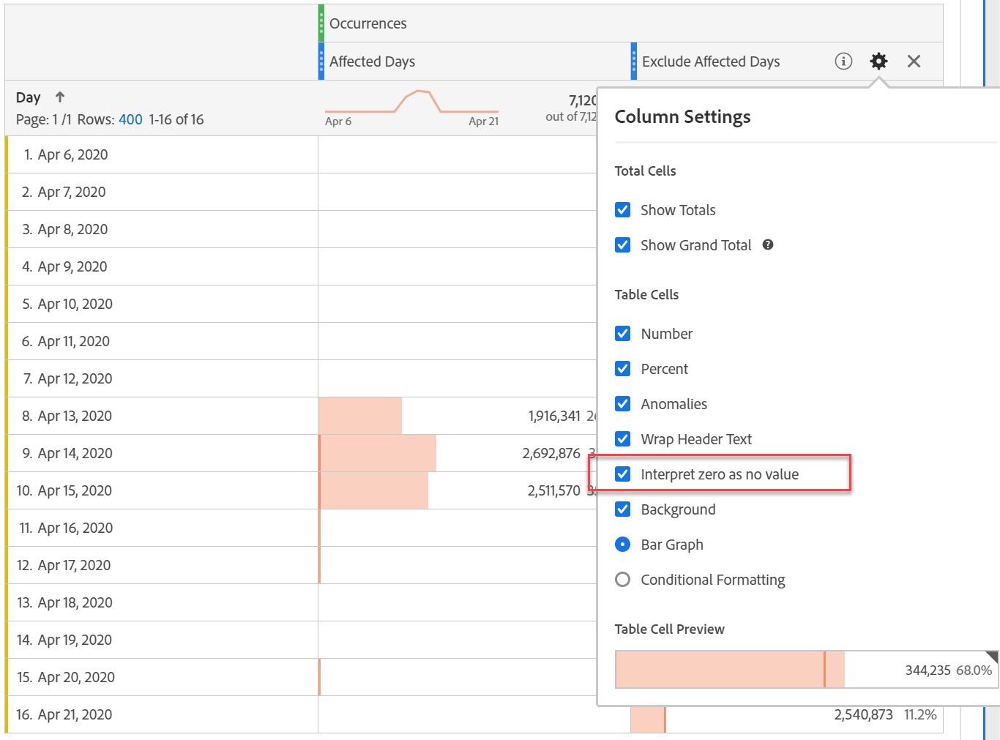

# 在分析中排除特定日期

如果您有資料 [受事件影響](overview.md)，您可以使用區段來排除任何您不想納入報表的日期範圍。 將受事件影響的日期分段有助於防止您的組織對部分資料做出決策。

## 隔離受影響的天數 {#isolate}

建立區段來隔離受影響的日期或日期範圍。 如果您只想聚焦於問題日來檢視更多有關其影響的資訊，此區段就十分實用。

1. 前往以下位置開啟區段產生器： **[!UICONTROL 元件]** > **[!UICONTROL 區段]**，然後按一下 **[!UICONTROL 新增]**.
2. 將「日」維度拖曳至定義畫布，並將其設為等於您要隔離的日。
3. 對要在報告中隔離的每天重複上述步驟。

>[!TIP]
>
>若要將OR陳述式變更為AND陳述式，請按一下OR旁的向下箭頭，然後選取AND。

Adobe建議使用橘色維度元件，而非紫色日期範圍元件。 如果您使用紫色日期範圍元件，這些元件會覆寫專案的日曆範圍：

## 排除受影響的天數 {#exclude}

建立區段，排除受影響的日期或日期範圍。 如果您想要排除遇到問題的天數，以將對整體報表的影響降至最低，此區段就十分實用。

1. 前往以下位置開啟區段產生器： **[!UICONTROL 元件]** > **[!UICONTROL 區段]**，然後按一下 **[!UICONTROL 新增]**.
2. 在區段定義畫布的右上角，按一下 **[!UICONTROL 選項]** > **[!UICONTROL 排除]**.
3. 將「日」維度拖曳至定義畫布，並將其設為等於您要移除的日。
4. 對您要在報表中移除的每一天重複上述步驟。

## 在報表中使用這些區段

建立排除區段後，您就可以像使用其他區段一樣使用該區段。

### 在趨勢報表中比較區段 {#compare}

您可以在報告中同時套用「受影響的天數」區段和「排除受影響的天數」區段，以便並排比較。 將這兩個區段拖曳到量度上方或下方，以便比較：

如果您不想在表格或視覺效果中顯示零（導致下降），請啟用 **[!UICONTROL 將零解譯為無值]** 在欄設定下。

如果您不想在表格或視覺效果中顯示零（導致下降），請啟用 **[!UICONTROL 將零解譯為無值]** 在欄設定下。

### 將排除區段套用至專案 {#apply}

您可以將「排除受影響的天數」區段套用至Workspace專案。 將排除區段拖曳至標示為的工作區畫布區段 *將區段拖放到這裡*.

>[!TIP]
>
>在面板說明中加入排除資料的相關備註，以協助檢視報表的使用者。 以滑鼠右鍵按一下面板的標題，然後按一下 **[!UICONTROL 編輯說明]**.

### 在虛擬報表套裝中使用排除區段 {#use-vrs}

您可在以下位置使用此區段： [虛擬報告套裝](/help/components/vrs/vrs-about.md) 以更方便排除資料。 此選項的理想之處在於，您不需要記得為包含受影響日期範圍的每個報表套用區段。 如果您已使用虛擬報表套裝作為主要資料來源，您可以將此區段新增至現有的VRS。

1. 導覽至 **[!UICONTROL 元件]** > **[!UICONTROL 虛擬報表套裝]**.
2. 按一下「**[!UICONTROL 新增]**」。
3. 輸入虛擬報表套裝所需的名稱和說明。
4. 將排除區段拖曳至標示為的區域 **[!UICONTROL 新增區段]**.
5. 按一下 **[!UICONTROL 繼續]** 然後按一下「 」 **[!UICONTROL 儲存]**.

