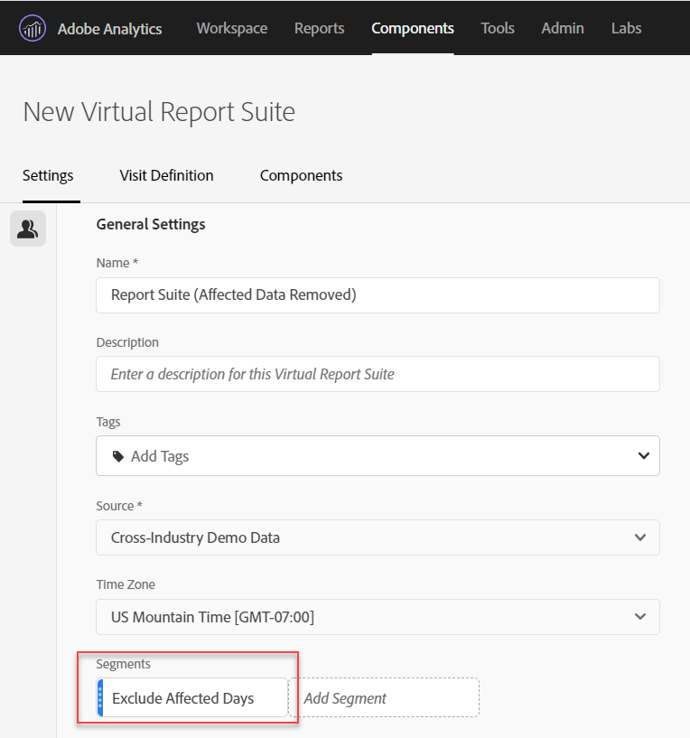

# 在分析中排除特定日期

如果您的資料 [受事件影響](overview.md)，您可以使用區段來排除您不想納入報表的任何日期範圍。 劃分事件影響的日期有助於防止組織對部分資料做出決策。

## 隔離受影響的日子

建立可隔離受影響日期或日期範圍的區段。 如果您只想關注問題日，以檢視其影響的詳細資訊，此區段就很實用。

1. 前往「元件 **[!UICONTROL >區段」開啟區段產]** 生器，然後按一下「 **[!UICONTROL 新增]******」。
2. 將「日」維度拖曳至定義畫布，並將其設為您要隔離的日。
3. 請針對您希望隔離在報表中的每一天重複上述步驟。

Adobe建議使用橘色維度元件，而非紫色日期範圍元件。 如果您使用紫色日期範圍元件，它們會覆寫專案的日曆範圍：

## 排除受影響的天數

建立區段，排除受影響的日期或日期範圍。 如果您想要排除發生問題的日期，以將整體報告的影響降至最低，此區段會很有用。

1. 前往「元件 **[!UICONTROL >區段」開啟區段產]** 生器，然後按一下「 **[!UICONTROL 新增]******」。
2. 在區段定義畫布的右上方，按一下「選 **[!UICONTROL 項]** >排 **[!UICONTROL 除」]**。
3. 將「日」維度拖曳至定義畫布，並將其設為您要移除的日。
4. 請針對您想在報表中移除的每一天重複上述步驟。

## 在報表中使用這些區段

建立排除區段後，您就可以像使用其他區段一樣使用它。

### 比較趨勢報表中的區段

您可以同時套用報表中的「受影響日」區段和「排除受影響日」區段，以並排比較。 拖曳兩個區段至量度上方或下方以比較：

如果您不想在表格或視覺化（導致下降）中顯示零，請啟用欄設定下的「解譯 **[!UICONTROL 零為無值]** 」。

如果您不想在表格或視覺化（導致下降）中顯示零，請啟用欄設定下的「解譯 **[!UICONTROL 零為無值]** 」。

### 套用排除區段至專案

您可以將「排除受影響的日」區段套用至工作區專案。 將排除區段拖曳至標示為拖曳區段至此處的「工 *作區畫布」區段*。

>[!TIP]
>
>在面板說明中包含排除資料的附註，以協助檢視報表的使用者。 以滑鼠右鍵按一下面板的標題，然後按一下「編 **[!UICONTROL 輯說明」]**。

### 在虛擬報表套裝中使用排除區段

您可以在虛擬報表套裝中 [使用區段](/help/components/vrs/vrs-about.md) ，以更方便地排除資料。 此選項最理想的選擇是，您不必記得為包含受影響日期範圍的每個報表套用區段。 如果您已使用虛擬報表套裝作為主要資料來源，則可將區段新增至現有的VRS。

1. Navigate to **[!UICONTROL Components]** > **[!UICONTROL Virtual report suites]**.
2. 按一下&#x200B;**[!UICONTROL 「新增」]**。
3. 輸入虛擬報表套裝的所需名稱和說明。
4. 將排除區段拖曳至標示為「新增區段」 **[!UICONTROL 的區域]**。
5. 按一 **[!UICONTROL 下右上方]** 的「繼續」 **[!UICONTROL ，然後按一下「]**&#x200B;儲存」。

