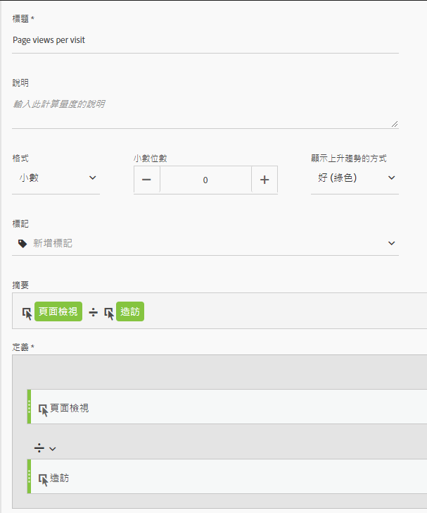
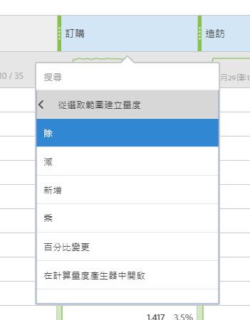

# 其他平台翻譯指南上常用的度量

在Google Analytics之類的其他平台上，許多報表共用相同的度量數。使用此頁面瞭解如何重新建立許多報表中使用的量度。

若要新增多個度量至工作環境自由表格，請從工作區中量度標題旁的元件區域拖曳量度：

## 贏取度量

**使用者** 大約等於工作區 **中的「獨特訪客** 」。See the [Unique Visitors](../../../components/c-variables/c-metrics/metrics-unique-visitors.md) metric in the Components user guide for additional details.

**新使用者** 可透過下列方式取得：

1. Drag the **Unique Visitors** metric onto the workspace.
2. Drag the **First Time Visits** segment above the Unique Visitors metric headers:

   

**「** 分析工作區」中的「工作階段」大約等於 **「瀏覽」** 。See the [Visits](../../../components/c-variables/c-metrics/metrics-visit.md) metric in the Components user guide for additional details.

## 行為度量

**「反彈率** 」可在分析工作區中立即使用。See the [Bounce Rate](../../../components/c-variables/c-metrics/metrics-bounce-rate.md) metric in the Components user guide for additional information.

**頁面/工作階段** 是計算量度。它可透過下列方式取得：

1. 如果您已建立計算量度，請將其找出在「量度」下方，然後拖曳至工作區。
2. If you have not yet created this calculated metric, click the **+** icon near the metric list to open the Calculated Metric Builder.
3. 為它提供「每次瀏覽頁面檢視次數」的標題，並視需要提供說明。
4. 將格式設定為小數，並將小數位數設定為2。
5. Drag the **Page views** metric and **Visits** metric into the definition area.
6. Arrange the definition so the formula is **Page Views divided by Visits**.

   

7. 按一下「儲存」返回工作區。
8. 將新定義的計算量度拖曳至工作區上。

   Learn more about [Calculated Metrics](../../../components/c-variables/c-metrics/calculated-metric.md) in the Components user guide.

**平均Session Duration** is approximately equal to **Time Spent per Visit (seconds)**. Learn more about [Time Spent](../../../components/c-variables/c-metrics/metrics-time-spent.md) metrics in the Components user guide.

## 轉換度量

**目標轉換率**、 **目標完成** 和 **目標值** 需要在這兩個平台上進行額外的實施。如果您的實施已容納產品維度和購買事件，請考慮下列步驟：

1. Drag the **Orders** metric, **Revenue** metric, and **Visits** metric onto the workspace.
1. Create a calculated metric of **Orders per Visit**. 在兩個量度標題上使用ctrl+ click(Windows)或cmd+ click(Mac)來反白標示它們。Right-click one of the headers, select **Create Metric From Selection**, then click **Divide**. 此新量度類似於「目標轉換率」。
1. 如果需要小數位數，請編輯計算量度。按一下量度標題中的「資訊」按鈕，然後按一下鉛筆圖示。在「計算量度產生器」視窗中新增或個小數位數，然後按一下「儲存」。

   

如果您的實作尚未容納產品或轉換資料，Adobe建議您與實施顧問合作以確保資料品質和完整性。
