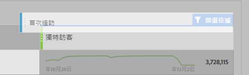
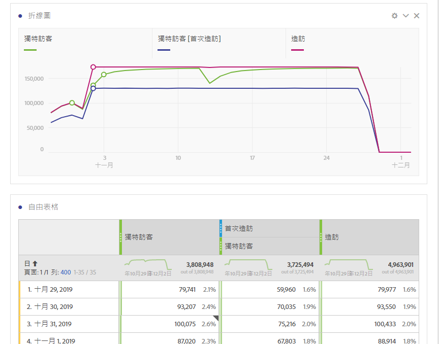

# 其他平台常用的量度轉譯指南

在 Google Analytics 等其他平台上，許多報表會擁有相同數目的量度。使用此頁來瞭解如何重新建立許多報表中使用的量度。

若要將多個量度新增至工作區自由表格，請從工作區中量度標頭旁的元件區域拖曳量度：

## 贏取量度

**使用者**&#x200B;約略等同於工作區中的&#x200B;**獨特訪客**。如需詳細資訊，請參閱「元件」使用指南中的[獨特訪客](/help/components/metrics/unique-visitors.md)量度。

可透過下列方式取得&#x200B;**新使用者**：

1. 將&#x200B;**獨特訪客**&#x200B;量度拖曳至工作區。
2. 將&#x200B;**首次造訪次數**&#x200B;區段拖曳至「獨特訪客」量度標頭上方：

   

**工作階段**&#x200B;約略等同於 Analysis Workspace 中的&#x200B;**造訪次數**。如需詳細資訊，請參閱「元件」使用指南中的[造訪次數](/help/components/metrics/visits.md)量度。

## 行為量度

**跳出率**&#x200B;可在 Analysis Workspace 中以量度形式提供。如需詳細資訊，請參閱「元件」使用指南中的[跳出率](/help/components/metrics/bounce-rate.md)量度。

**頁面/工作階段**&#x200B;是一項計算量度。它可透過下列方式取得：

1. 如果您已建立此計算量度，請在「量度」下找出該量度，並將其拖曳至工作區。
2. 如果您尚未建立此計算量度，請按一下量度清單旁的 **+** 圖示，以開啟計算量度產生器。
3. 請將其標題命名為「每次造訪頁面檢視次數」，並視需要提供說明。
4. 將格式設定為「小數」，並將小數位數設定為 2。
5. 將&#x200B;**頁面檢視**&#x200B;量度和&#x200B;**造訪**&#x200B;量度拖曳至定義區域。
6. 排列定義，使公式成為&#x200B;**頁面檢視除以造訪**。

   

7. 按一下「儲存」返回您的工作區。
8. 將新定義的計算量度拖曳至工作區。

   進一步瞭解「元件」使用指南中的[計算量度](/help/components/calculated-metrics/cm-overview.md)。

**平均工作階段期間**&#x200B;約略等同於&#x200B;**每次造訪逗留時間 (秒)**。在「元件」使用手冊中進一步了解[每次造訪逗留時間](/help/components/metrics/time-spent-per-visit.md)量度。

## 轉換量度

**目標轉換率**、**目標完成**&#x200B;以及&#x200B;**目標值**&#x200B;需要在這兩個平台上進行額外實施。如果您的實施已採用產品維度和購買事件，請考慮下列步驟：

1. 將&#x200B;**訂購**&#x200B;量度、**收入**&#x200B;量度和&#x200B;**造訪**&#x200B;量度拖曳至工作區。
1. 建立&#x200B;**每次造訪訂購**&#x200B;的計算量度。在兩個量度標頭上按住 Ctrl 鍵並按一下 (Windows) 或按住 Cmd 鍵並按一下 (Mac OS) 來反白顯示。以滑鼠右鍵按一下其中一個標頭，選取&#x200B;**從選取範圍建立量度**，然後按一下&#x200B;**除**。這項新量度類似「目標轉換率」。
1. 如果需要小數位數，請編輯「計算量度」。按一下量度標頭中的「資訊」按鈕，然後按鉛筆圖示。在「計算量度產生器」視窗中新增 1 或 2 個小數位數，然後按一下「儲存」。

   

如果您的實施尚未採用產品或轉換資料，Adobe 建議您與實施顧問合作，以確保資料品質和完整性。
