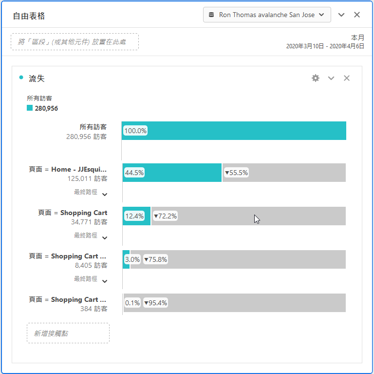
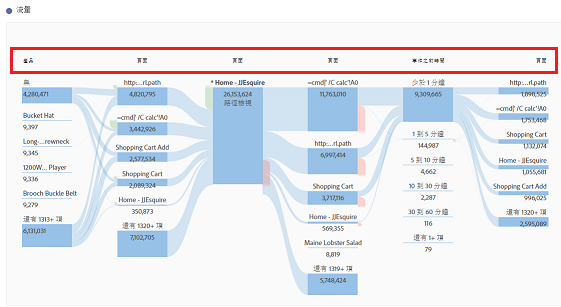

# 轉換報表

「轉換」是訪客在您的網站上直接轉換為您組織關鍵指標的動作。轉換報表顯示訪客如何轉換的詳細資訊。

此頁面假設使用者具備使用分析工作區的基本知識。See [Create a basic report in Analysis Workspace for Google Analytics users](create-report.md) if you are not yet familiar with the tool in Adobe Analytics.

## 目標報表

目標為Google Analytics使用者提供定義網站轉換的方式。它們是建立漏斗、反向行為流程、多通道漏斗和歸因的預設方法。Google Analytics中的目標無法追溯，只能在管理頁面上設定。此外，它們只以頁面、事件、逗留時間或平均頁數為基礎。

在Adobe Analytics中，不需要目標概念，因為量度可以套用至任何上下文。只要您的實施容納您要追蹤的事件，您就可以調整任何轉換報告，並立即取得歷史資料的結果。

### 漏斗視覺效果

漏斗視覺效果報告可協助分析者專注於轉換所需的一系列步驟。例如，在進行購買之前，電子商務網站上的訪客將需要存取購物車、帳單和運送頁面、付款頁面和訂購審查頁面。

在分析工作區中，可使用流失視覺化來檢視此資料。

1. 按一下左側的視覺效果圖示，然後拖曳流失視覺效果至自由表格上方的工作區上
2. Click the components icon on the left, then locate the **Pages** dimension.
3. 按一下「頁面」維度旁的箭頭圖示，以顯示頁面值。維度值是黃色的。
4. 找出要作為第一個接觸點的頁面，並將其拖曳至視覺化中標示為「新增接觸點」的空格。
5. 將頁面值拖曳至視覺化，繼續新增所需的接觸點。

流失視覺效果不僅限於頁面維度。您可以使用任何維度、量度或區段來量身打造流失報表，以符合組織的需求。

## 電子商務報告

電子商務報告通常用於銷售產品或服務的網站，以測量購買項目的訂購量和收入。此功能適用於Adobe Analytics，稱為「產品」報表。

Google Analytics中的電子商務報表和Adobe Analytics中的產品報表都需要自訂實施變更。See the [Products](../../../components/c-variables/dimensionslist/reports-products.md) dimension in the Components user guide for more information.

## 多頻道漏斗報告

多通道漏斗報表可提供其他行銷管道資料，超出收購報告所提供的資料。這些報告著重於訪客如何轉換，而不是訪客如何到達您的網站。

> [!NOTE]
>
> 在Adobe Analytics中使用多管道報表需要設定行銷渠道和自訂實施，才能容納產品變數和購買事件。如果您的報表套裝尚未設定這些功能，Adobe建議您與實施顧問合作。

### 多頻道-協助轉換

輔助轉換會顯示每個渠道有多少次協助轉換。In Analysis Workspace, the **Order Assists** metric can be used.

1. In the Components menu, locate the **Marketing Channel** dimension and drag it onto the large freeform table area labeled 'Drop a Dimension here'.
2. Drag the **Order Assists** metric on top of the automatically created **Occurrences** metric header to replace it. 如有需要，可拖曳其他量度至工作區。

### 多頻道-熱門轉換路徑

頂端轉換路徑報告會顯示使用者在轉換前所採取的最大頻道路徑。分析工作區使用流量報告來視覺化排名最前的轉換路徑。

1. 按一下左側的「面板」圖示，並將「屬性」面板拖曳至自由表格上方。
2. Click the Components icon on the left, locate the **Marketing Channel** dimension, and drag it to the box labeled 'Add Dimension'.
3. 在「度量」下找出所要的轉換事件(例如訂購)，並將其拖曳至標示為「新增量度」的方塊。請注意，「歸因」面板不支援計算量度。
4. 按一下「建立」。
5. 在產生的報表中，找出「頻道流量」視覺化。此流量顯示訪客在購買之前所接觸的頂端路徑。

此流量視覺化是互動式的。按一下每個渠道以展開任何方向的流量。

### 多頻道-時間延遲

時間延遲報告顯示訪客在您的網站上轉換的時間長度。In Analysis Workspace, this data is available using the **Days Before First Purchase** dimension. 它僅適用於正確實作購買事件的上下文。

1. In the Components menu, locate the **Days Before First Purchase** dimension and drag it onto the large freeform table area labeled 'Drop a Dimension here'.
2. Drag the desired metrics onto the workspace alongside the automatically created **Occurrences** metric. See the [Metric translation guide](common-metrics.md) for details on how to obtain each respective metric.

Adobe recommends using the **Orders**, **Units**, or **Revenue** metrics with this dimension.

For other types of conversions, including custom events, the **Time Prior to Event** dimension is available. 它會在幾分鐘內顯示訪客在瀏覽中觸發事件的時間長度。

1. In the Components menu, locate the **Time Prior to Event** dimension and drag it onto the large freeform table area labeled 'Drop a Dimension here'.
2. Drag the desired metrics onto the workspace alongside the automatically created **Occurrences** metric. See the [Metric translation guide](common-metrics.md) for details on how to obtain each respective metric.

Adobe建議您搭配自訂事件或購買事件使用此維度。

### 多頻道-路徑長度

路徑長度報表會顯示轉換事件之前所接觸的頻道數。在分析工作區中，「歸因」面板包含其中一個視覺化資料。

1. 按一下左側的「面板」圖示，並將「屬性」面板拖曳至自由表格上方
2. Click the Components icon on the left, locate the **Marketing Channel** dimension, and drag it to the box labeled 'Add Dimension'.
3. 在「度量」下找出所要的轉換事件(例如訂購)，並將其拖曳至標示為「新增量度」的方塊。請注意，「歸因」面板不支援計算量度。
4. 按一下「建立」。
5. 在產生的報表中，找出「每個歷程的接觸點」視覺化。此色階分布圖顯示訪客在購買之前所接觸的頻道數。
