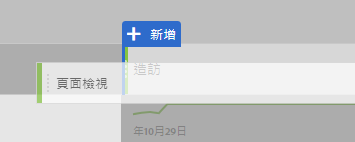

# 在分析工作區中為Google Analytics使用者建立基本報表

Analysis工作區(Adobe Analytics中的主要功能之一)提供了一個強大的區域，讓使用者獲得對收集資料的任何洞察。Google Analytics和Adobe Analytics之間的報告方式非常不同：

* Google Analytics中的報表結構可讓您選取特定類型的資料，例如地理位置或反向連結流量。平台使用預先炮製的報告檢視，以檢視該資料的預期最佳方式。
* 分析工作區中的報告結構提供空白畫布，提供更大的彈性以符合完全報告需求。

由於「分析工作區」更像畫布，而非預先炮製的報告，因此從Google Analytics重新建立報表只是使用正確的視覺效果和元件而已。

## 工作區中使用的重要詞彙

* **面板** 是工作區的覆蓋建立區塊。在幾乎所有情況下，都會使用自由面板。
* **視覺化** 會組成所有自由面板。其目的是代表不同格式的資料。大部分時間都是表格，但其他時間可以是環圈圖或折線圖。Google Analytics中的許多報表都是由兩個視覺化所組成：折線圖和自由表格。
* **元件** 放置在視覺化中，以傳回資料。元件可以以許多不同的方式混合，以滿足報告需求。
   * **維度** 是變數值，通常包含文字。範例包括頁面名稱、反向連結或地理國家。它們最常列在表格中的列中。
   * **度量** 通常表示某個事件或某個排序的轉換。範例包括常見事件，例如頁面檢視，或更重要的購買或註冊之類的事件。它們最常被視為表格中的欄，以顯示每個維度發生的事件次數。
   * **區段** 是您資料的子集，且行為類似於Google Analytics中的區段。它們可讓您進行自訂篩選，讓您專注於資料的特定部分。
   * **日期範圍** 可讓您在發生事件時組織資料。它們是檢視隨時間趨勢的骨幹，通常與度量搭配使用。

## 在工作區中建立基本報表

將正確的元件拖曳至工作區畫布，即可建立「所有頁面」報表(類似於Google Analytics中的報表)。

1. Log in to [experiencecloud.adobe.com](https://experiencecloud.adobe.com) using your Adobe ID credentials.
2. 按一下右上方的方形圖示，然後按一下彩色的Analytics標誌。
3. 在頂端導覽列中，按一下「工作區」。
4. 按一下「建立新專案」按鈕。
5. 在模型彈出式視窗中，確定已選取「Blank Project」(空白專案)，然後按一下「Create」(建立)。
6. 左側會顯示維度、度量、區段和日期範圍的清單。找出「頁面」維度(彩色橘色)，並將它拖曳至標示為「拖曳維度至此」的畫布上。
7. 會顯示一份報告，其中顯示本月的熱門頁面。Analysis Workspace automatically populates the report with the [Occurrences](../../../components/c-variables/c-metrics/metrics-occurrences.md) metric.
8. Google Analytics中的表格通常包含7-8度量。找出「反彈率」量度(彩色綠色)，並拖曳它至「發生次數」度量標題旁邊。如果拖曳「發生次數」旁的「反彈率」量度，兩個量度都會並排顯示。
9. 您可以拖曳現有量度標題旁的量度，以並排放置許多度量。See [commonly used metrics](common-metrics.md) for information on how to obtain metrics typically used in Google Analytics.

   

## 從工作區中預先建立的報表範本開始

存取專案範本，建立「內容消費」範本(類似於Google Analytics中的「所有頁面」報表)。

1. 按一下「建立新專案」按鈕。
2. 找到並按兩下「所有範本」下方所列的「內容消費(Web)」圖示。
3. 瀏覽預先建立的每個視覺效果：登入頁面流量、排名最前的頁面表格、退出頁面流量、登入網站區域流量和排名最前的網站區域表格。

   

## 實驗工具

由於Analysis Workspace是報告工具，因此不會影響資料收集。不需重新計算，將元件拖曳至專案中，即可查看哪些項目有效。將維度和度量的不同組合拖曳至工作區專案，以瞭解您可以使用甚麼。

如果您意外拖曳無效的元件至工作區專案，或想要返回步驟，請按Ctrl+ Z(Windows)或cmd+ Z(Mac)來還原最後的動作。You can also start with a clean slate by clicking *[!UICONTROL Project] &gt; [!UICONTROL New]* in the upper left menu.

Adobe在「分析工作區」中，在右鍵內容選單中放入許多功能。您可以直接按下大部分視覺化和元件，以進行更詳細的分析與互動。考慮在工作區中按一下滑鼠右鍵，以查看可用的選項。

## 瞭解要使用的維度和度量

如果您熟悉Analysis工作區，且想要重新建立通常在Google Analytics中檢視的特定報表，請在其各自頁面找到報表：

* [即時報表](realtime-reports.md)
* [對象報表](audience-reports.md)
* [贏取報表](acquisition-reports.md)
* [行為報告](behavior-reports.md)
* [轉換報表](conversions-reports.md)
