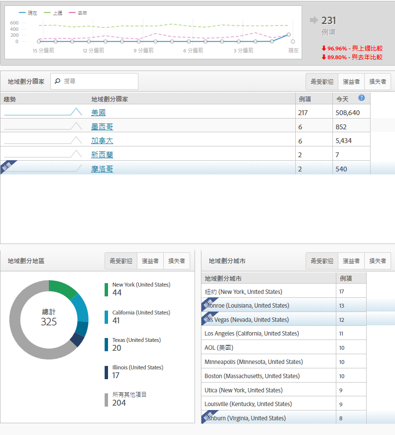
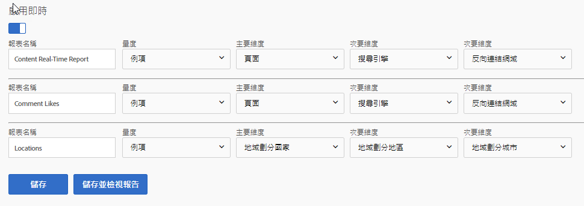

# 即時報表

即時報告顯示您的網站目前發生了甚麼。這些類型的報表對於查看您對網站所做的立即更新特別有用。例如，在黑色星期五執行銷售的公司可以評估特定頁面的流量，並判斷哪些銷售額根據當時的績效排列優先順序。

即時報告是少數尚未引入分析工作區的功能之一。使用「報告與分析」取得此資料。他們需要一些簡單的組態來開始收集資料。

若要達到即時報告設定頁面(必要權限)：

1. Click [!UICONTROL Reports] in the Adobe Analytics header navigation.
2. In the left menu, Click *[!UICONTROL Site Metrics]* &gt; *[!UICONTROL Real-Time]*.
3. 如果報表套裝尚未啓用即時功能，則會顯示訊息以設定報表套裝的連結。If the report suite has real-time enabled, click [!UICONTROL Configure] near the real-time report&#39;s title.

Adobe最多允許三個即時報告同時收集資料。每項都必須先設定，才能開始收集資料。

## 即時位置

即時位置可告訴您訪客在目前的時間瀏覽您的網站。若要設定三個即時報表之一，以顯示位置資料：

1. Click [!UICONTROL Configure] near the real-time report&#39;s title.
2. 在其中一個即時報表槽下方：
   * 為您的即時報告命名；例如「位置」。
   * 例項通常用作度量。目前報告中無法使用使用者/獨特訪客。
   * 對於主要維度，通常會使用地域劃分國家。地域劃分地區、地域劃分US DMA和地域劃分城市也已推出。
   * 對於兩個次要維度，請使用您想查看此流量的其他資料。次要維度不一定必須是特定位置。
3. Click [!UICONTROL Save and View Report].

## 即時流量來源

即時流量來源會告訴您訪客在目前瀏覽您的網站時所處的位置。若要設定三個即時報告之一，以顯示流量來源資料：

1. 按一下即時報表標題附近的「設定」。
2. 在其中一個即時報表槽下方：
   * 為您的即時報告命名；例如「流量來源」。
   * 例項通常用作度量。目前報告中無法使用使用者/獨特訪客。
   * 對於主要維度，通常會使用反向連結網域。也可以使用搜尋引擎和搜尋關鍵字。
   * 對於兩個次要維度，請使用您想查看此流量的其他資料。次要維度不一定必須是流量來源。
3. Click [!UICONTROL Save and View Report].

## 即時內容

即時內容會告訴您訪客目前正在檢視哪些頁面。若要設定三個即時報表之一，以顯示內容資料：

1. Click [!UICONTROL Configure] near the real-time report&#39;s title.
2. 在其中一個即時報表槽下方：
   * 為您的即時報告命名；例如「內容」。
   * 例項通常用作度量。目前報告中無法使用使用者/獨特訪客。
   * 對於主要維度，通常會使用頁面。如果您的實施定義了這些變數，則也可以使用網站區域和伺服器。
   * 對於兩個次要維度，請使用您想查看此流量的其他資料。次要維度不一定必須屬於內容。
3. Click [!UICONTROL Save and View Report].

## 即時活動

即時事件會告訴您哪些事件在網站上最常發生。在Google Analytics中，事件會擷取特定動作(通常是未與頁面檢視無關的動作)的次數。GA事件會隨類別、標籤和動作而傳送。在Adobe Analytics中，自訂事件是管理控制台中好記名稱的度量，可與任何維度一起分析。如果您在尋找類似Google Analytics事件的維度，請考慮套用自訂連結維度，此維度通常被用來收集與頁面檢視無關的資料(除了「退出連結-退出連結-退出連結-適用於下載的退出連結)」。

> [!NOTE] 在即時報告中使用自訂事件時，維度值必須定義在與自訂事件相同的點擊中。例如，如果檢視「反向連結網域」維度的「註冊」自訂事件，則不會傳回任何資料，而不需要額外實施。由於反向連結網域只會出現在第一次點擊中，而自訂事件通常會出現在瀏覽中，因此無法在即時報告中關聯資料。使用標準處理延遲(通常是30-90分鐘)可使用分析工作區。

## 即時轉換

即時轉換可在不同平台之間以不同的方式呈現資料。Google Analytics中的目標是Adobe Analytics中的度量和成功事件。您可以在「即時報表」中使用Adobe Analytics中的大部分度量(例如成功事件和收入等標準量度)。與Google Analytics類似，您也可以在即時報告中套用產品名稱、追蹤代碼和促銷活動績效等維度。

1. Click [!UICONTROL Configure] near the real-time report&#39;s title.
2. 在其中一個即時報表槽下方：
   * 為您的即時報告命名；例如「轉換」。
   * 例項通常用作度量。目前報告中無法使用使用者/獨特訪客。
   * 對於主要維度，通常會使用追蹤代碼。如果您的實施使用，也可以使用「產品」維度。
   * 對於兩個次要維度，請使用您想查看此流量的其他資料。次要維度不一定需要轉換。
3. Click [!UICONTROL Save and View Report].

> [!NOTE] 如果使用例項以外的事件(例如「訂購」)，請確定您的實施定義了相同點擊上的維度和事件。如果維度和事件未在相同點擊上引發，則會使用標準處理延遲(通常是30-90分鐘)在Analysis工作區中使用該資料。
