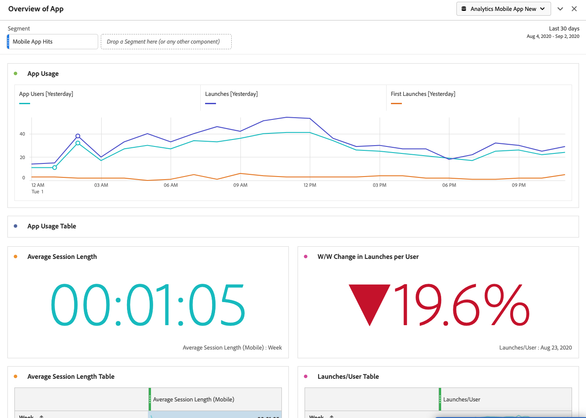

# 移轉行動服務處理規則至 Adobe Analytics

本文件旨在提供如何移轉任何其他處理規則 (超出生命週期量度) 的說明；讓您了解將行動服務 UI 中建立的處理規則移轉至 Adobe Analytics。

處理規則用於將內容資料變數的值移至 prop 和 eVar。例如，您可以將「搜尋-字詞」內容資料變數值放入 Commerce 變數 eVar 的值，並月且覆蓋每次點擊的值。若沒有處理規則，內容資料變數就毫無意義，且不會填入 Analytics 的任何報告。

本文件還會讓您了解如何在 Analysis Workspace 中進行行動使用情況的報告。

## 移轉處理規則

如果您是利用行動服務的免費功能，例如處理規則和使用報告功能，則您可以無縫地移至 Analytics UI (處理規則 UI 或 Analysis Workspace) 以實現這些功能。若是生命週期量度或設定在 AA 處理規則 UI 內的規則，您不必進行任何移轉。生命週期量度是「即時可用」量度，當 SDK 首次實施作業於您的應用程式中時會自動收集這些量度。

如果您在行動服務 UI (超出生命週期量度) 中建立任何其他 (超出生命週期量度) 處理規則，您應該將那些則規移轉過去，以便在您失去行動服務存取權後，可在 Analytics 中編輯/刪除這些規則。

1. 登入 `experience.adobe.com`，並前往「行動服務」。
1. 在您要移轉至 Adobe Analytics 的內容變數對應所在行動應用程式，按一下齒輪圖示。
1. 按一下「**[!UICONTROL 管理變數和量度]**」選單項目，然後按一下「**[!UICONTROL 自訂變數]**」標籤。在這裡，您可以看到已新增至設定中的內容變數對應 (內容資料)。記下這些設定（或拍攝熒幕擷圖）。 範例：

   

1. 在Experience Cloud中，切換至Adobe Analytics，並確保您是在行動服務中看到的相同行動報表套裝中。
1. 前往「**[!UICONTROL 管理員]** > **[!UICONTROL 報告套裝]** > **[!UICONTROL 編輯設定]** > **[!UICONTROL 一般]** > **[!UICONTROL 處理規則]**。
1. 按一下「**[!UICONTROL 新增規則]**」。
1. 無需理會條件限制，繼續新增行動服務內存在的相同內容變數。

   

1. 按一下「**[!UICONTROL 儲存]**」。

## Analysis Workspace 中的行動使用報告。

除了提供行動量度和維度 (如果為行動服務啟用了報告套裝)，Analysis Workspace 還包含多個可方便分析的行動專案範本：

* **[!UICONTROL 傳送訊息]**：著重應用程式內部和推送訊息效能。
* **[!UICONTROL 位置]**：包括展示位置資料的地圖。
* **[!UICONTROL 關鍵量度]**：掌握您應用程式的關鍵量度。
* **[!UICONTROL 應用程式使用情形]**：應用程式擁有多少使用者和首次啟動次數，而平均工作階段時間長度又如何？
* **[!UICONTROL 擷取]**：行動擷取連結的效能如何？
* **[!UICONTROL 效能]**：應用程式效能如何以及用戶有哪些方面的問題？
* **[!UICONTROL 保留客戶]**：我的忠實使用者是哪些人？他們都進行什麼活動？
* **[!UICONTROL 歷程]**：我應用程式的顯著使用模式為何?

以下是行動應用程式使用範本的部分內容：

若要存取範本：

1. 登入 `experience.adobe.com` 並選取「Analytics」。
1. 確保您是在為行動服務啟用的報表套裝中。
1. 按一下「**[!UICONTROL Workspace]**」標籤。
1. 按一下「**[!UICONTROL 建立新專案]**」。
1. 選取任何行動範本，並按一下「**[!UICONTROL 建立]**」。

## 移轉其他行動服務功能

以下行動服務功能也與 Adobe Analytics 有關聯，但需要購買 Adobe Analytics Sku：

* 贏取連結
* 推送訊息
* 應用程式內傳訊
* 位置參考資訊管理

如果您正在利用行動服務的付費功能，則您沒有前往其他內部/外部工具的可行移轉路徑：

* 若需要擷取連結，我們可將您導向 Adobe 合作夥伴以滿足您的需求。
* 推送訊息和應用程式內的傳送訊息適用於 Adobe Campaign Standard 和 Adobe Campaign Classic (僅限推送)。但是，目標定位所用的基本資料集不同。我們建議您找 Adobe 帳戶團隊，以確定傳送訊息資料的移轉選項。
* 關於定位功能，請您採用新的[Adobe Experience Platform定位服務](https://www.adobe.com/experience-platform/location-service.html)，所有Adobe Experience Platform客戶均可免費使用。
